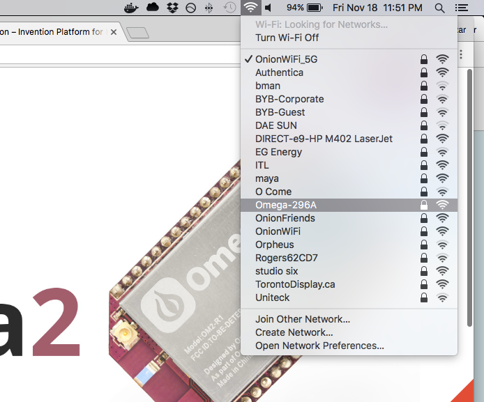

## The Omega & Wireless Connectivity {the-omega-and-wireless-connectivity}

<!-- // this article will explain the different wireless configurations the Omega supports -->

### Hosting a WiFi Access point

<!-- // highlight that this is the 'Out of the Box' state for the Omega -->

When you power on your Omega, a new network called `Omega-ABCD` will show up on your list of networks.

<!-- // include an illustration -->

This is referred to as the Omega's Access Point (AP), or the Omega's WiFi. The Omega's AP gives you the ability to wirelessly connect to your Omega with, or without an internet connection.
<!-- // explain what hosting a WiFi access point means ie that a bunch of other devices can connect to the Omega's network -->
<!-- // mention that this may be refered to as the Omega's AP (access point), Omega's Wifi -->

### Connected to a WiFi network

<!-- // highlight that this is how we get internet on the omega; connecting to your own existing wifi network -->

Your Omega can connect to the internet to unlock a lot of features, such as the ability to download packages with `opkg`. For more on `opkg`, you can read this [article on using opkg](#using-opkg).

This is done by connecting your Omega to an existing router that is supplying internet, giving your Omega access to the internet.

<!-- // include an illustration -->

<!-- // explanation of what connecting to a Wifi network means and how there is a router somewhere out there, etc -->

### Connected to a WiFi network AND hosting a WiFi Access Point

<!-- // highlight that this is the state the omega is in after completing the setup Wizard -->

Once your Omega is connected to the internet, the Omega's AP will be able to supply an internet connection to the devices that are connected. This means that connecting to your device to your Omega's AP will give your device access to the internet.

<!-- // include an illustration -->

<!-- // explain that the Omega is super powerful and that it can connect to a Wifi network while simultaneously hosting it's own access point -->
<!-- // this is powerful because it can share/forward connectivity between the two networks, brief intro on the firewall (where the config can be found, how to restart it) -->
