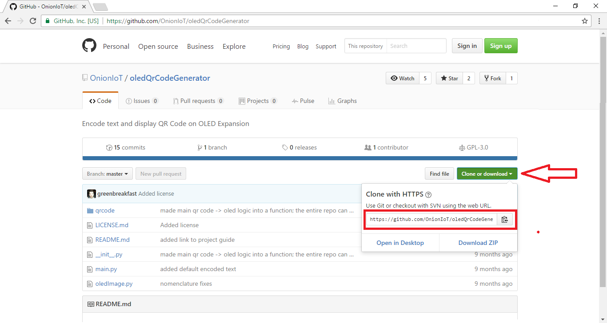

## Installing and Using Git

Git is a popular [version control](https://git-scm.com/book/en/v2/Getting-Started-About-Version-Control) system that allows coders to track changes to their codebase, easily collaborate with others, and manage their project.

Git is the version control system used by [GitHub](https://github.com/), the super popular online web-based repository hosting service. The team at Onion uses GitHub exclusively for all of our version control needs.

### Installing Git

[//]: # (steps on using opkg to install Git)
It's really easy to install Git on your Omega2/Omega2+ using OPKG. For a tutorial on how OPKG works, click [here](./Using-opkg.md)
1. First, make sure you have an internet connection

2. Run the command `opkg update`

3. After opkg updates, run `opkg install git git-http`

4. A successful installation will show:
```
Configuring git.
Configuring git-http.
```

If your installation fails, make sure you're connected to the internet and that you've updated opkg.
> To check if you've got an internet connection run `ping www.google.com`

4. To check if you have Git already installed type `opkg list-installed | grep git`
	* The desired output is
	```
	git - <version number>
	git-http - <version number>
	```

Congratulations you've successfully installed Git on your Omega.


### Using Git

[//]: # (brief steps using git on the omega to download projects from github)
With Git installed on your Omega you can now clone repositories directly into your Omega just like you would on your computer. This is especially useful to try out some of the cool projects we have on our [GitHub](https://github.com/OnionIoT/)

[//]: # (exalt the virtues of github and collaborative projects and how much onion loves this stuff)
GitHub allows us as developers to collaborate with the community in various ways. If you've worked on something for the Omega that you would like to share with the community, you can submit a pull request. This allows us at Onion to see your work and potentially incorporate it into the official OnionIoT GitHub!
[Click here to learn more about pull requests](https://help.github.com/articles/about-pull-requests/)

Let's try using Git to clone one of the repositories off the Onion GitHub!

First, open your browser and navigate to `https://github.com/OnionIoT/`


Next, find the repository you'd like to clone. In this example we'll use the oledQrCodeGenerator repo. Click on oledQrCodeGenerator. On the next page you'll want to click on the `Clone or Download` button. Click on the button, and copy the link in the box.



Now, open your terminal and move to the directory in which you want the repository to reside. From there, enter:

```
git clone https://github.com/OnionIoT/oledQrCodeGenerator.git
```

You'll see something similar to this:

```
root@Omega-2757:/tmp# git clone https://github.com/OnionIoT/oledQrCodeGenerator.git
Cloning into 'oledQrCodeGenerator'...
remote: Counting objects: 81, done.
remote: Total 81 (delta 0), reused 0 (delta 0), pack-reused 81
Unpacking objects: 100% (81/81), done.
```

Now if you type `ls` you should see a directory called `oledQrCodeGenerator`. Enter
```
ls oledQrCodeGenerator/
```
and you'll see the contents of the repository on your Omega.

```
root@Omega-2757:/tmp# ls oledQrCodeGenerator/
LICENSE.md    __init__.py   oledImage.py
README.md     main.py       qrcode
```
