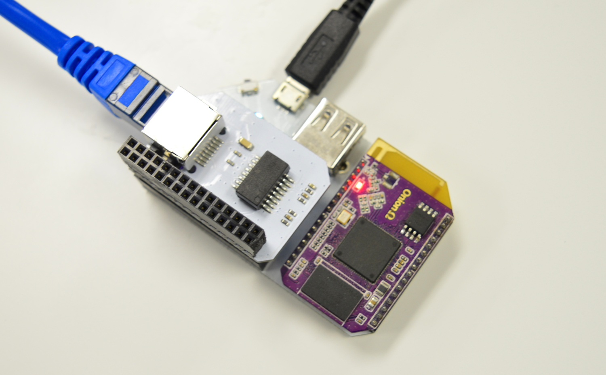

# The Omega as a Router

[//]: # (make this make sense)
 This tutorial will show you how to set up the Omega as a WiFi router. Those of you familiar with OpenWRT will probably know that it was originally designed for use with routers, and only recently did it become a popular operating system for embedded devices in general.

[//]: # (illustration showing the whole system)

 To do this, you will need:

* 1x Omega
* 1x Expansion Dock
* 1x Ethernet Expansion

## Step 1: Setup the Hardware

First, connect the Omega to the Expansion Dock, and plug the Ethernet Expansion into the Expansion Dock. Then, connect the ethernet cable coming from your modem to the Ethernet Expansion, and connect the power to the Omega, as shown below:



After you have connected everything, power on the Omega.


## Step 2: Disable wifi on the Omega

[//]: # (explanation of which wifi you're disabling)

To do this, you will be editing `/etc/config/wireless` file and changing the access point settings of your Omega:

Find the following block

```
config wifi-iface
        option device 'ra0'
        option network 'wlan'
        option mode 'ap'
        option encryption 'psk2'
        option key '12345678'
        option ssid 'Omega-ABCD'
        option ApCliEnable '1'
        option ApCliAuthMode 'WPA2PSK'
        option ApCliEncrypType 'AES'
        option ApCliSsid 'yourwifissid'
        option ApCliPassWord 'yourwifipassword'

```

and replace
```
option ApCliEnable '1'
```
with
```
option ApCliEnable '0'
```

[//]: # (mention why we do this)


[//]: # (create a new step regarding the ssid name)
Within this block, you can change the SSID if your Omega, the router password, as well as the type of encryption you want to use for the router and the password.

```
option ssid 'OmegaRouter'
option key 'RouterPassword'
option encription 'YourEncryptionType'
```

Once you have finished customizing the WiFi network, simply save and close the file, and run the following command to restart the WiFi network:

```
wifi
```

## Step 3: Enable `eth0`

The Omega is primarily designed as a development board to prototype WiFi-enabled devices, so by default, we have turned off the ethernet interface `eth0` in the firmware. In order to use the Omega as a router, you will need to re-enable this. To do this, you will need to open up the `/etc/config/network` file, find the the block that looks something like the following:

```
config interface 'wan'
   option ifname 'eth0'
   option proto 'dhcp'   
```
and add the following line:

```
option hostname 'OnionOmega'
```

```
config interface 'wan'
   option ifname 'eth0'
   option proto 'dhcp'
   option hostname 'OnionOmega'
```

This will tell the Omega to turn on the `eth0` interface and we will also be referring to this network as `wan`.

Once you have saved and closed the file, run the following command to restart the network service to reload the new configuration:

```
/etc/init.d/network restart
```

## Step 4: Enabling Packet Routing

Next, you will need to configure the Omega to route packets from the ethernet interface (`eth0`) to your WiFi interface (`wlan0`). To do this, you will be editing the `/etc/config/firewall` file:

Find the the block that looks something like the following:

```
config zone
    option name         wan
    list   network      'wwan'
    option input        ACCEPT
    option output       ACCEPT
    option forward      ACCEPT
    option masq     1
    option mtu_fix      1
```

and add the following line:

```
list   network      'wan'
```

What you will end up with is something like the following:

```
config zone
    option name         wan
    list   network      'wwan'
    list   network      'wan'
    option input        ACCEPT
    option output       ACCEPT
    option forward      ACCEPT
    option masq     1
    option mtu_fix      1
```

What this tells the Omega to do is to add the `wan` network (which we defined in `/etc/config/network` file) to a firewall zone called `wan`. This zone has already been setup to route packets to another firewall zone called `lan`, which contains the `wlan0` interface.

Once you have saved and closed the file, run the following command to restart the firewall with the updated configuration:

```
/etc/init.d/firewall restart
```

## Step 6: Using the Omega Router

And we are done! To use the Omega Router, you simply need to connect your computer or your smartphone/tablet to the WiFi network that you configured in Step 4, and your devices should be able to access the Internet via the Omega :)

Happy hacking!
