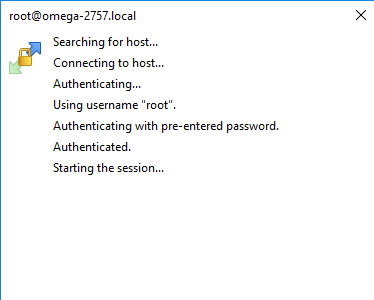
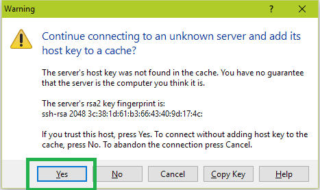
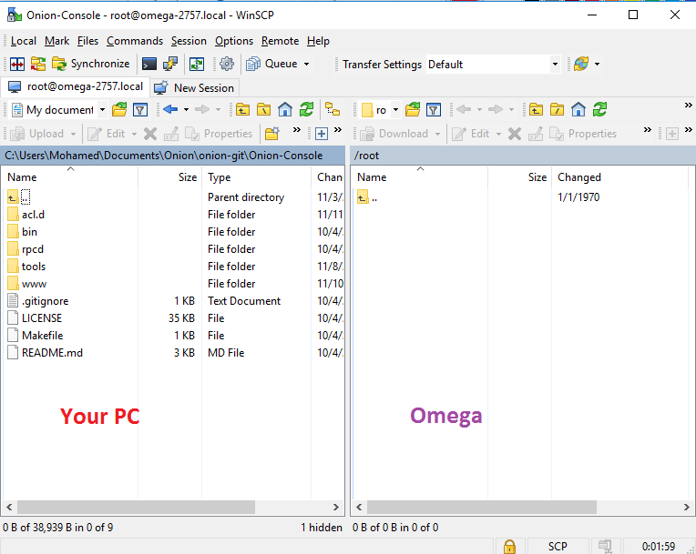

# Transferring Files to the Omega

The Omega is incredibly powerful in that it is a full Linux computer. This means that it has it's only filesystem, allowing you to store files directly on the Omega. It also means that you can take your files from an external device and copy them to your Omega. This tutorial will show you how you can do that.

## Using Windows

The Omega can use the SCP file protocol to transfer files wirelessly. In this tutorial we're going to use WinSCP to transfer our files.

# What is WinSCP?

WinSCP is an open source free SFTP client, FTP client, WebDAV client and SCP client for Windows. Its main function is file transfer between a local and a remote computer. Beyond this, WinSCP offers scripting and basic file manager functionality.

In short, it makes creating & updating files on your Omega a lot easier!

# Getting Started

First, download [WinSCP from their site](https://winscp.net/eng/download.php).  

Once downloaded, install the application and then run it.

# Configure the Connection

Connecting to the Omega is super simple. First, make sure your Omega has internet connection. If this is not the case, follow the [Getting Started guide](../Get-Started/First-Time.md).

In the right hand pane, you'll need to set the details for your Onion Omega. Typically these are:

|Setting   | Value  |
|:---: | :---:|
| File Protocol | SCP |
| Hostname | omega-ABCD.local |
| Port Number | 22 |
| Username | root |
| Password | onioneer |

Once finished, press the "Save" button.

On the next window there is a tickbox option to save the password, thats up to you. Saving the password is less secure, but faster to access your Omega.

You can name the connection and you can also you can save a desktop shortcut if desired.

Now from the left menu you'll see the name you saved the new site as a few moments ago, eg "root@192.168.3.1", click on this, then "Login".

You will now try to connect to your Omega. On success you'll see this in the window:

If you connection fails, WinSCP will let you know that the host was not found. If this is the case, make sure that both you and your Omega have an internet connection, and that you have Apple's Bonjour Service installed. If you don't have Apple's Bonjour Service, you can connect to your Omega's access point, and connect to its IP `192.168.3.1` .

As this is your first time connecting via WinSCP you'll receive a warning similar to the one below. That's to be expected, click on "Yes"

Congratulations, you now have remote, easy access to your Onion Omega system files!

## Using Linux or Mac OX X

// step by step instructions on using rsync

// LATER: add console
