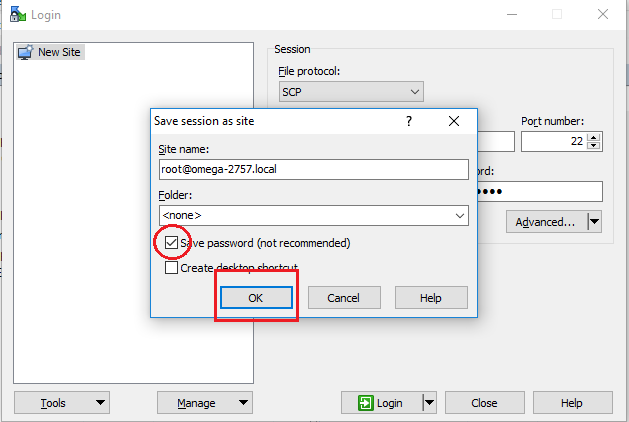
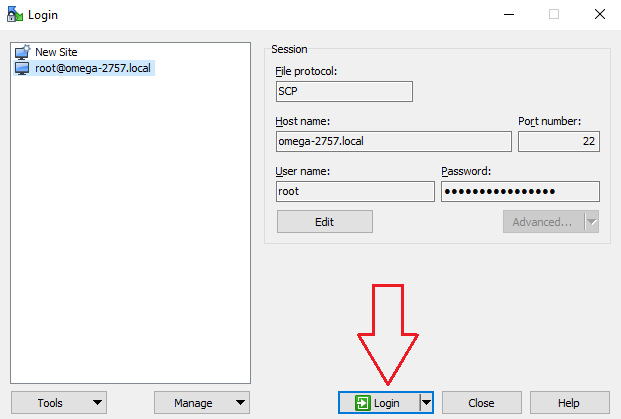

# Transferring Files to the Omega

[//]: # (brief intro of how the Omega has it's own Filesystem and why it might be useful to be able to transfer files easily back and forth)


## Using Windows

[//]: # (step by step instructions on using WinSCP)
The Omega can use the SCP file protocol to transfer files wirelessly. In this tutorial we're going to use WinSCP to transfer our files.

### What is WinSCP?

WinSCP is an open source free SFTP client, FTP client, WebDAV client and SCP client for Windows. Its main function is file transfer between a local and a remote computer. Beyond this, WinSCP offers scripting and basic file manager functionality.

In short, it makes creating & updating files on your Onion Omega a lot faster!

### Getting Started

First, download the [WinSCP program from their site](https://winscp.net/eng/download.php).  

Once downloaded, install the application and then run it.

### Configure the Connection

Connecting to the Omega is super simple. Connect to your Omega's access point and create a New Site as shown in the image below:


In the right hand pane, you'll need to set the details for your Onion Omega. Typically these are:

**File Protocol:** SCP

**Hostname:** 192.168.3.1

**Port Number:** 22

**Username:** root

**Password:** onioneer


Once finished, press the "Save" button.

On the next window there is a tickbox option to save the password, thats up to you. Saving the password is less secure, but faster to access your Omega. 

You can name the connection and you can also you can save a desktop shortcut if desired.



Now from the left menu you'll see the name you saved the new site as a few moments ago, eg "root@192.168.3.1", click on this, then "Login".



As this is your first time connecting via WinSCP you'll receive a warning similar to the one below. That's to be expected, click on "Yes".


Congraulations, you now have remote, easy access to your Onion Omega system files!

Happy Hacking!


## Using Linux or Mac OS X

### `rsync`
[//]: # (step by step instructions on using rsync)

On Mac or Linux, we can use the command-line utility `rsync` (remote sync) to transfer files to and from the Omega. It's included in comes with Mac OS and most Linux distributions by default, but in case you don't have it simply run the below commands to install it:

```
sudo apt-get update
sudo apt-get install rsync
```

`rsync` uses the `ssh` protocol when connecting to remote servers. When working with an Omega, specify the username as `root` and provide the password when prompted (`onioneer` by default).

#### Push to Omega

To quickly copy an entire directory to your Omega, fill in this template with the paths of your folders, where `ABCD` is your Omega's factory name:

```
rsync -a local_directory root@Omega-ABCD.local:~/directory_to_push_to
```

To copy only the *files* inside a directory, add a `/` to the end of `local_directory` like so:

```
rsync -a local_directory/ root@Omega-ABCD.local:~/directory_to_push_to
```

If you get a warning about connecting to an unknown host, type 'yes' (as this is your Omega).


#### Pull from Omega

Entire folder:

```
rsync -a root@Omega-ABCD.local:~/directory_to_pull_from local_directory 
```

Files only:

```
rsync -a root@Omega-ABCD.local:~/directory_to_pull_from/ local_directory 
```

#### Adding Your SSH Key

To skip the password prompt, you can add your SSH key to the Omega. Follow the guide here: [Add Your SSH Key To The Omega](./Add-Your-SSH-Key-to-The-Omega)

#### Syntax

Using a push command, the syntax for the command is explained below

```
rsync -a local_directory username@remote_host:destination_directory
```

We'll go over each part of the command below.

* **-a** - The `-a` flag means 'archive' and syncs recursively, including files attributes such as permissions, group, and owners. You'll typically want to add this flag in your `rsync` commands.

* **local_directory** - The directory containing the files you want to push. There are two ways this can be done, shown below:

  * `~/my_directory` - copies the folder itself over to the destination, eg. `destination_directory/my_directory`
  * `~/my_directory/` - by adding a `/` at the end, this means the *contents* of `my_directory`, so if it had files `file1`, `file2`, `file3`, then the remote server would have the files:
    * `destination_directory/file1`
    * `destination_directory/file2`
    * `destination_directory/file3`

* **username** - the user on the remote system. For the Omega, this will always be `root`.

* **remote_host** - the URL or IP of the remote server. For an Omega connected to your WiFi/LAN, this can be typically `Omega-ABCD.local` (`ABCD` being your Omega's factory name), or the IP address, eg. `192.168.12.34`

* **destination_directory** - the directory where your local files will be sent to, eg. `~/source/my_cool_project`

[//]: # (LATER: add console)
