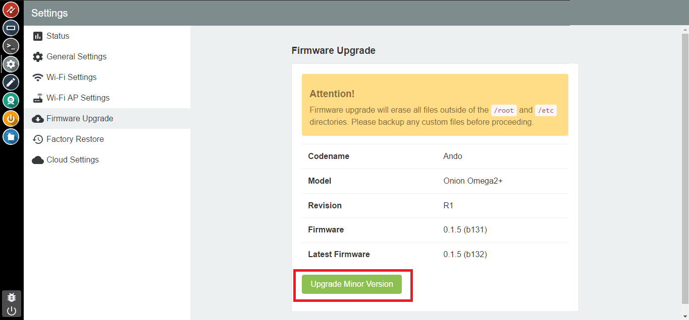
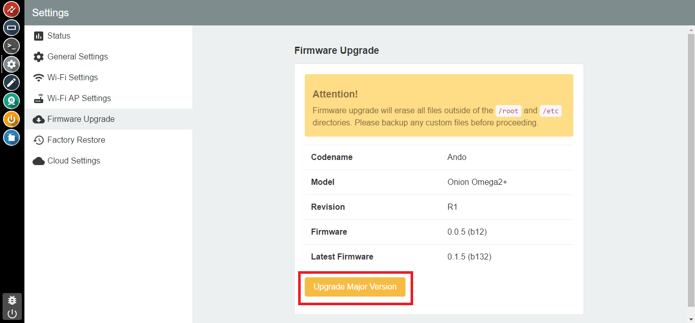

## Updating the Omega using the Console {#updating-the-omega-using-console}

In order to keep improving the user experience for the Omega, we will be releasing firmware updates on a rolling basis. To capitalize on these improvements, users should update their Omegas to the latest firmware release.

You can update your Omega's firmware through the Settings app. Open the Settings app, and click on the `Firmware Upgrade` tab.

This page will display your Omega's firmware information and will notify you of available upgrades.

### The Omega Firmware

The Omega firmware can be in three different states:

***Up to date:***

Your Omega is on the latest *stable* firmware version and requires no further action.

***Minor Version Available:***

Your Omega is on a previous build of the firmware and might be missing some minor features or bug fixes. You can choose to upgrade your firmware to acquire these changes.

***Major Version Available:***

Your Omega is on a previous version and is potentially missing core features. It is highly recommended to upgrade your firmware to acquire these features.

Let's go through what each state will look like in the Console.

#### Up To Date!

If your Omega is up to date with the latest firmware, you will see a page similar to the following:

You'll see that the firmware versions match up exactly in terms of major version, minor version, and build number.

In this state, your Upgrade Button will not be active and no further action is required!

#### Minor Version Available!

If your Omega is behind a minor version or build, you will see a page similar to the following:

You'll see that the versions match up, but the build does not. This means there is a new firmware available and you can choose to upgrade to get all the latest and greatest features in development.

***Note: Upgrading your firmware will erase all files not located in `/root` or `/etc`.***

Click on the `Upgrade Minor Version` button and your new firmware will begin downloading:

Once the download is complete a notification will pop up, and the upgrade will begin:

**Do not turn off your Omega during this time.** It will reboot automatically with the latest features.

<!-- // TODO: later: add info about flashing led -->

#### Major Version Available!

If a major version is available then an upgrade is required. Your page will look similar to this:

Here you see the firmware versions don't match.

***Note: Upgrading your firmware will erase all files not located in `/root` or `/etc`.***

Click on the `Upgrade Major Version` button and your new firmware will begin downloading:

// TODO: fix this screenshot

Once the download is complete a notification will pop up, and the upgrade will begin:
// TODO: fix this screenshot

**Do not turn off your Omega during this time.** It will reboot automatically with the latest features.

<!-- // TODO: later: add info about flashing led -->
