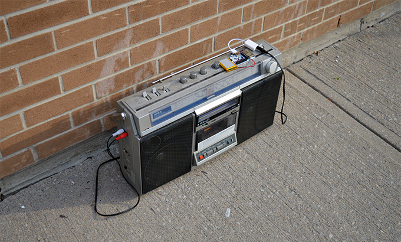
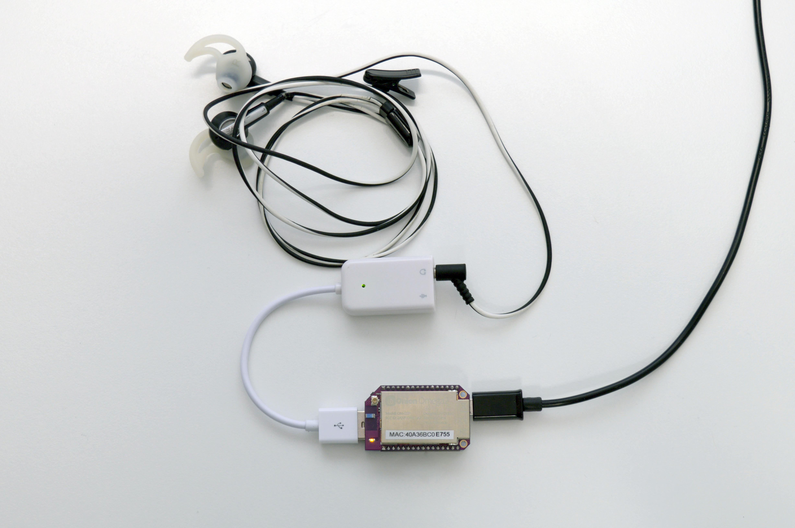

## AirPlay Speaker {#airplay-audio-receiver}

Since the Omega can be set up to receive AirPlay streams, we can turn our Omega into a WiFi speaker that can be controlled with a laptop or phone using a USB audio device.




### Overview

**Skill Level:** Intermediate

**Time Required:** 15 Minutes

There's three main pieces of the puzzle here:

To get AirPlay working, we will set up `shairport-sync` on the Omega. The audio stack on the Omega will work out of the box with USB devices, so we simply need to plug in any USB audio device. Finally, to actually stream music, a device with AirPlay controller capabilities must be set up to stream to the Omega.

Reference configuration files can be found on Onion's [`audio-airplay-receiver` repo](https://github.com/OnionIoT/audio-airplay-receiver) on GitHub.

### Ingredients

* Onion [Omega2](https://onion.io/store/omega2/) or [Omega2+](https://onion.io/store/omega2p/
* Any Onion Dock with a USB host connector: [Expansion Dock](https://onion.io/store/expansion-dock/), [Power Dock](https://onion.io/store/power-dock/), [Mini Dock](https://onion.io/store/mini-dock/), [Arduino Dock 2](https://onion.io/store/arduino-dock-r2/)
	* We found the [Power Dock](https://onion.io/store/power-dock/) especially useful since you can take it on the go!
* A USB audio device *
* Headphones or a speaker

\* We used a USB Audio adapter, but USB speakers will likely work as well


### Step-by-Step

Follow these steps and we'll have audio streaming to the Omega in no time!

#### 1. Prepare the Ingredients

For this project, we'll need an Omega2 ready to go. If needed, complete the [First Time Setup Guide](https://docs.onion.io/omega2-docs/first-time-setup.html) to connect your Omega to WiFi and update to the latest firmware.


#### 2. Replace Avahi

The version of Avahi that comes installed on the Omega does not have `dbus-daemon` support, this needs to be fixed!

[Connect to the Omega's command line](https://docs.onion.io/omega2-docs/connecting-to-the-omega-terminal.html#connecting-to-the-omega-terminal) to uninstall the pre-existing avahi package. Then we can get the `avahi-dbus-daemon` package to replace it.

First uninstall avahi:
```
opkg remove avahi-nodbus-daemon --force-depends
```

Once that's finished,

```
opkg update
opkg install avahi-dbus-daemon --force-overwrite
```

#### 3. Install Shairport Sync

The `shairport-sync` package runs an Airplay Receiver server to listen and process AirPlay streams.

Fortunately, it is available in the Onion Repositories, so we can install with `opkg`:

```
opkg install shairport-sync
```

#### 4. Configure Shairport Sync

Shairport Sync requires some setup to work properly. To configure it, we'll be editing `/etc/config/shairport-sync`. Open it up and you should see something like this:

```
# Use your own config file
config shairport-sync 'shairport_sync_file'
        option disabled '1'
        option respawn '1'
        option conf_custom '1'
        option conf_file '/etc/shairport-sync.conf'

# Use OpenWrt UCI config
config shairport-sync 'shairport_sync'
        option disabled '1'
        option respawn '1'
        ...
        ...
```

The first block isn't useful to us. We want to edit options under the `# Use OpenWrt UCI config` line.

Specifically, these following lines:

```
        option disabled '1'
        ...
        option name 'Shairport-Sync-%v-%h'
        option password ''
        ...
        option mdns_backend '' # avahi/external-avahi/dns-sd/external-dns-sd/tinysvcmdns
```

The Steps:

* First let's set `disabled` to `'0'` to enable the UCI configuration.
* Optionally, pick out a new name to display in your AirPlay devices menus.
* Optionally, add a password to ensure only trusted users can access your Airplay receiver - Not Recommended
* Finally, make sure the `mdns_backend` is set to `'tinysvcmdns'`
* The rest of the options can be kept as their default values.

If you need a reference for the configuration files, we've put them into the [`audio-airplay-receiver` repo](https://github.com/OnionIoT/audio-airplay-receiver) on GitHub.

Restart the Omega for the changes to take effect, and we'll plug in some speakers!

#### 5. Set up your Speakers

In our setup, we used a USB-based Audio Adapter. It has a built in Digital-Analog Converter (DAC) that receives digital audio data from the Omega through the USB port and converts it into an analog audio signal for speakers or headphones.

But any USB speaker setup should work out of the box thanks to Linux's audio stack. Plug it into the dock, and we'll be good to go!




#### 6. Prepare your controller

AirPlay works out of the box for iOS devices, so if you own one there's no set up needed.

If you wish to use an Android device, we found AllStream and DoubleTwist to have stable AirPlay integration.


#### 7. Fire up Shairport Sync

Now that everything's ready to go, enter `shairport-sync -d` to start up the shairport-sync server in the background.

### Listening to Tunes

Now take a look at your AirPlay device, and you should see the Omega pop up as a receiver!

On an iPhone:


On an Andriod phone using the AllConnect App:


Play some tunes and enjoy your AirPlay-powered WiFi audio streaming brought to you by your Omega.

### Acknowledgements

A big thank you to Mike Brady, who keeps the [`shairport-sync` project](https://github.com/mikebrady/shairport-sync) alive, making this project possible!
