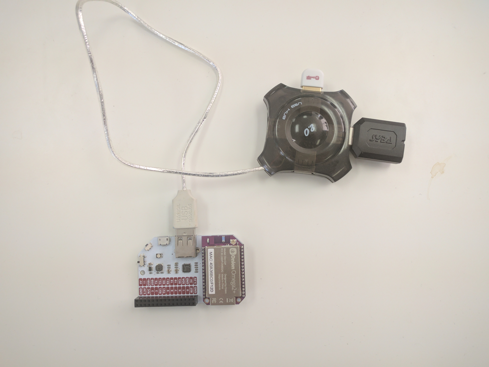
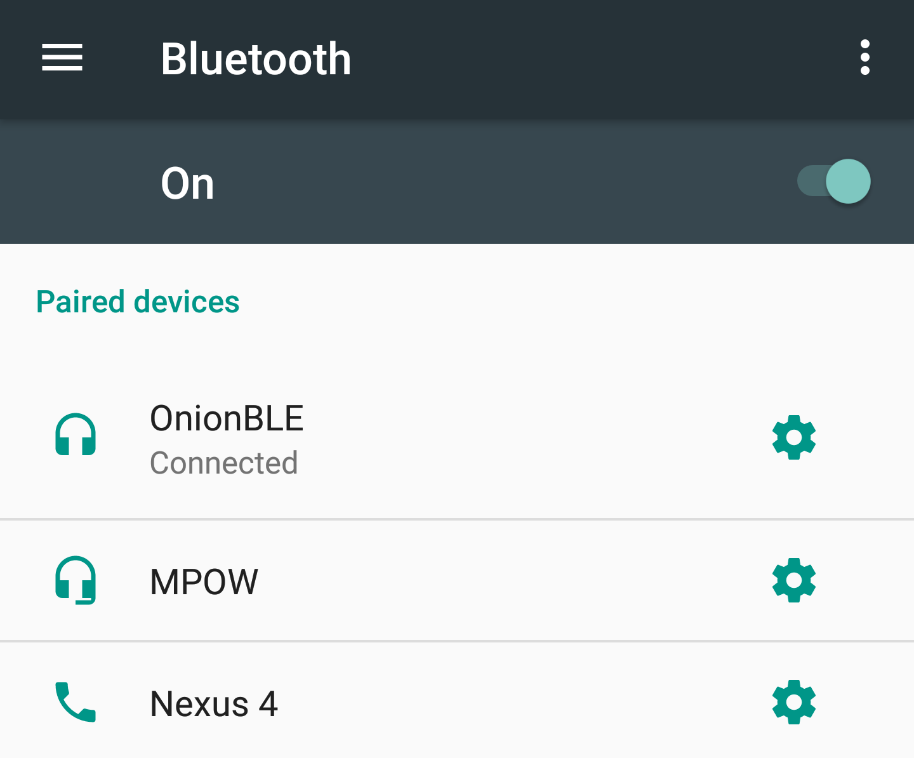
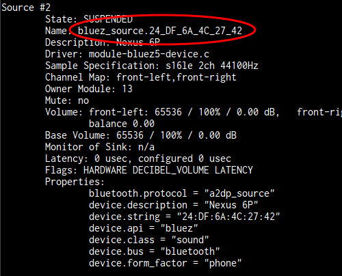

## Bluetooth Audio Streaming

The Omega can communicate with other devices using the Bluetooth Low Energy wireless protocol. In this project, we're going to turn it into a Bluetooth speaker that you can control from your phone or tablet!


### Overview

**Skill Level:** Intermediate

**Time Required:** 15 minutes

We'll first install the necessary Bluetooth and audio drivers. Then we'll learn how to pair Bluetooth devices with the Omega. Then we'll connect a speaker and play our favourite music!

### Ingredients

1. Onion Omega2 or Omega2+
1. Any Onion Dock with a USB host connector: Expansion Dock, Power Dock, Mini Dock, Arduino Dock R2
1. Onion Bluetooth Expansion
1. USB Audio Expansion, or any generic USB audio dongle
1. USB hub with at least 2 ports
1. Standard headphones or speakers with a 3.5mm audio jack

<!-- The Steps -->
### Step-by-Step

Here's how to turn your Omega into a Bluetooth speaker!

#### 1. Setup the Hardware

1. Connect the Omega to the Dock.
1. Plug in the USB hub to the large USB host port. 
1. Plug in the Bluetooth Expansion and USB Audio Expansion into the USB hub.
1. Do not connect your speaker just yet, as there will be loud popping and crackling when the USB Audio Expansion initializes!



After assembling all the components, turn on the Omega.

<!--# 2 -->

#### 2. Install Software

Connect to the Omega's command line and install the necessary packages by running the commands below:

```
opkg update
opkg install bluez-libs bluez-utils pulseaudio-daemon pulseaudio-tools alsa-lib alsa-utils
```

* The `bluez` packages are for controlling the Bluetooth radio.
* The `pulseaudio` and `alsa` packages are audio drivers for Linux.

#### 3. Setting Up the `pulseaudio` daemon

Run the following commands to initialize the daemon:

```
mkdir /run
udevd --daemon
chmod 0777 /dev/snd/*
mkdir -p /var/lib/pulse
pulseaudio --system --disallow-exit --no-cpu-limit &
```

##### After Rebooting

If you reboot the Omega, the daemon may still be running. Check using:

```
ps | grep pulse
```

If you see something like:

```
1124 pulse    10956 S <  /usr/bin/pulseaudio --system --disallow-exit --no-cp
```

Then it's running. You only need to run:

```
udevd --daemon
chmod 0777 /dev/snd/*
```

before moving to the next step again.

#### 4. Pairing the Omega to Your Bluetooth Device

Check that your Bluetooth Expansion is properly detected by the Omega by running:

```
hciconfig -a
```

You should see some lines with information about your device.


Run the following commands to turn on your Bluetooth Expansion:

```
hciconfig hci0 up
hciconfig hci0 sspmode enable
hciconfig hci0 piscan
```

Turn on Bluetooth on the device you wish to connect to the Omega. Then on the Omega, enter the `bluetoothctl` command to be taken into a new command prompt. Then run:

```
agent on
discoverable on
pairable on
scan on
```

You should see success messages, and a list of Bluetooth devices.


If you do not see these messages try removing the Bluetooth Expansion, rebooting your Omega, and trying again.

Take note of the device address you wish to pair, or copy it down in a text editor on your computer somewhere. In this example, the device's address is the string of numbers, letters, and colons in the red bubble above.

Then run:

```
pair YOURDEVICEADDRESS
```

It will then prompt you for a PIN to secure this connection. You can enter 0, 0000, 1234, or anything you like; make sure to remember it!


You should then get a prompt on your device asking you to connect to `OmegaBLE` and enter a PIN. Enter the PIN you just provided on the command line to finish connecting.


Complete the prompt on your device, then on the Omega run:

```
trust YOURDEVICEADDRESS
```

Your device has been **paired** with the Omega, meaning it can connect at any time. However, they are still not connected yet.

Now on your device, tap on the connection again and it should connect.



You can now quit the `bluetoothctl` program with the command:

```
quit
```

Check to make sure your device is still connected by running this command:

```
hcitool con
```

Your device should be listed. If you see nothing, try initiating the connection again from the remote device. If that doesn't work, go back to the previous step.


#### Set Up Audio Streaming From the Device

We will use a command called `pactl` to set up audio streaming from the Bluetooth connection to the USB Audio Expansion. First run:

```
pactl list sources
```

And look for the Source with `bluez_source` in the `Name` field. Copy that entire label down for later.



Substitute the `source` name into the following command:

```
pactl load-module module-loopback source=SOURCENAME sink=alsa_output.default rate=44100 adjust_time=0
```

The Omega is now ready to stream Bluetooth audio!

##### Using the Bluetooth Audio Streamer

Before plugging in your speaker, make sure the volume is set as low as possible. Then start playing music or audio on your device. Gradually turn up the volume on the speaker until you can hear it. And you're done!

