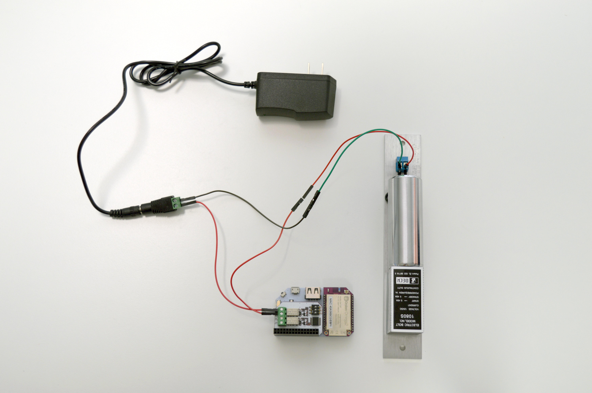
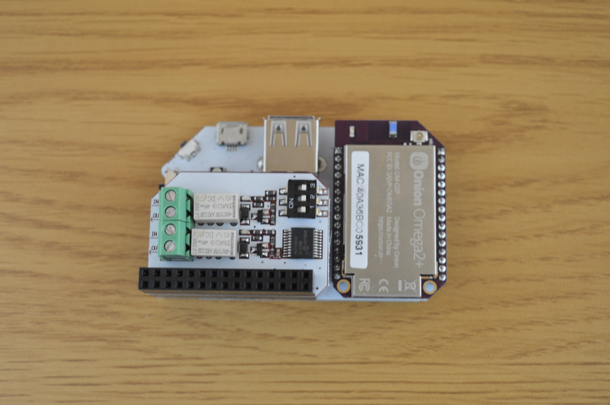
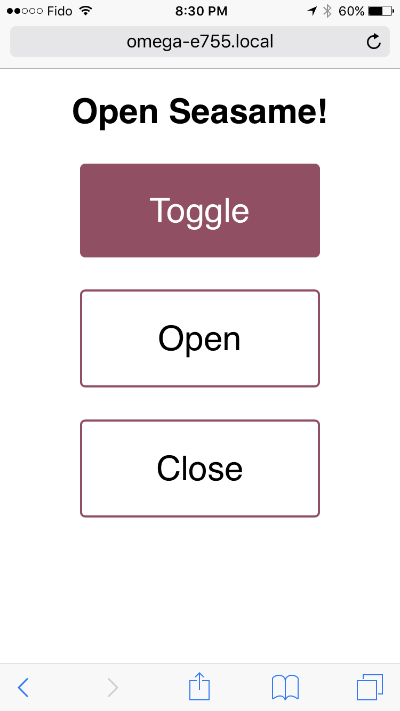

## IoT Lock {#internet-lock-p1}

Keys are so last year. With the Omega and the internet, we can unlock things with our keyboard or touchscreen!

In this project, we'll be building an electric lock system with the Omega:



In fact, we use this very setup to control a secondary lock at Onion HQ:


>Note: in fact, keys are still very useful. We still recommend you to use a normally-open lock and a key-lock in conjunction, as power failure will result in a fail-safe backup instead of locking you out.

**Disclaimer: This security-related project is just that, a *project*. This is not intended to be a fully-featured or robust home security solution. Use your own judgment when applying this project to securing your belongings, property, etc. By doing this project, you accept all risk and Onion cannot be held responsible for any damages or misuse.**

### Overview

**Skill Level:** Intermediate

**Time Required:** 1.5 hours

To accomplish this, we'll use the HTTP server, `uhttpd` on the Omega to listen for the unlock signal through a request and `cgi-bin` scripts to control the lock. When it's set up, we'll be able to to unlock by accessing a web page through a phone, a laptop, a tablet, a tv, anything!

The web page will allow us to:

* unlock
* lock
* toggle - unlock and then lock again after some time
	* If the lock is currently locked. If not, this action does nothing


### Ingredients

* Onion [Omega2](https://onion.io/store/omega2/) or [Omega2+](https://onion.io/store/omega2p/)

* Any Onion Dock that supports Expansions: [Expansion Dock](https://onion.io/store/expansion-dock/), [Power Dock](https://onion.io/store/power-dock/), [Arduino Dock 2](https://onion.io/store/arduino-dock-r2/)
* Onion [Relay Expansion](https://onion.io/store/relay-expansion/)
* An electric lock *
* Lock mounting tools - screws, bolts, extra wires, and appropriate tools
* Appropriate DC power supply for your lock
    * we found a [12V/1A DC power supply](https://www.amazon.com/gp/product/B019X3XVWS/ref=as_li_tl?ie=UTF8&camp=1789&creative=9325&creativeASIN=B019X3XVWS&linkCode=as2&tag=onion0e-20&linkId=7e3fcbbeb2bf474a33f4d68a7413fc21) to be compatible with most locks

\* We recommend a simple power locking, normally unlocked lock so you don't get locked out when there's no power.

Here's what our list looked like - minus the mounting tools and parts.


### Step-by-Step

Our instructions will be based on the recommended lock type. If you have an advanced electric lock with multiple settings, you can adjust the instructions as you see fit.

#### 1. Prepare

To get started, we need to set up the Omega and our lock.

First we need an Omega2 ready to go. If you haven't already, complete the [First Time Setup Guide](https://docs.onion.io/omega2-docs/first-time-setup.html) to connect your Omega to WiFi and update to the latest firmware.

Plug in the Relay Expansion, and that's it for the Omega.



#### 2. Test the lock

Next, read up on the operation of the lock of choice. Our code is based of a simple on/off switch system so it helps to know if it will work with your chosen lock.

It's a good idea to start with a simple circuit to test the hardware. Using a two-wire lock, we'll connect it to our power supply through the Relay Expansion.

>To set up the terminals on the Relay Expansion, turn the screw on the terminal counterclockwise until the metal clamp inside is sitting a bit less than halfway in the bottom of the housing, not too much or the screw might pop out.
>The screw terminal on the barrel jack adapter is a bit different, it will rise and sink depending on the clamp position. When the screw is roughly flush with the top, it is open. To close it, turn clockwise until the screw sinks to about halfway, or until it becomes difficult to continue turning.

* First, connect the **negative (ground) terminal** (usually the black wire) of the lock to the **negative (ground) terminal** of the power supply.
* Next, connect the **positive terminal** of your supply to the **IN** screw terminal of Channel 0 on the Relay Expansion
* Finally, connect the **positive (power) terminal** (usually red) to the **OUT** screw terminal of Channel 0 on the Relay Expansion.


Once the lock is wired, connect to the Omega's [command line](https://docs.onion.io/omega2-docs/connecting-to-the-omega-terminal.html#connecting-to-the-omega-terminal) and then switch on the relay:

```
relay-exp -i 0 on
```

If the lock's state changes, you're all set to continue! Before proceeding, Yyu can disable the lock with:

```
relay-exp -i 0 off
```


#### 4. Plan out the Lock Placement

Before getting to software, you should make sure the lock chosen can be mounted to the door with good fit. Take some measurements and plan out the wiring and placement of the Omega/supply so we can quickly follow through once the software is ready to go.

*Measure twice, cut once.*


#### 5. Mount the lock

Now that the pieces work together, it's time to mount your lock! Keep all the components powered off, and take the testing rig apart


>At Onion HQ, we've extended the wiring of the lock and routed it to an Omega and power supply right next to the door, but depending on the situation, you may have to do something completely different.

#### 6. Download the Project Code

The code for this project can be found in Onion' [`iot-door-lock` repository](https://github.com/OnionIoT/iot-door-lock) on GitHub. We'll use [`git` to download the code to your Omega](https://docs.onion.io/omega2-docs/installing-and-using-git.html): navigate to the `/root` directory on the Omega, and clone the GitHub repo:

```
opkg update
opkg install git git-http ca-bundle
cd /root
git clone https://github.com/OnionIoT/iot-door-lock.git
```

>If your lock has more modes/controls, feel free to take a look at the code (specially `www/cgi-bin/door.sh`) and make changes that control your lock more effectively.


#### 7. Adjust the Code for your Lock

The code assumes two things:

* That the lock in use is a normally closed lock
	* ie when there is no current (the Relay Expansion channel is off) the lock will be in the **locked** state
* When toggling the lock, it assumes a delay of **24 seconds** between unlocking and locking again

To adjust either of the above, you'll need to edit the `www/cgi-bin/door.sh` script:
* To change the Relay Expansion channel values for the lock, adjust the `LOCKED` and `UNLOCKED` variables
* To change the delay between unlocking and locking during a toggle, adjust the `TOGGLE_TIME` variable


#### 8. Serve the Lock Webpage

In order to serve up the webpage that we'll use to send the lock commands, copy the contents of the `www` directory of the project directory to the `/www` directory on your Omega, and you should be good to go!

```
cp -r iot-door-lock/www/ /
```

> By virtue of `uhttpd`, the HTTP server running on the Omega, all of the files in the `/www` directory will be served up as a website.

### Using the IoT Lock

Now the truly IoT part, using the IoT Lock!

1. Connect your Omega to your WiFi network, or connect your computer to the Omega's WiFi network.
1. In a web browser, navigate to `omega-ABCD.local/lock.html`, where `ABCD` is the last 4 digits on the sticker on the Omega.
	* On some Android and PC devices, the `omega-ABCD.local` address doesn't always work. Follow our [guide on finding your Omega's IP Address](https://docs.onion.io/omega2-docs/finding-omega-ip-address.html) and use the IP address instead of `omega-ABCD.local` when connecting the web interface. It will be something along the lines of `192.168.1.109/lock.html`
1. Hit any of the buttons to carry out the action indicated
	* As a refresher, we can Toggle the lock (unlock momentarily and then lock again), unlock it, or lock it




### Bonus: Automatically Lock & Unlock

To make this truly useful & automated, we can schedule when the IoT lock will unlock and lock using the `cron` Linux utility!

Check out the cron example that sets up the lock to turn on and off at 11AM and 6PM respectively but only on weekdays:

```
0 11 * * 1,2,3,4,5 sh /www/cgi-bin/door.sh unlock
0 18 * * 1,2,3,4,5 sh /www/cgi-bin/door.sh lock
#
```

> This is included in the project code repo as `crontab.txt`

Here's a quick overview of cron job definitions work:

```
# * * * * *  command to execute
# ┬ ┬ ┬ ┬ ┬
# │ │ │ │ │
# │ │ │ │ │
# │ │ │ │ └───── day of week (0 - 7) (0 to 6 are Sunday to Saturday, or use names; 7 is Sunday, the same as 0)
# │ │ │ └────────── month (1 - 12)
# │ │ └─────────────── day of month (1 - 31)
# │ └──────────────────── hour (0 - 23)
# └───────────────────────── min (0 - 59)

# The hash (#) denotes a comment that will be ignored
```

So the first line specifies that the lock will be unlocked at 11am on weekdays, and the second line specifies that it will be locked at 6pm on weekdays.

To apply this scheduling to your IoT lock, type `crontab -e` to add a task to the `cron` daemon, it will open a file in vi, enter in the command listed up above. Then restart the `cron` daemon for the changes to take effect:

```
/etc/init.d/cron restart
```

Great! Your IoT lock now runs on a schedule!


> Check out the Omega documentation for more info on [using `cron`](https://docs.onion.io/omega2-docs/running-a-command-on-a-schedule.html)


### Going Further

While this is really useful, [next](#internet-lock-p2) we'll make the lock react to Tweets from authorized users, so you can lock and unlock your IoT lock from anywhere, and even give access to your friends!
