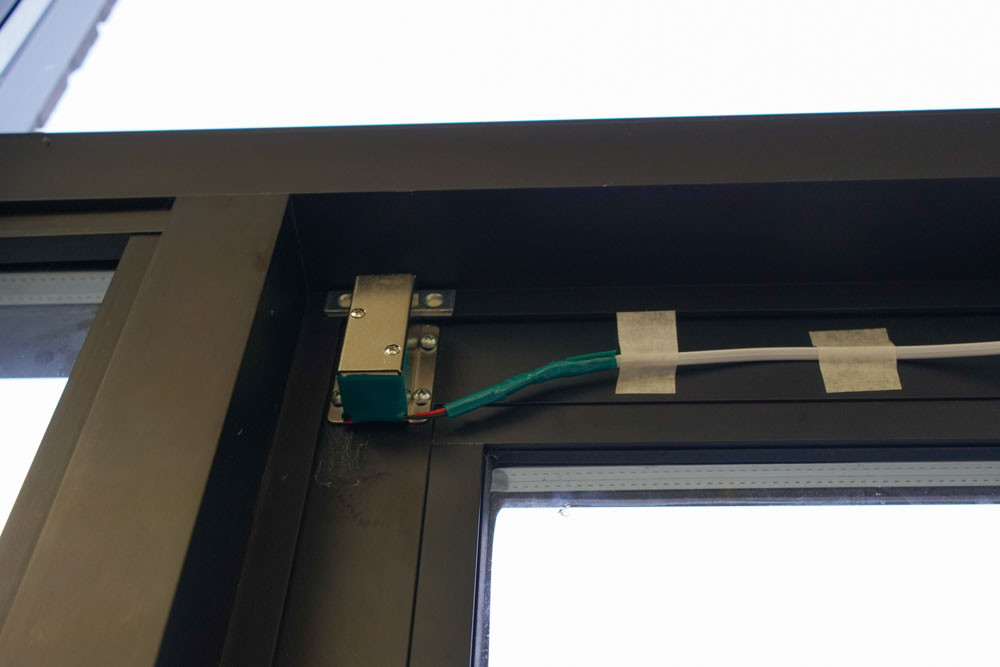
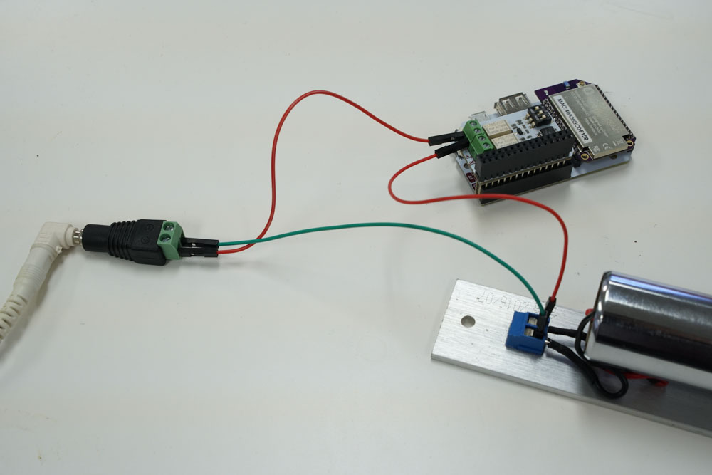

## Internet Lock - Part 1{#internet-lock-p1}


// TODO: update this title

Keys are so last year. With the internet, we can unlock things with our keyboard!


Here's a setup we've placed in Onion HQ:



>Note: in fact, keys are still very useful. We still recommend you to use a normally-open lock and a key-lock in conjunction, as power failure will result in a fail-safe backup instead of locking you out.

<!-- DONE: Disclaimer about security and how this is a project, not a full-blown home security solution. Use your own judgement on applying this project to securing your belongings, residence, etc. User accepts all risk and Onion cannot be held responsible. -->

**Disclaimer: This security-related project is just that: a *project*. This is not intended to be a fully-featured nor robust home security solution. Use your own judgment when applying this project to securing your belongings, property, etc. By doing this project, you accept all risk and Onion cannot be held responsible for any damages or misuse.**

### Overview

**Skill Level:** Intermediate

**Time Required:** 1.5 hours

<!-- // go into some detail here about how we're going to be implementing the project //	eg. which programming language we'll be using, APIs //	include links to any api or module references -->

To accomplish this, we'll use the HTTP server on the Omega to listen for the unlock signal through a request. When it's set up, we'll be able to to unlock by accessing a web page through a phone, a laptop, or a kerosene powered toaster.


### Ingredients

<!-- // a numbered list of all physical items used to make this project -->
<!-- //	all items should be linked to a place online where they can be bought -->
<!-- //	the Onion items should be linked to their corresponding Onion store page -->

1. Onion Omega2 or Omega2+
1. Any Onion Dock that supports Expansions: Expansion Dock, Power Dock, Arduino Dock 2
1. Onion Relay Expansion
1. An electric lock *
1. Lock mounting tools - screws, bolts, extra wires, and appropriate tools
1. Appropriate power supply for your lock
    * we found 12V/1A DC supply to be compatible with most locks

\* We recommend a simple power locking, normally unlocked lock so you don't get locked out when there's no power.

<!-- // DONE: picture of ingredients all together -->

Here's what our list looked like - minus the mounting tools and parts.


### Step-by-Step

Our instructions will be based on the recommended lock type. If you have an advanced electric lock with multiple settings, you can adjust the instructions as you see fit.

<!-- // each step should be simple -->

#### 1. Prepare the ingredients

To get started, we need to set up the Omega and our lock.

First we need an Omega2 ready to go. If you haven't already, complete the [First Time Setup Guide](https://docs.onion.io/omega2-docs/first-time-setup.html) to connect your Omega to WiFi and update to the latest firmware.

Plug in the Relay Expansion, and that's it for the Omega.

Next, read up on the operation of the lock of choice. Our code is based of a simple on/off switch system so it helps to know if it will work with the chosen lock.

#### 2. Test the lock

It's a good idea to start with a simple circuit to test the hardware. Using a two-wire lock, we'll connect it to our power supply through the Relay Expansion.

* First, connect the `GND` wire (usually the black wire) of the lock to the ground terminal of your power supply.
* Next, connect the power wire (red) to the 'OUT' terminal of Channel 0 on the Relay Expansion.
* Finally, connect the power terminal of your supply to the 'IN' terminal of Channel 0 on the Relay Expansion

<!-- // DONE: lock+relay+omega picture -->



Once the lock is wired, connect to the Omega's [command line](https://docs.onion.io/omega2-docs/connecting-to-the-omega-terminal.html#connecting-to-the-omega-terminal) and then try to switch the relay:

```
relay-exp -i 0 1
```

If it works, you're all set to continue!

#### 4. Plan out the mounting

Before getting to software, you should make sure the lock chosen can be mounted to the door with good fit. Take some measurements and plan out the wiring and placement of the Omega/supply so we can quickly follow through once the software is ready to go.


#### 5. Setting up the code

The code used to handle this setup can be found in the [iot-door-lock repository](https://github.com/OnionIoT/iot-door-lock) on GitHub. Download the repo and copy the contents of the `www` folder to the `/www` directory on your Omega, and you should be good to go!

>If your lock has more modes/controls, feel free to take a look at the code (specially `door.sh`) and make changes that control your lock more effectively.

#### 6. Mount the lock

Now that the pieces work together, it's time to mount your lock! Keep all the components powered off, and take the testing rig apart

<!-- // DONE: example picture of mounting a lock -->


>At Onion HQ, we've extended the wiring of the lock and routed it to an Omega and power supply right next to the door, but depending on the situation, you may have to do something completely different.

#### 5. Automatically lock/unlock

We've also included a crontab example (`crontab.txt`) in the repo that sets up the lock to turn on and off at 11AM and 6PM respectively.

Here's a quick overview of how it works:

```
# * * * * *  command to execute
# ┬ ┬ ┬ ┬ ┬
# │ │ │ │ │
# │ │ │ │ │
# │ │ │ │ └───── day of week (0 - 7) (0 to 6 are Sunday to Saturday, or use names; 7 is Sunday, the same as 0)
# │ │ │ └────────── month (1 - 12)
# │ │ └─────────────── day of month (1 - 31)
# │ └──────────────────── hour (0 - 23)
# └───────────────────────── min (0 - 59)

# The hash (#) denotes a comment that will be ignored
```


<!-- ### Bonus Points! -->

<!-- // one or two paragraphs (max) about something cool we did in the code -->
<!-- //	just give a brief description/overview and provide links to where they can learn more (Onion Docs, online resources, etc) -->

<!-- // TODO: Bonus points -->
