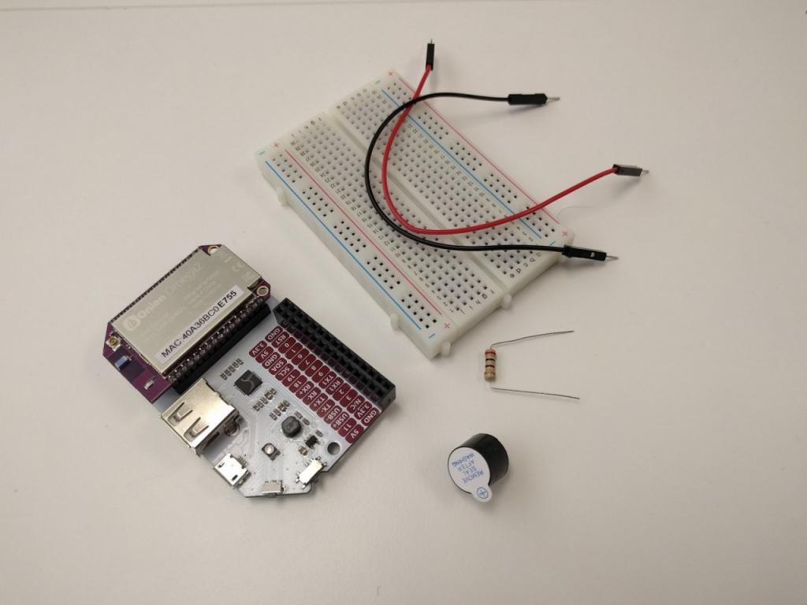
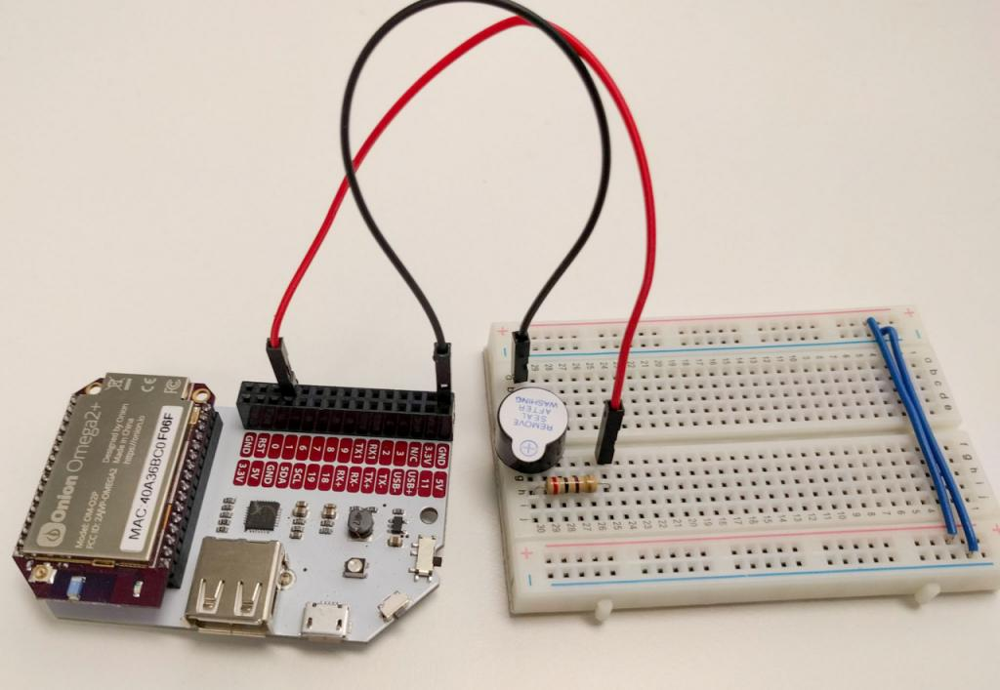
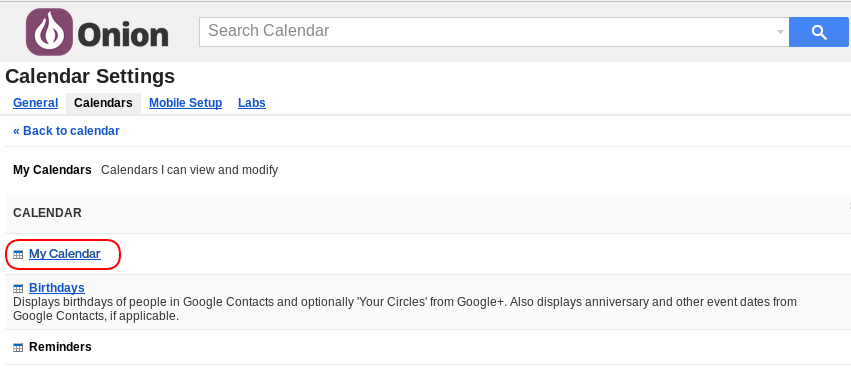

## iCalendar Buzzer Alarm 


This project will set up a buzzer alarm by automatically pulling calendar data from a source of your choice.

### Overview

**Skill Level:** Advanced

**Time Required:** 45 minutes

This project requires an online calendar source in addition to the ingredients below. We'll be using Google calendar in our Step-By-Step, but you can pick any compatible iCalendar source.

The complete project code can be found in Onion's [`iot-gcal-alarm` repo on GitHub](https://github.com/OnionIoT/iot-gcal-alarm).


### Ingredients

1. Onion Omega2 or Omega2+
1. Any Dock with expansion headers
1. A breadboard (optional, but recommended)
1. 1x 100Ω Resistor
1. Buzzer
1. 2x Jumper wires (M-M)





### Step-by-Step

Follow these instructions to setup the Smart Plant project on your very own Omega!


#### 1. Prepare

You'll have to have an Omega2 ready to go, complete the [First Time Setup Guide](https://docs.onion.io/omega2-docs/first-time-setup.html) to connect your Omega to WiFi and update to the latest firmware.


#### 2. Install Required Software on the Omega

[Connect to the Omega's Command line](https://docs.onion.io/omega2-docs/connecting-to-the-omega-terminal.html#connecting-to-the-omega-terminal-ssh) and install Python as well as some of the packages we need:

```
opkg update
opkg install python python-pip
```

We'll need python packages that aren't available in the LEDE repository. To install, we'll use `pip` instead of `opkg`:

``` 
pip install setuptools
pip install urllib3 python-crontab icalendar
```

First we'll install `setuptools` - a requirement for our other packages.

`urllib3` will help connect to our calendar source. `icalendar` will help parse the calendar data, and `crontab` will allow us to create and remove cron jobs for our alarm.


#### 3. Build the Buzzer Circuit

To keep it straightforward, the buzzer will be powered directly by a GPIO. We'll build it on our breadboard for ease of setup. Feel free to do some soldering or electrical tape if you'd like a more compact alarm.

1. Plug the Buzzer across the channel of your breadboard.
1. Using a jumper, connect the negative end of the buzzer (the pin WITHOUT a plus sign) to a `GND` pin on the expansion headers
1. Plug in a 100Ω current limiting resistor across the (+) row of the buzzer and an empty row.
1. Finally, connect the resistor to GPIO1 on the expansion headers.

Once we're done, it should look a little like this:




#### 4. Download the Project Code

The code for the Calendar Alarm can be found in Onion's [iot-gcal-alarm repo](https://github.com/OnionIoT/iot-gcal-alarm) on Github. You can either use git to clone it to your Omega:

```
cd /root
git clone https://github.com/OnionIoT/iot-gcal-alarm.git
```

Or use wget to download the three files directly to your Omega
```
cd /root
wget https://raw.githubusercontent.com/OnionIoT/iot-gcal-alarm/master/iotGcalAlarm.py https://raw.githubusercontent.com/OnionIoT/iot-gcal-alarm/master/config.json https://raw.githubusercontent.com/OnionIoT/iot-gcal-alarm/master/config.json
```

Now all of the code will be in the new `/root/iot-gcal-alarm/` directory on your Omega.

#### 5. Find Your Calendar

The calendar can be any calendar you wish, but for the events to be recognized, they have to include `SET_BUZZER` string in the event's title. More specifically, the 'SUMMARY' field of the iCalendar event.

We'll use a Google calendar as an example.

First, go to the settings page of your calendar:


Then navigate to the 'Calendars' tab in the settings page. Here, click which calendar your event will be in:


The green 'ICAL' button next to 'Private Address' will be a direct link to your up-to-date calendar in the `.ics` format - this is it! To get the link, right click, and hit the 'Copy Link Location' button.


Open up `config.json` from the repo, and paste the link as the value to the "icalAddr" key - replacing `your-calendar-address`.

#### 6. Run the Code

Let's run the code!

```
python /root/iot-gcal-alarm/iotGcalAlarm.py
```

The script will read the calendar data from your source, and add a cron job for every event in the future with the keyword `SET_BUZZER`. It will also clear any cron jobs that have already been run - only for up to a year, since cron does not keep track of year data.


### Code Highlight

<!-- // one or two paragraphs (max) about something cool we did in the code -->
<!-- //	just give a brief description/overview and provide links to where they can learn more (Onion Docs, online resources, etc) -->
