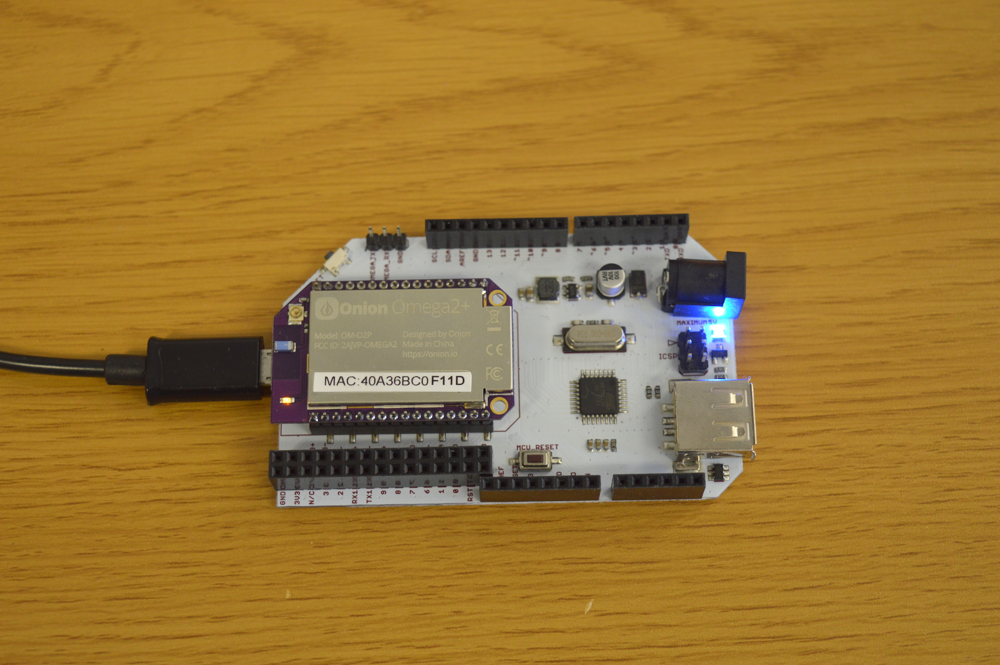
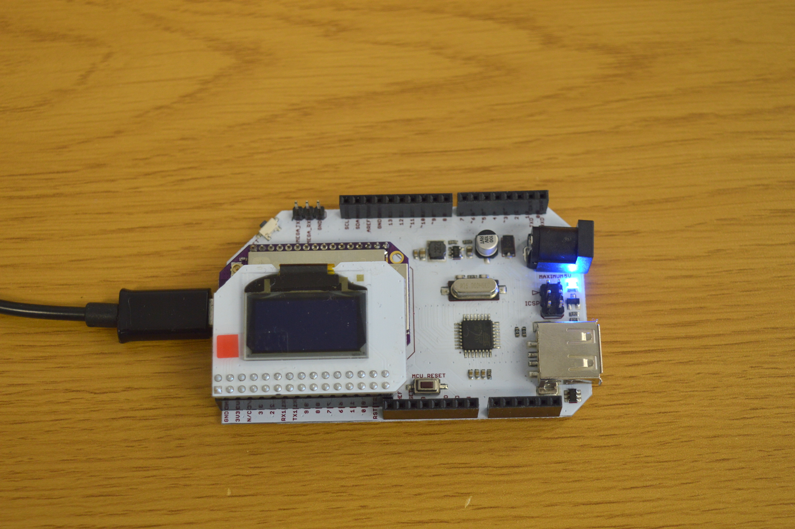
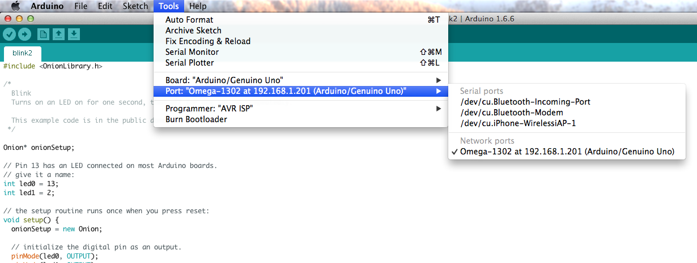
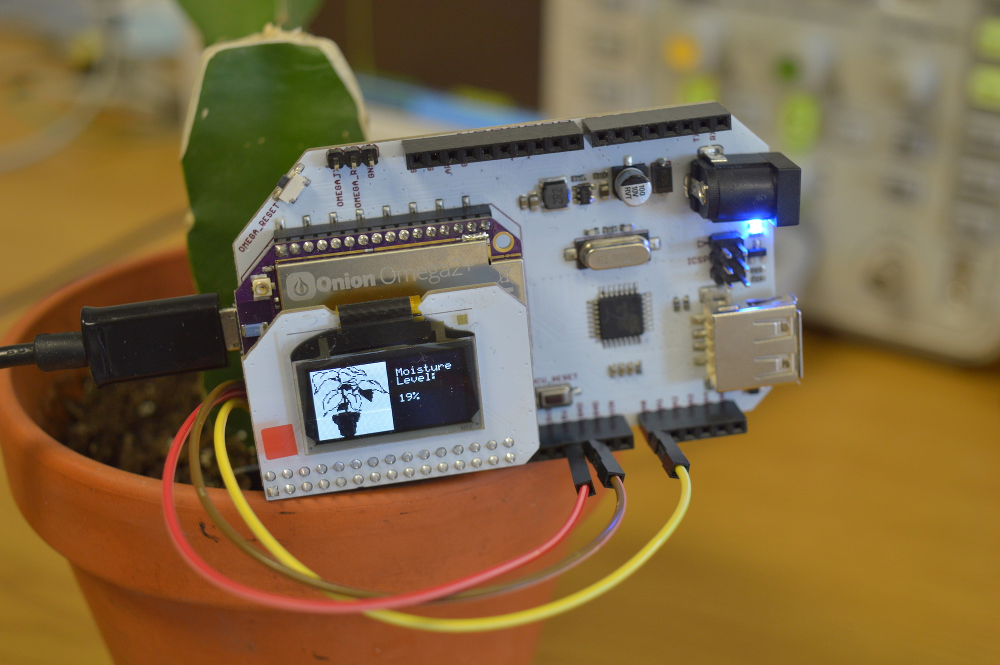

## Smart Plant - Part 1

This is the first part of a multi-step project where we'll make on of your plants smart! For now, we'll measure and display the soil moisture level of your plant.


### Overview

**Skill Level:** Beginner-Intermediate

**Time Required:** 45 minutes

We'll be using the Arduino Dock to read the analog measurement from a soil moisture sensor. The code is written in Python and makes use of the UART1 serial port on the Omega to communicate with the Arduino Dock's microcontroller. We're also using [Onion's `pyOledExp` module](https://docs.onion.io/omega2-docs/oled-expansion-python-module.html) to provide control of the OLED Expansion.

The complete project code can be found in Onion's [`smart-plant` repo on GitHub](https://github.com/OnionIoT/smart-plant).


### Ingredients

1. Onion Omega2 or Omega2+
1. Onion Arduino Dock 2
1. Onion OLED Expansion (optional but recommended)
1. Soil Moisture Sensor
1. 3x Male-to-Female Jumper Wires


### Step-by-Step

Follow these instructions to setup the Smart Plant project on your very own Omega!


#### 1. Prepare

You'll have to have an Omega2 ready to go, complete the [First Time Setup Guide](https://docs.onion.io/omega2-docs/first-time-setup.html) to connect your Omega to WiFi and update to the latest firmware.



Once that's done, plug in your OLED Expansion:



#### 2. Install Required Software on the Omega

[Connect to the Omega's Command line](https://docs.onion.io/omega2-docs/connecting-to-the-omega-terminal.html#connecting-to-the-omega-terminal-ssh) and install Python as well as some of the packages we need:

```
opkg update
opkg install arduino-dock-2 python python-pyserial pyOledExp git git-http ca-bundle
```

The `arduino-dock-2` package installs all the software required to interact with and flash the Arduino Dock. We're also installing the `python` programming language and `python-pyserial`, a module that will allow us to communicate with the microcontroller via the `UART1` serial port.

The `git`, `git-http`, and `ca-bundle` packages will allows us to download the project code form GitHub.

#### 3. Arduino IDE Setup

If you don't already have it, install the [Arduino IDE](https://www.arduino.cc/en/Main/Software) on your computer. Then follow [our instructions](https://docs.onion.io/omega2-docs/flash-arduino-dock-wirelessly.html) to enable the Arduino IDE to wirelessly flash the Arduino Dock 2.



#### 4. Flash the Arduino Dock's Microcontroller

<!-- TODO: adding Onion Library to Arduino IDE needs to be linked to an article on how this can be accomplished  -->

First we'll need to add the Onion Library to your Arduino IDE. Then we'll upload one of the example sketches from the library to the microcontroller on your Arduino Dock.

Go to File -> Examples -> Onion -> Read Analog Value

<!-- TODO: screenshot of selecting the Onion example sketch -->

This sketch will read the signal on Analog pin A0 and will transmit the value via serial if the correct command is received from the other end.

Select your Omega from the listed Network Ports when you open the Tools menu and then Port:

<!-- TODO: screenshot of the above -->

> If your Omega doesn't show up in the list of Network Ports, run `/etc/init.d/avahi-daemon restart` and it should show up in about 15 seconds.


#### 5. Connect the Sensor

There's three connections we'll have to make to wire up the soil moisture sensor to your Arduino:


Use jumper wires to make the following connections:

| Soil Moisture Sensor Pin | Arduino Dock Pin |
|--------------------------|------------------|
| GND                      | GND              |
| VCC                      | 5V               |
| SIG                      | A0               |

> Depending on where you got your sensor, the labelling might be a little different, but they should all follow the same sort of pattern as above.

Plug in the female ends of the jumper wires into the sensor:


And then the male ends of the jumper wires into the appropriate Arduino Dock pins.

#### 6. Sensor -> Plant

To be able to measure the moisture level of the plant's soil, we'll need to put the sensor into the pot!


Insert the sensor into the soil so that the metallic parts are completely covered by the soil.

> The sensor isn't super water-proof, when watering your plant, avoid pouring water directly on the sensor.


#### 7. Download the Project Code

The code for the Smart Plant can be found in Onion's [smart-plant repo](https://github.com/OnionIoT/smart-plant) on Github. We'll use [`git` to download the code to your Omega](https://docs.onion.io/omega2-docs/installing-and-using-git.html): navigate to the `/root` directory on the Omega, and clone the GitHub repo:

```
cd /root
git clone https://github.com/OnionIoT/smart-plant.git
```

Now all of the code will be in the new `/root/smart-plant/` directory on your Omega.

#### 8. Run the Code

Let's run the code!

```
python /root/smart-plant/smartPlant.py --oled
```

The program will run and collect a moisture level measurement through the Arduino Dock about once a minute and displayed on the command line as well as the OLED Expansion:

```
root@Omega-F11D:~# python /root/smart-plant/smartPlant.py --oled
> Latest measurement:  201
 > Measurement List: 19%
 >> Average Value: 19%
> Latest measurement:  200
 > Measurement List:  19%  19%
 >> Average Value: 19%
> Latest measurement:  201
 > Measurement List:  19%  19%  19%
 >> Average Value: 19%
> Latest measurement:  202
 > Measurement List:  19%  19%  19%  19%
 >> Average Value: 19%
 ```



If you don't have an OLED Expansion, leave out the `--oled` part of the command.

> The soil moisture sensor is an analog sensor, meaning that the signal it outputs to the Arduino Dock is anywhere from 0V to 5V. The microcontroller sketch will read this as a value between 0 and 1023, where 0 represents 0V and 1023 represents 5V. This number isn't particularly meaningful to us, so on the Omega, we convert it to a percentage. If you take a look at the above example, the first reading is 201, 201/1023*100% is 19%. And 19% is what we display on the OLED.


##### Changing the Program Operation

> This part is optional!

To avoid fluctuations, the value from the moisture level sensor is averaged out from the previous 15 readings. This number can be changed with the **command line arguments** that are passed when the program is run.

To have the value averaged out from the 3 latest readings, that is, to make it more reactive to changes, run the following command:

```
python /root/smart-plant/smartPlant.py --oled --number=3
```

If you would like to make the readings less reactive to changes, we can also have the value averaged out from the last 60 readings:

```
python /root/smart-plant/smartPlant.py --oled --number=60
```

##### Exiting the Program

Hit 'ctrl+c' to end the program. You'll notice that the OLED will change so that you know your smart plant is now just a regular plant:


#### 9. Automate the Program to Run at Boot

To make sure your plant is always smart, we can configure the system so that the smart plant program runs whenever the Omega boots up.

Open the `/etc/rc.local` file using the Vi editor: `vi /etc/rc.local`. Hit `i` and paste in the command we used to launch the smart plant program:

```
root@Omega-F11D:~# python /root/smart-plant/smartPlant.py --oled
```

Make sure you put this in before the `exit 0` line. Hit `esc` and type `:wq` to save and close the file.

Try rebooting your Omega (enter `reboot` in the command line), and you'll see that your program will start up again when the Omega boots up.


### Code Highlight

// one or two paragraphs (max) about something cool we did in the code
//	just give a brief description/overview and provide links to where they can learn more (Onion Docs, online resources, etc)
