<!-- comment: anything in triangle brackets is meant to be replaced with text -->
<!-- comment: see `Omega2/Projects/oled/twitter-feed.md` for an example -->

## Smart Plant - Part 3 {#smart-plant-p3}

// brief intro to the project

// include a photo of the final result

### Overview

**Skill Level:** [Beginner|Intermediate|Advanced]

**Time Required:** <a time estimate to complete the project>

// go into some detail here about how we're going to be implementing the project
//	eg. which programming language we'll be using, APIs
//	include links to any api or module references

### Ingredients

// a numbered list of all physical items used to make this project
//	all items should be linked to a place online where they can be bought
//	the Onion items should be linked to their corresponding Onion store page

1. Onion Omega2 or Omega2+
1. Any Onion Dock that supports Expansions: Expansion Dock, Power Dock, Arduino Dock 2
1. Onion OLED Expansion

### Step-by-Step

Follow these instructions to set this project up on your very own Omega!

// each step should be simple

#### 1. Prepare

You'll have to have an Omega2 ready to go, complete the [First Time Setup Guide](https://docs.onion.io/omega2-docs/first-time-setup.html) to connect your Omega to WiFi and update to the latest firmware.

#### 1. Complete the Previous Parts of the Project

This project builds on the first and second parts of the Smart Plant project. If you haven't already completed the [first part](#smart-plant-p1) and [second parts](#smart-plant-p2), go back and do them now now!

#### 1. Login to Losant

#### 1. Create a New Losant Workflow

We'll need to create a new workflow ... TODO: complete this

Click on the `Workflows` menu and then `Create Workflow`. Give your workflow a name and a description:

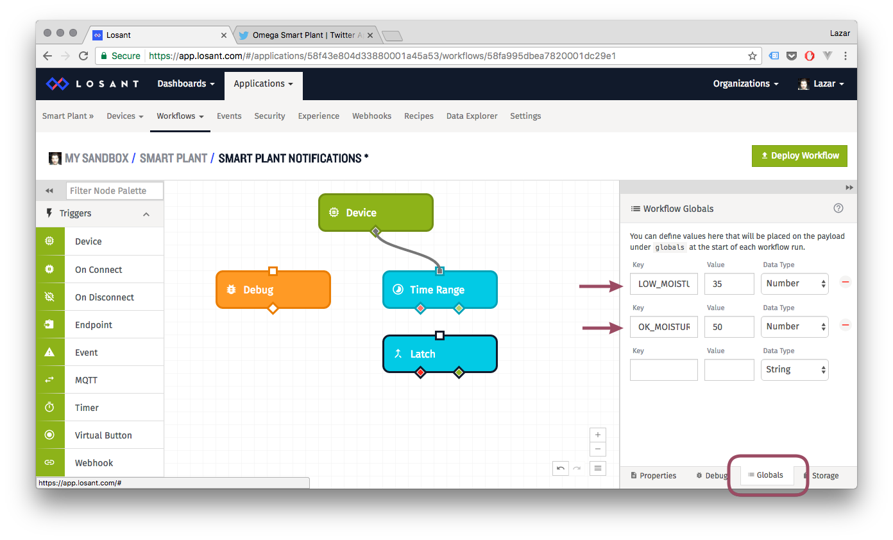

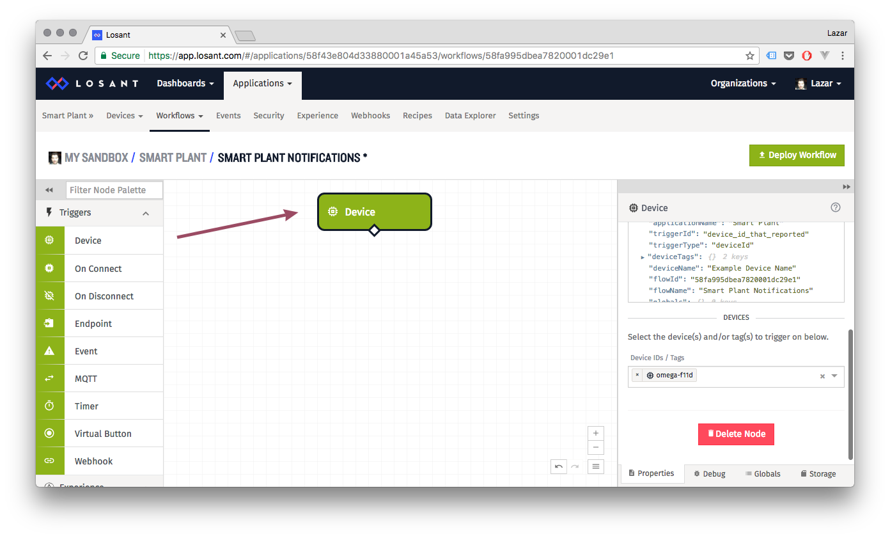

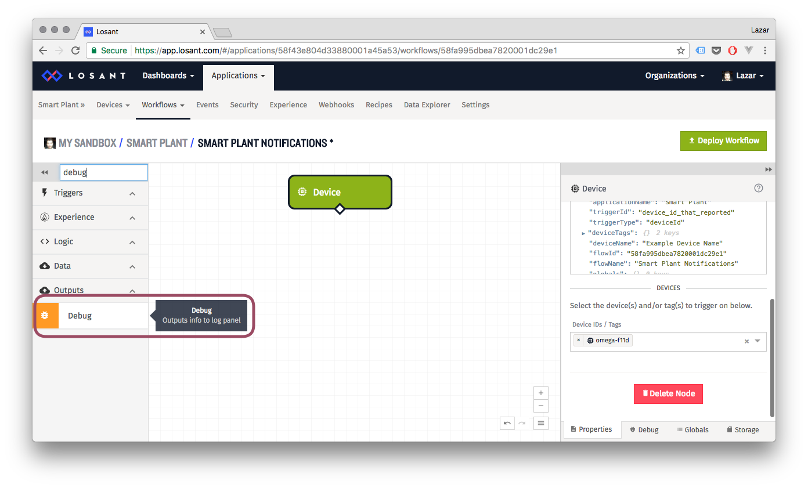

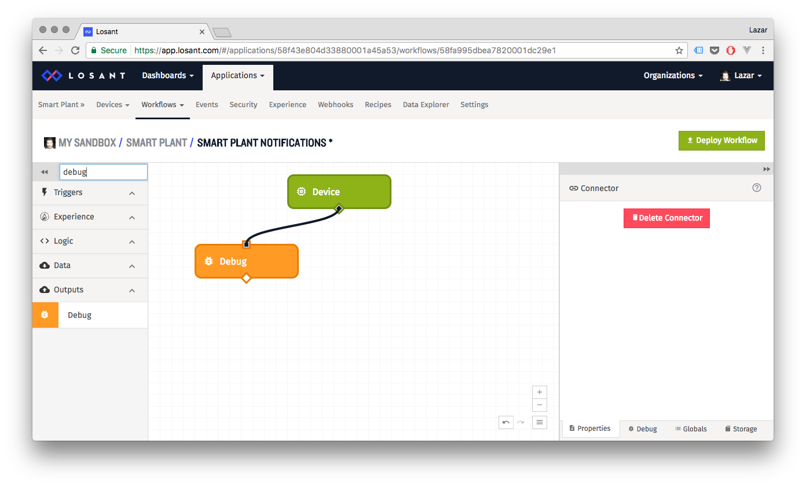

#### 1. Create a Twitter Application

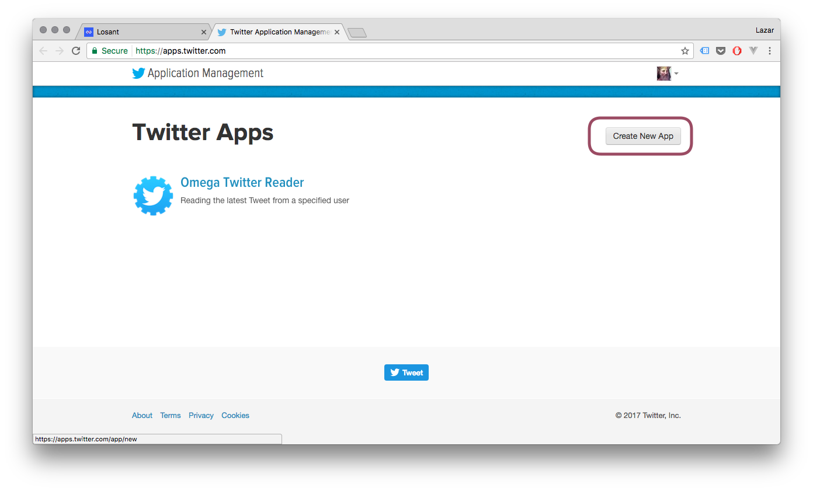

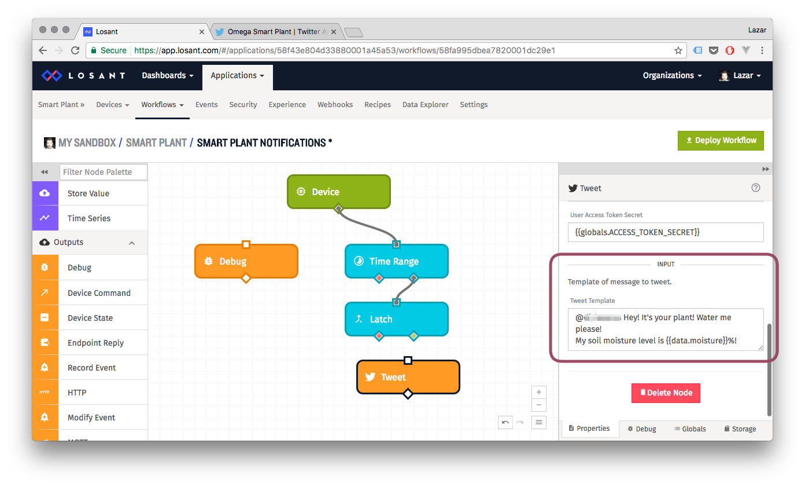

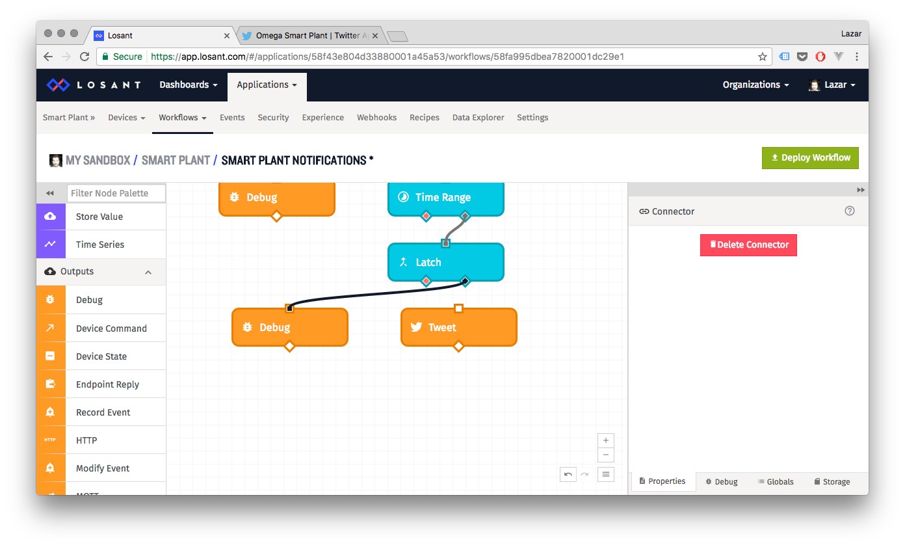

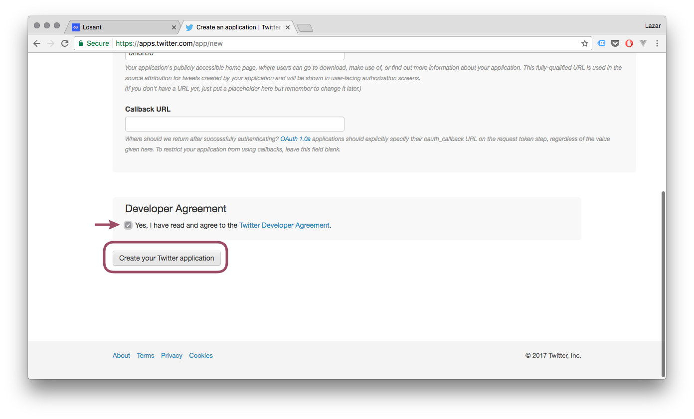

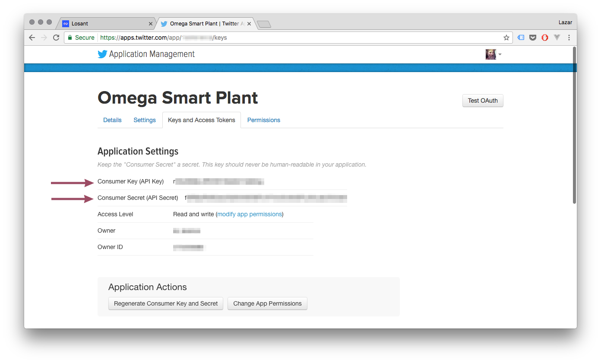

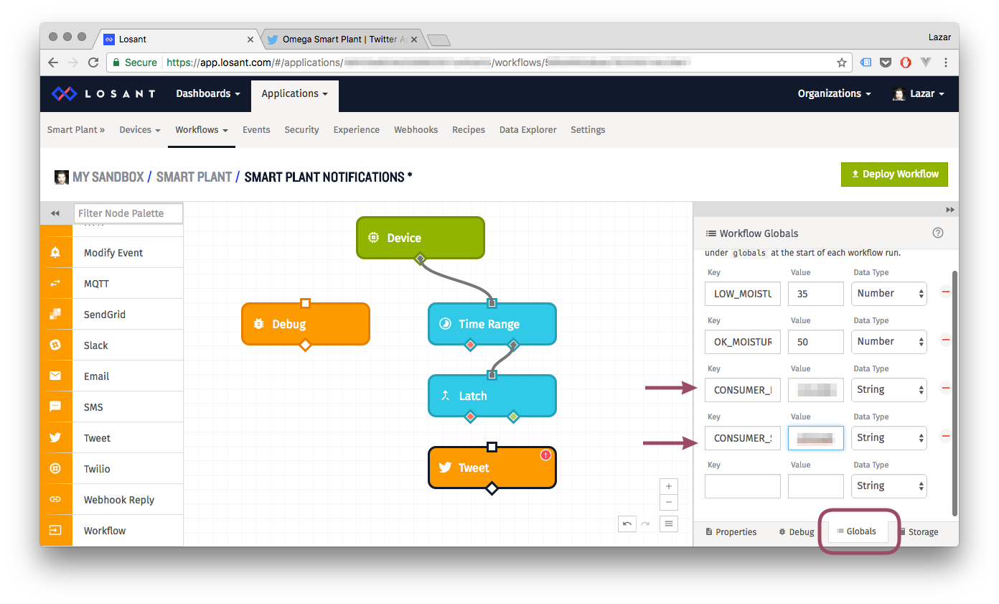

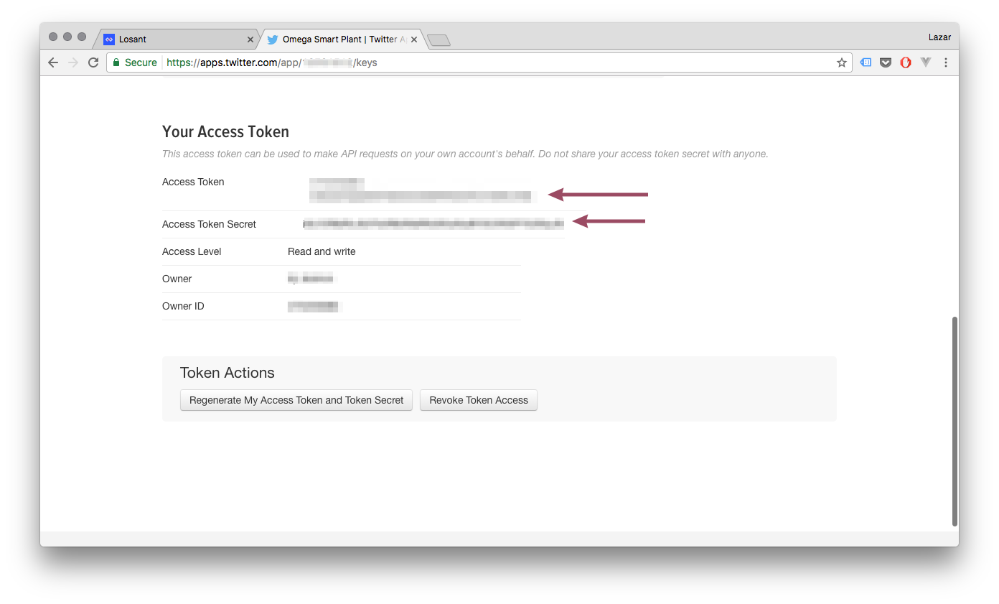

#### 1. Test Tweeting

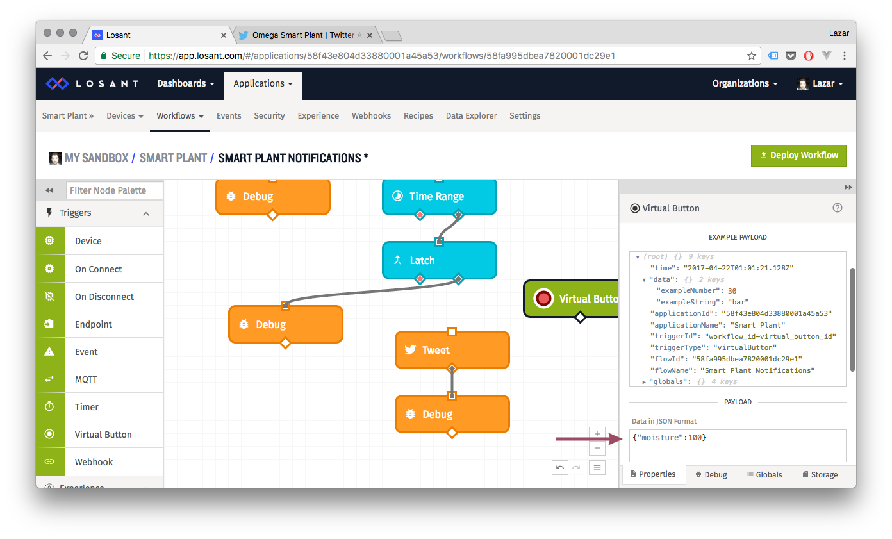

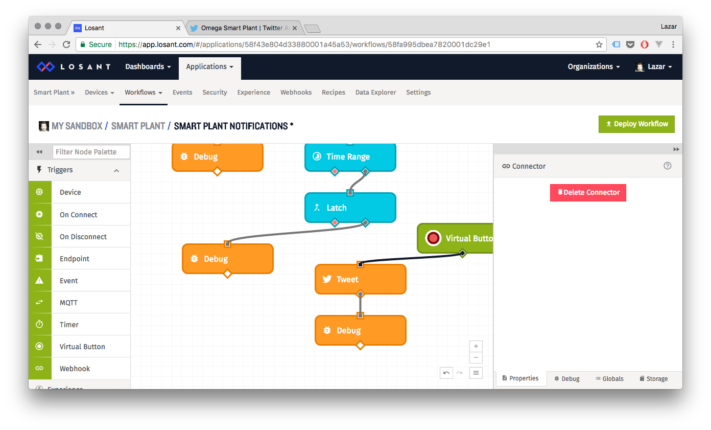

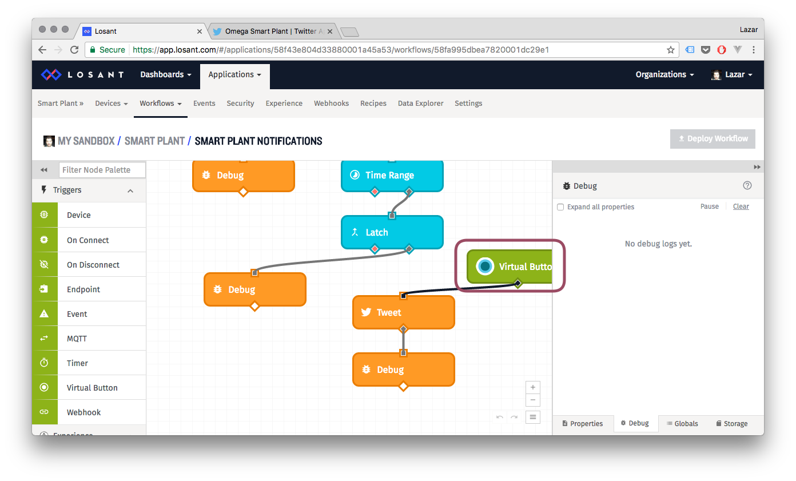

#### 1. Complete the Workflow

### Code Highlight

// one or two paragraphs (max) about something cool we did in the code
//	just give a brief description/overview and provide links to where they can learn more (Onion Docs, online resources, etc)
