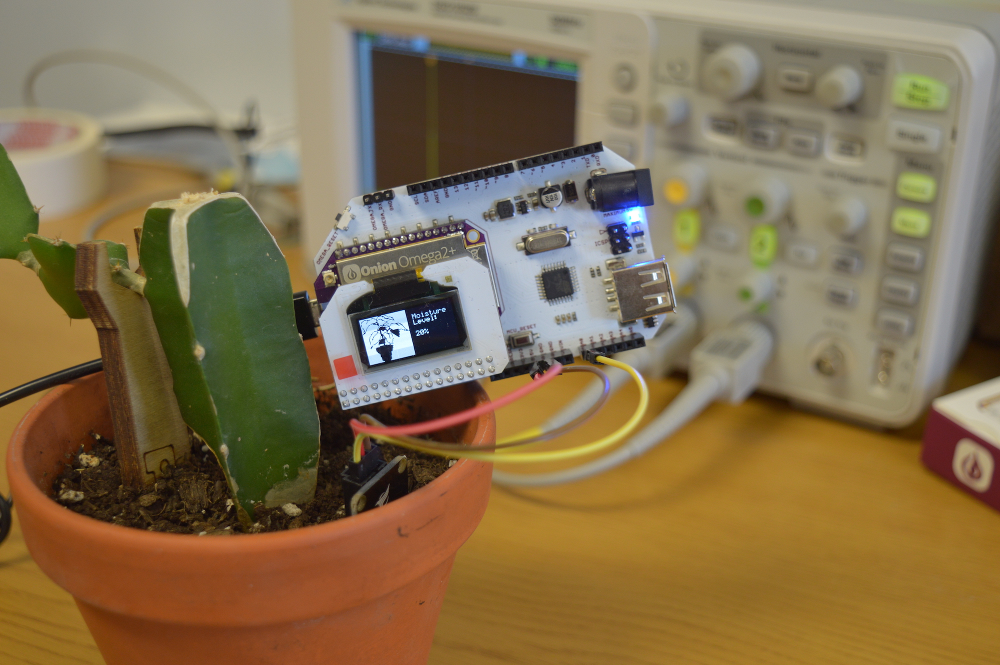
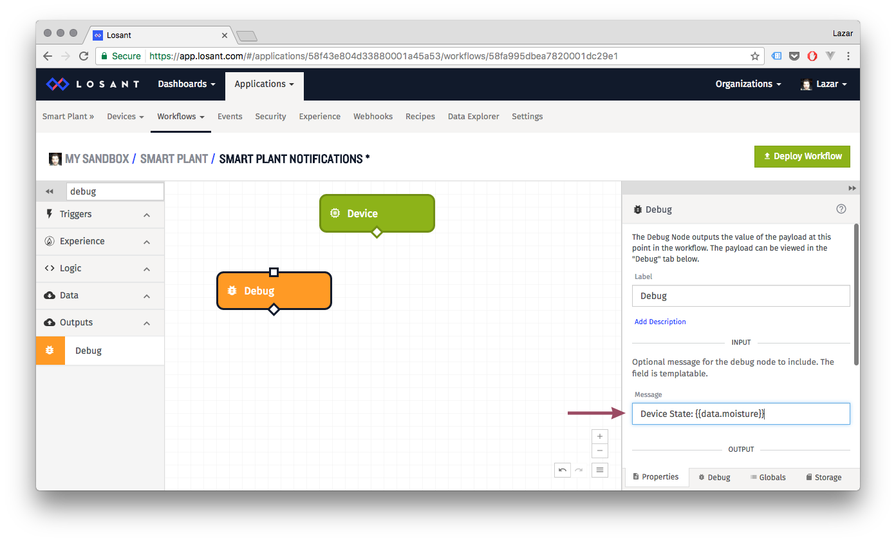
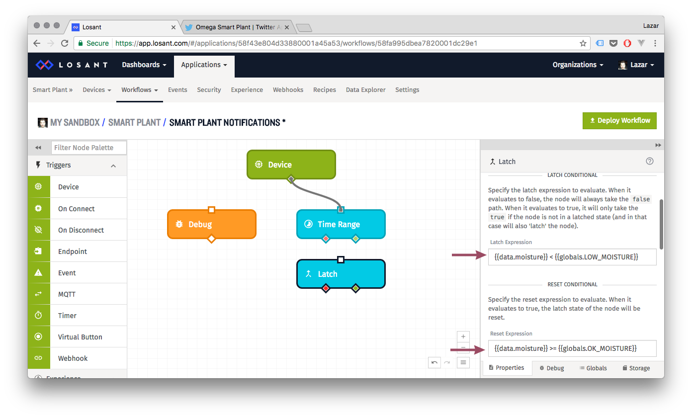
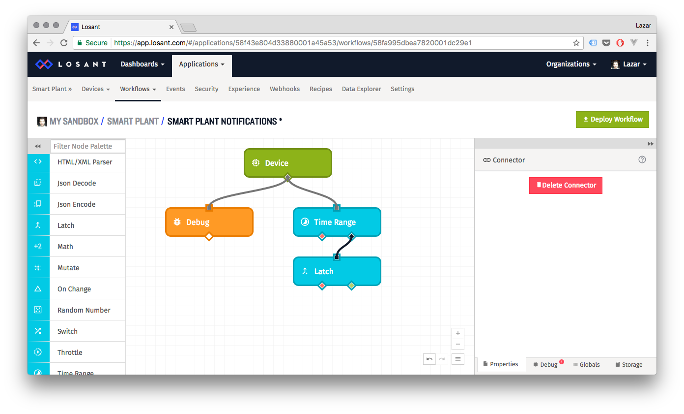
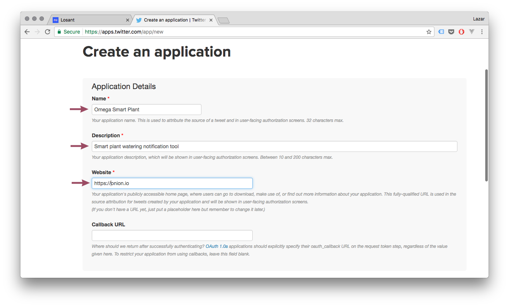
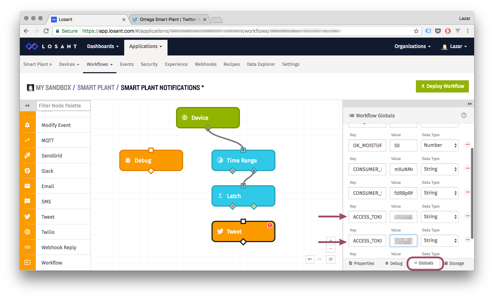
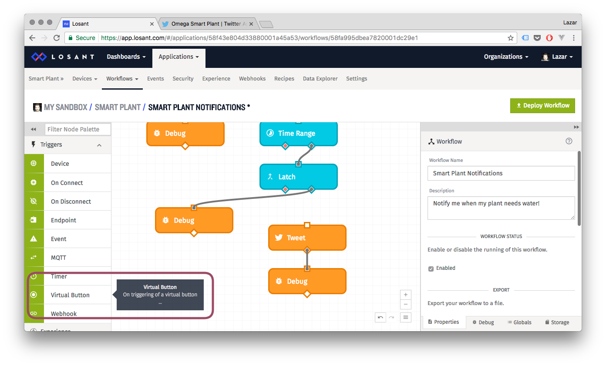

## Smart Plant - Twitter Alerts {#smart-plant-p3}

<!-- // DONE: lol, this first sentence is lame. change it to a proper intro -->
<!-- // if it's so lame, what's a better way of saying it then? -->

Give your plant a voice of its own with Twitter! In part three, we'll build on what we've created in part [one](#smart-plant-p1) and [two](#smart-plant-p2) to get our plant to Tweet at us based on the moisture data collected.

### Overview

**Skill Level:** Intermediate

**Time Required:** 25 minutes

To accomplish this, we'll create a Losant workflow to read and check the moisture data from the Omega, then send a Tweet using Losant's Twitter integration. To get there, we'll create an App on Twitter to allow Losant to send Tweets.

### Ingredients

The same as the first part of the project:

* Onion Omega2 or Omega2+
* Arduino Dock 2
* Onion OLED Expansion
* Soil Moisture Sensor
* 3x Male-to-Female Jumper Wires


### Step-by-Step

Follow these instructions to set this project up on your very own Omega!

<!-- // DONE: enumerate the steps correctly (when you're done all of the others) -->

#### 1. Prepare

You'll have to have an Omega2 ready to go, complete the [First Time Setup Guide](https://docs.onion.io/omega2-docs/first-time-setup.html) to connect your Omega to WiFi and update to the latest firmware.


#### 2. Complete the Previous Parts of the Project

This project builds on the first and second parts of the Smart Plant project. If you haven't already completed the [first part](#smart-plant-p1) and [second parts](#smart-plant-p2), go back and do them now!



#### 3. Login to Losant

Head over to [Losant.com](https://www.losant.com/) and log in.

#### 4. Losant Workflow: First Things

We'll need to create a new **workflow** to let our plant Tweet at us.

Click on the `Workflows` menu and then `Create Workflow`. Give your workflow a name and a description:


Add a `Device` block just like before:


Make sure the device is pointing to the Omega connected to our plant.


#### 5. Losant Workflow: Debugging Node

Let's drop in a `Debug` block to check our moisture data is being properly received:


We'll add in a message to print out the moisture level:



And make the connection:


#### 6. Losant Workflow: Time Window

It would defeat the purpose and be be pretty annoying if our plant sent us a notification asking to be watered in the middle of the night. We'll use the `Time Range` node to make sure our notifications go out only during the day. Check out [Losant's `Time Range` node documentation](https://docs.losant.com/workflows/logic/time-range/) for more info.

Pull out a Time Range node from the sidebar to get started:


As always, the options provided by the node can be found in the right panel. We've set the node to allow the flow to continue if the time is between 9:00 to 21:00 (9am and 9pm) every day, feel free to decide what times work for your plant. Don't forget to set your Time Zone!


#### 7. Losant Workflow: Check Moisture

Once we have our time window set up, we'll have to check for moisture!

<!-- // DONE: need a better description for the latch node, see the losant docs for a better idea of what this node does: https://docs.losant.com/workflows/logic/latch/ -->

The `Latch` node is used to perform a task a single time when a condition has been fulfilled. The node will not perform the task again until another condition has been achieved; kind of like a reset switch. It can be used for things such as one-time notifications. Check out [Losant's `Latch node` documentation](https://docs.losant.com/workflows/logic/latch/) for more details.


For example, you can use it to send a single alert when a moisture sensor has dropped below 20%, and not send any more alerts until the level has risen back above 40%.

<!-- // DONE: link to losant docs: https://docs.losant.com/workflows/logic/latch/, see time range step for example -->

Each Latch node has two required conditions:

* The 'Latched' condition - when evaluates to `true`, triggers a following node **once and only once** until it has been reset.
* The 'Reset' condition - when evaluates to true, resets the 'Latched' condition so that it may trigger a node again.

<!-- // DONE: find a way to work in the names of the two conditions, Latch Condition and Reset Condition

// DONE: explain that until the reset condition is met, the node cannot be triggered again even if the Latch Condition is met -->


Let's create some global variables to dictate the moisture levels we'll use to trigger the latch and to reset it. By using global variables, it's easy for us to later experiment with different moisture levels and then ensure that the values get updated throughout the entire workflow. Create a `LOW_MOISTURE` variable to trigger the latch and a `OK_MOISTURE` variable to reset the latch:


Once the global variables are setup, they can be used in the `Latch` node:



Now that it's set up, we'll connect the `Latch` to the `Time Range` node. Make sure to connect to the `Time Range` node's `true` path. This is the path that will be active if the current time is within our previously defined time range:



#### 7. Losant Workflow: Twitter Event

The goal of this project is to get our plant to Tweet us. So when the `Latch` triggers, we definitely want it to send off a Twitter event.

Luckily for us, Losant provides a `Tweet` node! Check out [Losant's `Tweet` node documentation](https://docs.losant.com/workflows/outputs/tweet/) for more info.

<!-- // DONE: link to losant docs: https://docs.losant.com/workflows/outputs/tweet/, see time range step for example -->


Taking a look at the properties, it looks like we'll need to register an App with Twitter so we can obtain an API key and User Access Token to send Tweets:


#### 8. Create a Twitter Application

It's time to pay Twitter a visit!

Login to Twitter with the account of your choice. Feel free to create a new one - your plant is special, after all!

When you're in, visit https://apps.twitter.com where we'll be able to create a new App to access Twitter's APIs:


Give it a name, a description, and a website. The website can really be anything you wish - it will be used by Twitter to give credit and send users for more information.



>Feel free to link it to this project!

Agree to the Twitter Developer Agreement - read it over if you can - and hit the Button to create your App!


Welcome to your Twitter App!

Now let's go and get what we came for: the API keys. Navigate to the 'Keys and Access Tokens' tab:


And you'll be greeted with your Consumer Key and Consumer Secret:


>If you think your keys have fallen into the hands of **evil**, you can always regenerate a new pair here. The old ones will no longer be useable at all when you do this, so take care with the regenerate button.

Copy the keys and head back to your workflow. Create `CONSUMER_KEY` and `CONSUMER_SECRET` global variables to hold the values:


Once the keys are in, it's time to generate Access Tokens. Head back to Twitter and create a new access token:


Note the token values:


Just like with the consumer key and secret, create `ACCESS_TOKEN` and `ACCESS_TOKEN_SECRET` global variables in the Losant Workflow to hold the Access Token values:



Now we can put the keys into the Twitter node by referencing the global variables:


Come up with something you think your plant would say:


And the Twitter Node is ready for action!

As good practice, let's put in a debug message so we can easily see in the Debug Log when a Tweet should have been sent out:


And connect it to the same trigger that will fire the Tweet - the moisture level Latch:


#### 8. Test Tweeting

It's a good idea to test out smaller pieces first. So let's make sure that our `Tweet` node works as intended.

First, set up a debug message to follow up on the Tweet event:


Connect it to the `Tweet` node, this will let us know that a Tweet was attempted by Losant - successfully or not.

Now let's add a `Button` node so we can trigger the Tweet event on demand for testing:



The button needs a payload to send to the node it triggers.

The payload we used is this json string:
```
{"moisture":100}
```

Looking something like this:


Connect the button to the `Tweet` node and Deploy the Worflow:


And hit that sucker!


We can see the 'Tweet Sent!' Message in the debug log:


And then check Twitter for the actual tweet:


Looks like the Twitter node is working as expected!


#### 9. Complete the Workflow

Now that we're done testing the Tweet node, let's delete the `Button` block and finish the Workflow. Connect the `Twitter` Node to the `true` path of the `Latch` node:


This ensures the `Twitter` node will be activated (just once) when the Latch condition is true, that is, when the soil moisture level drops below the value we set for the `LOW_MOISTURE` global variable. Note that because of the `Latch`, the `Twitter` node will not be activated again until the plant is watered enough so that the soil moisture level rises above the value set for the `OK_MOISTURE` global variable.

Now Deploy the workflow and we're done!


### Going Further

<!-- // DONE: complete this section, tease a few more things you can do with the losant workflow 'Send an email, send an SMS Text Message, even send a command to a device' ... wouldn't it be nice if we could tell the Omega to water the plant for us? <Teaser for the next part> -->

You can extend the Losant workflow to send more types of notifications, such as an SMS text message, email, or even a command to another device. But wouldn't it be nice if we could tell the Omega to water the plant for us?

