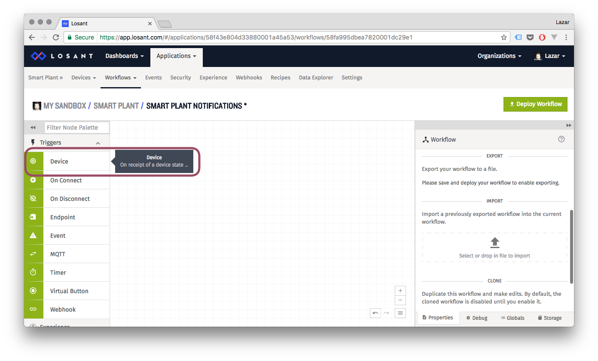
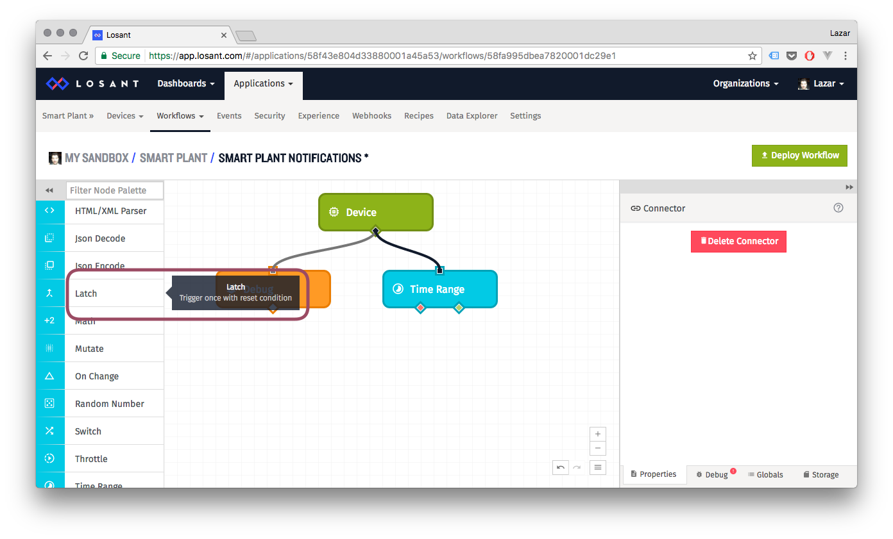
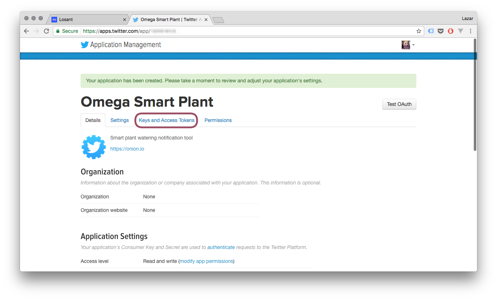
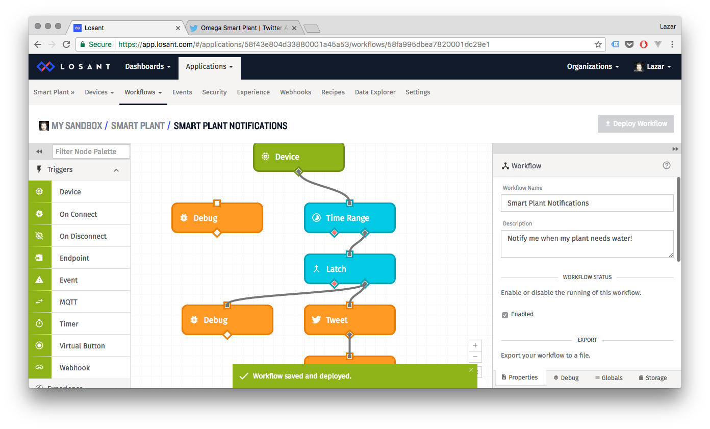

<!-- comment: anything in triangle brackets is meant to be replaced with text -->
<!-- comment: see `Omega2/Projects/oled/twitter-feed.md` for an example -->

## Smart Plant - Part 3 {#smart-plant-p3}

<!-- // brief intro to the project
// include a photo of the final result -->

Welcome to Smart Plant 3: The Tweetening! In part three, we'll build on what we've created in part [one](#smart-plant-p1) and [two](#smart-plant-p2) to get our plant to Tweet at us based on the moisture data collected.

### Overview

**Skill Level:** Intermediate

**Time Required:** 25 minutes

<!-- // go into some detail here about how we're going to be implementing the project
//	eg. which programming language we'll be using, APIs
//	include links to any api or module references -->

To accomplish this, we'll create a Losant workflow to read and check the moisture data from the Omega, then send a tweet using Losant's Twitter integration. To get there, we'll create an App on twitter to allow Losant to send Tweets.

### Ingredients

<!-- // a numbered list of all physical items used to make this project
//	all items should be linked to a place online where they can be bought
//	the Onion items should be linked to their corresponding Onion store page -->

1. Onion Omega2 or Omega2+
1. Arduino Dock 2
1. Onion OLED Expansion
1. Soil Moisture Sensor
1. 3x Male-to-Female Jumper Wires


### Step-by-Step

Follow these instructions to set this project up on your very own Omega!

<!-- // each step should be simple -->

#### 1. Prepare

You'll have to have an Omega2 ready to go, complete the [First Time Setup Guide](https://docs.onion.io/omega2-docs/first-time-setup.html) to connect your Omega to WiFi and update to the latest firmware.


#### 1. Complete the Previous Parts of the Project

This project builds on the first and second parts of the Smart Plant project. If you haven't already completed the [first part](#smart-plant-p1) and [second parts](#smart-plant-p2), go back and do them now now!

#### 1. Login to Losant

Head over to `https://www.losant.com/` and log in or register.

#### 1. Losant Workflow: First Things

We'll need to create a new workflow to let our plant Tweet at us.

Click on the `Workflows` menu and then `Create Workflow`. Give your workflow a name and a description:


Add a device just like before:



Make sure the device is pointing to the Omega connected to our plant.


#### 1. Losant Workflow: Debugging Node

Let's drop in a debug block to check our moisture data is being properly received:


We'll add in a message to print out the moisture level:


And make the connection:


#### 1. Losant Workflow: Time Window

Of course, we don't need to track our plants all the time. Losant's 'Time Range' node will set a time window for the workflow to have effect.

Pull out a Time Range node from the sidebar to get started:


As always, the options provided by the node can be found in the right panel. We've set the node to check if the time is between 9:00 to 21:00, feel free to decide what times work for your plant.


#### 1. Losant Workflow: Check Moisture

Once we have our time window set up, we'll have to check for moisture!

The 'Latch' node is quite useful when dealing with cases where a value needs to switch on and off at different signals.



Each Latch node has two required conditions - one to trigger the 'Latched' state, and the other to reset it.


We'll need to create some globals to dictate the moisture level that will trigger a response, and when to reset:


Once we have our globals, we can reference the moisture level against them in the Latch node properties:


Now that it's set up, we'll connect the Latch to the Time Range node at the 'true' connection point. This makes the Latch and anything that it may trigger active between 9:00 and 21:00.


#### 1. Losant Workflow: Twitter Event

The goal of this project is to get our plant to tweet us. So when the Latch triggers, we definitely want it to send off a Twitter event.

How fortunate that Losant provides a 'Tweet' node!


Taking a look at the properties, it looks like we'll need to register our App with Twitter so we can obtain API keys to send Tweets.

So let's create four globals to represent each of the keys required to send Tweets through Losant:


#### 1. Create a Twitter Application

It's time to pay Twitter a visit!

Login to Twitter with the account of your choice. Feel free to create a new one - your plant is special, after all!

When you're in, visit `apps.twitter.com` where we'll be able to create a new App to access Twitter's APIs:


Give it a name, a description, and a website. The website can really be anything you wish - it will be used by Twitter to give credit and send users for more information.


>Feel free to link it to this project!

Agree to the Twitter Developer Agreement - read it over if you can - and hit the Button to create your App!


Welcome to your Twitter App!

Now let's go and get what we came for: the API keys.

Navigate to the 'Keys and Access Tokens' tab:



And you'll be greeted with your Consumer Key and Consumer Secret:


>If you think your keys have fallen into the hands of **evil**, you can always regenerate a new pair here. The old ones will no longer be useable at all when you do this, so take care with the regenerate button.

Copy the keys and head back to your workflow to fill out their respective global variables:


Once the keys are in, it's time to generate Access Tokens.

Head back to the Twitter tab and create a new access token:


Just as with the consumer key and secret, copy the Access Token and Access Token Secret over to the Losant Workflow:


Now we can put the keys into the Twitter node by referencing our globals:


Come up with something you think your plant would say:


And the Twitter Node is ready for action!

As good practice, let's put in a debug message to notify when a tweet should be sent:


And connect it to the same trigger that will fire the Tweet - the moisture level Latch:


#### 1. Test Tweeting

It's a good idea to test out smaller pieces first. So let's make sure that our Tweet node works as intended.

First, set up a debug message to follow up on the Tweet event:


This will let us know that a Tweet was attempted by Losant - successfully or not.

Now let's create a Button node so we can trigger the Tweet event on demand:


The button needs a payload to send to the node it triggers.

The payload we used is this json string:
```
{"moisture":100}
```

Looking something like this:


Connect the button to the Tweet node:


And hit that sucker!


Here's the results in Losant and on twitter:


Looks like the Twitter node is working as expected!


#### 1. Complete the Workflow

To finish off, we'll attach the Twitter node to its intended trigger - our moister Latch - and hit deploy:


Done!




### Code Highlight

// one or two paragraphs (max) about something cool we did in the code
//	just give a brief description/overview and provide links to where they can learn more (Onion Docs, online resources, etc)
