## Smart Plant - Automatic Plant Watering {#smart-plant-p4}

<!-- // DONE: brief intro to the project -->

<!-- // DONE: include a photo of the final result -->

Now that our plant can tweet at us, let's see if we can have our plant water itself! For this project, we'll add a water pump to our work in [Smart Plant Part 3](#smart-plant-p3) so we can automate the watering process.

<!-- // TODO: this photo shows the sensor disconnected... retake it ;-; -->


### Overview

**Skill Level:** Intermediate

**Time Required:** 1 Hour

<!-- // DONE: explanation of what we're doing in this project: -->
<!-- // * using a Relay Expansion to switch a water pump on and off -->
<!-- // * enabling another option in the program (make sure to mention to link to the `pyRelayExp` module documentation) -->
<!-- // * physical pump and watering setup -->
<!-- // * creating a workflow send commands to your omega to calibrate our plant watering -->
<!-- // * add device command to our previous workflow to automatically water the plant -->

For this project, we'll be using the Relay Expansion to control a water pump, enabling our smart plant to water itself! To do that, we'll build a circuit to power the water pump, and use the [Relay Expansion Python Module](https://docs.onion.io/omega2-docs/relay-expansion-python-module.html) to control the pump with a script.

Once our pump works as expected, we'll build a new Losant **workflow** to test it out. Finally, we'll add it to the Losant workflow we've built in [Smart Plant Part 3](#smart-plant-p3) to get our plant to water itself!

The complete project code can be found in Onion's [`smart-plant` repo on GitHub](https://github.com/OnionIoT/smart-plant).

### Ingredients

We'll need all of the same materials as in the previous part:

1. Onion Omega2 or Omega2+
1. Arduino Dock 2
1. Onion OLED Expansion
1. Soil Moisture Sensor
1. 3x Male-to-Female Jumper Wires

And some new ingredients:

1. Onion Relay Expansion
1. DC Barrel Jack Adapter
1. [Water Pump (12V DC)](http://www.canadarobotix.com/index.php?route=product/search&search=pump)
1. 3x Male-to-Male Jumper Wires
1. 12V 1A DC Power Supply
1. Flexible Plastic Tubing
    * Make sure to match the tubing's **inner** diameter (ID) is slightly less than the pump's ports' **outer** diameter (OD). This is so the tubing will stretch and grip the ports, preventing any leaks!
    * [This mini water pump's](http://www.canadarobotix.com/pump/2033) ports have a 0.34 inch OD, and we found vinyl tubing with 0.25 inch ID provides a great seal when coupled together.

Tools:

1. Flat-head screwdriver

<!-- DONE: find water pump from a US retailer -->
<!-- DONE: add specific tubing -->

<!-- DONE: ingredients photo -->
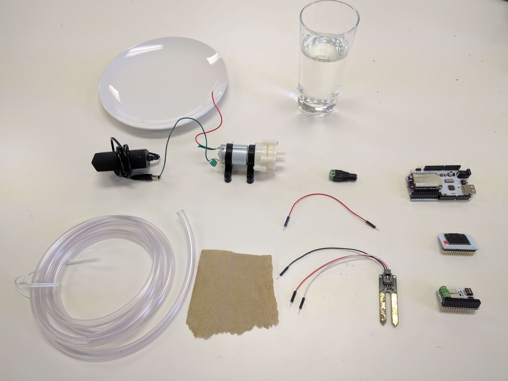


### Step-by-Step

Follow these instructions to set this project up on your very own Omega!


#### 1. Prepare

You'll have to have an Omega2 ready to go, complete the [First Time Setup Guide](https://docs.onion.io/omega2-docs/first-time-setup.html) to connect your Omega to WiFi and update to the latest firmware.


#### 1. Complete the Previous Parts of the Project

This project builds on the previous parts of the Smart Plant project. If you haven't already completed the [first](#smart-plant-p1), [second](#smart-plant-p2), and [third parts](#smart-plant-p3), go back and do them now!


#### 1. Install Required Software on the Omega

To control the Relay Expansion from a Python program, you'll need to install the Onion Relay Expansion Module:

```
opkg update
opkg install pyRelayExp
```

#### 1. Wire up the Pump

We'll wire up the Water Pump with the Relay Expansion before connecting the Relay Expansion to the Dock.

<!-- // DONE: photo: water pump, 3x jumper wires, relay expansion, dc barrel jack adapter, dc power supply -->


<!-- // DONE: add photos for each step (note: the steps don't have to be in a list, can just be broken up with photos) -->

1. Run a jumper wire from the **negative terminal** of the DC Barrel Jack Adapter to the **negative terminal** of the Water Pump


1. Run a jumper wire from the **positive terminal** of the DC Barrel Jack Adapter to the **IN** screw terminal on Channel 0 of the Relay Expansion


1. Run a jumper wire from the **OUT** screw terminal on Channel 0 of the Relay Expansion to the **positive terminal** of the Water Pump


<!-- // DONE: Add a brief > note on how to use screw terminals -->
>To set up the terminals on the Relay Expansion, turn the screw on the terminal counterclockwise until the metal clamp inside is sitting a bit less than halfway in the bottom of the housing, not too much or the screw might pop out.
>The screw terminal on the barrel jack adapter is a bit different, it will rise and sink depending on the clamp position. When the screw is roughly flush with the top, it is open. To close it, turn clockwise until the screw sinks to about halfway, or until it becomes difficult to continue turning.


#### 1. Connect the Relay Expansion and Provide Power

Grab your Smart Plant Omega and Arduino Dock and unplug it from power. Take off the OLED Expansion and plug in your freshly wired Relay Expansion.

<!-- // DONE: photo of the above -->
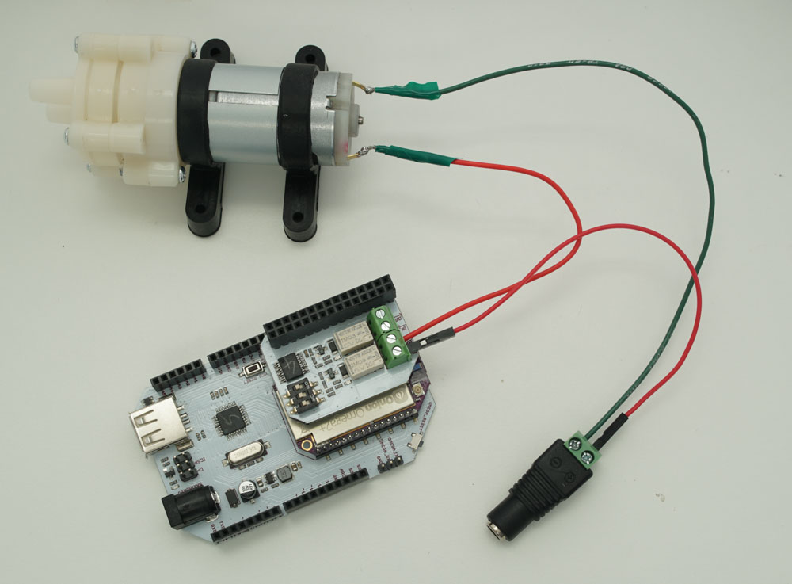

You can then plug the OLED Expansion into the Relay Expansion.

<!-- // DONE: photo of the above -->
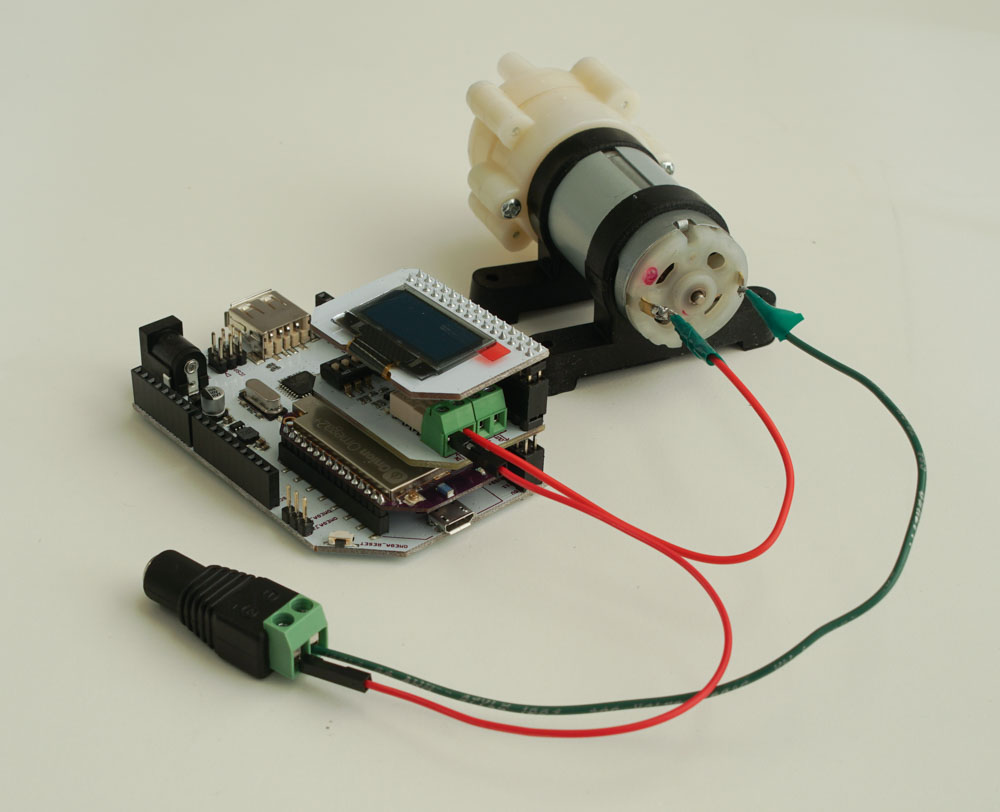

Power the Omega and Arduino Dock through the Micro-USB port and connect the 12V power supply to the DC Barrel Jack Adapter:

<!-- // DONE: photo of the above -->


#### 1. Test your Setup

When your Omega boots up again, login to the Omega's command line and run the following command to turn on the relay connected to the water pump:

```
relay-exp 0 on
```

Your pump should now come to life!

To turn off the pump, run the following:

```
relay-exp 0 off
```

> For more info on the `relay-exp` command, see our (Relay Expansion documentation](https://docs.onion.io/omega2-docs/using-relay-expansion.html).


#### 1. Water Pump Setup

<!-- // DONE: section on connecting tubing to the pump. then running the tubing to a water reservoir and the other end to the plant -->

Before we connect the tubing, disconnect the motor from the circuit. This is so you can more easily work with the pump and avoid spilling water on your components.

Now prepare a water reservoir; it can be as simple as a glass of water. Then measure a length of tubing that would go from the bottom of your reservoir to the inlet of the pump. Cut off the tubing, then first fit one end to the pump's inlet.


Then insert the other end into your reservoir. We recommend securing it to the reservoir using some tape so that the tubing stays inside.

Repeat this process for another piece of tubing that will go from the pump outlet to your plant.


Now connect the motor back to the circuit, and plug in the power supplies for the Omega and pump:

<!-- // TODO: this photo shows the sensor disconnected... retake it ;-; -->


#### 1. Stop the Existing Program

In the first part of the project, we modified `/etc/rc.local` to automatically run the smart plant program on boot. We'll now need to find the program and stop it before running it again manually.

Find the process of the running smart plant program:

```
root@Omega-F11D:~# ps | grep smart
 1999 root     17568 S    python /root/smart-plant/smartPlant.py --oled --quiet
 2185 root      1184 S    grep smart
```

Kill the process to stop the program:

```
root@Omega-F11D:~# kill 1999
```


#### 1. Pump Calibration

We'll need to play with the pump a little to see how long it should be enabled in order to properly water the plant.

Let's first run the Smart Plant program with the pump option enabled:

```
python /root/smart-plant/smartPlant.py --oled --quiet --losant /root/smart-plant/losant.json --pump
```

Now, let's create a Losant workflow where we can use a virtual button to turn on our pump. We'll use this workflow now to find the optimal watering duration for your plant, and then afterwards you can use it to water your plant from anywhere in the world!

Head over to `https://www.losant.com/` and log in. Select your Smart Plant Application, click on the `Workflows` menu and then `Create Workflow`. Give your workflow a name and a description:


Add a `Virtual Button` block to your workflow:


For completeness, have the button send a payload:


Now add a `Device Command` block:

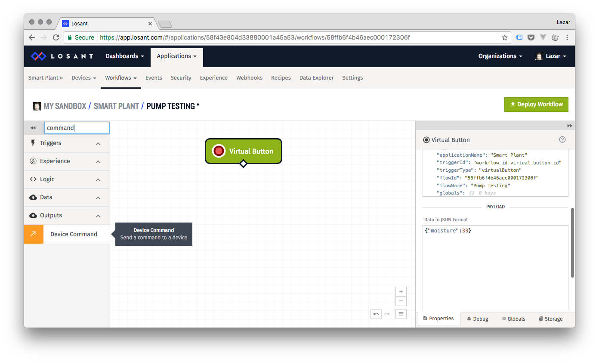

Set it up to use the device associated with your Smart Plant Omega, in our case, that was `omega-f11d`:


Now we need to setup the command to send to the device. The name of command the program on the Omega is expecting is `waterPlant`, the payload is a string that is the number of seconds to keep the pump enabled. In our case, we started with 4 seconds:


Let's also add a `Debug` block:

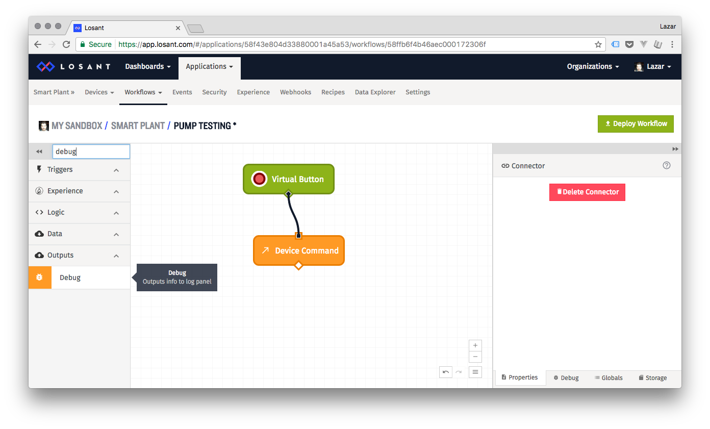

Set the debug message to something simple so we know our button click has gone through, and Deploy the workflow:


Try pressing the button and seeing how much water actually makes it to your plant:


Experiment with the payload of the `Device Command` block to see how much water suits your plant. Also, keep in mind the `LOW_MOISTURE` and `OK_MOISTURE` levels we set in the [previous part of the project](#smart-plant-p3), when your plant is watered at the `LOW_MOISTURE` level, the amount of water added should take it back up above `OK_MOISTURE` level.

We found a duration of **7 seconds** to work well for our plant.


#### 1. Update Program Run at Boot

Since we now need to run the Smart Plant program with additional arguments to enable the pump, we'll need to update the `/etc/rc.local` file.

Open the `/etc/rc.local` file using the Vi editor: `vi /etc/rc.local`. Hit `i` and paste in the additional arguments, your file should look like this:

```
# Put your custom commands here that should be executed once
# the system init finished. By default this file does nothing.

python /root/smart-plant/smartPlant.py --oled --quiet --losant /root/smart-plant/losant.json --pump
exit 0
```
Hit `esc` and type `:wq` to save and close the file.

Try rebooting your Omega (enter `reboot` in the command line), and you'll see that your program will start up again when the Omega boots up.


#### 1. Update the Existing Workflow

To make our smart plant truly automated, we need to add sending the `waterPlant` command to the notification workflow made in the [previous part of the project](#smart-plant-p3):

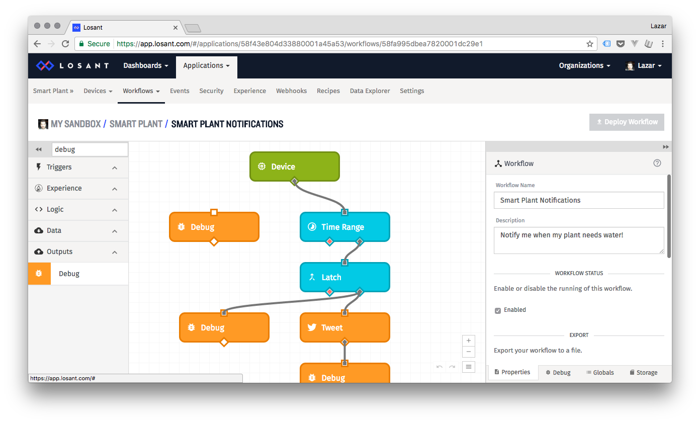

Add a `Device Command` Block to the bottom:


Like before, we need to set it up to use the device associated with your Smart Plant Omega:

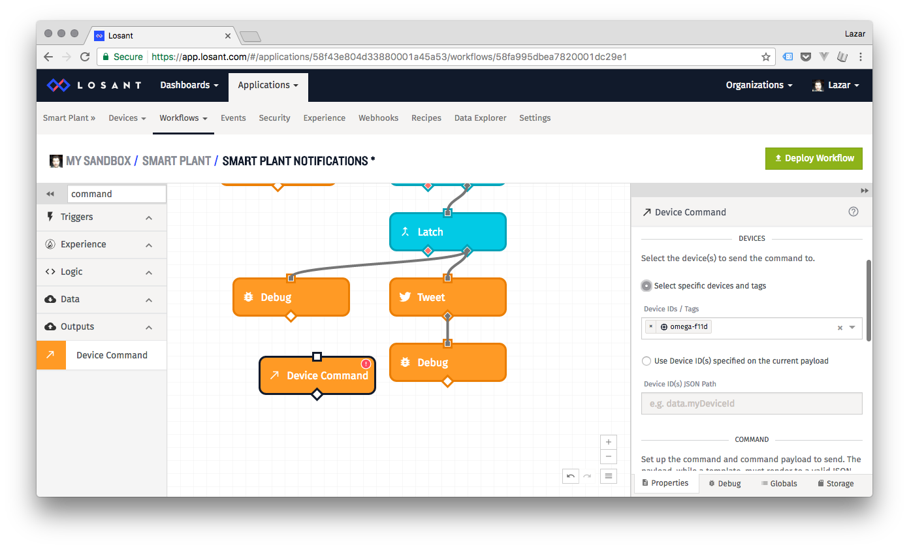

Create a Global variable to store the duration for which the pump will be active:

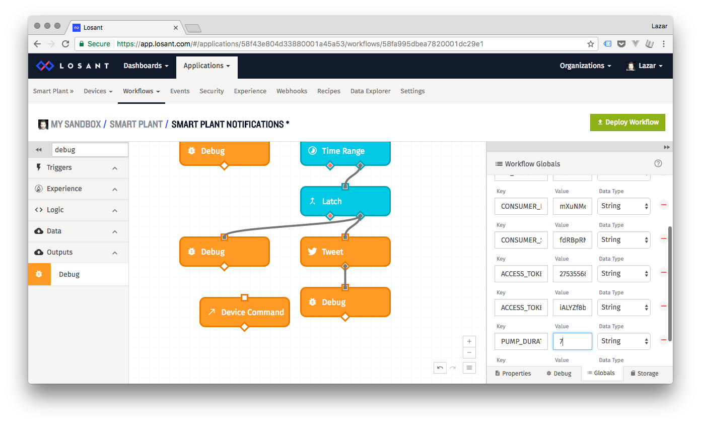

Now, go back to the `Device Command` block to setup the command name and payload. It will be the same as in the testing workflow used above, just this time, use `{{globals.PUMP_DURATION}}`, the global variable we just created:

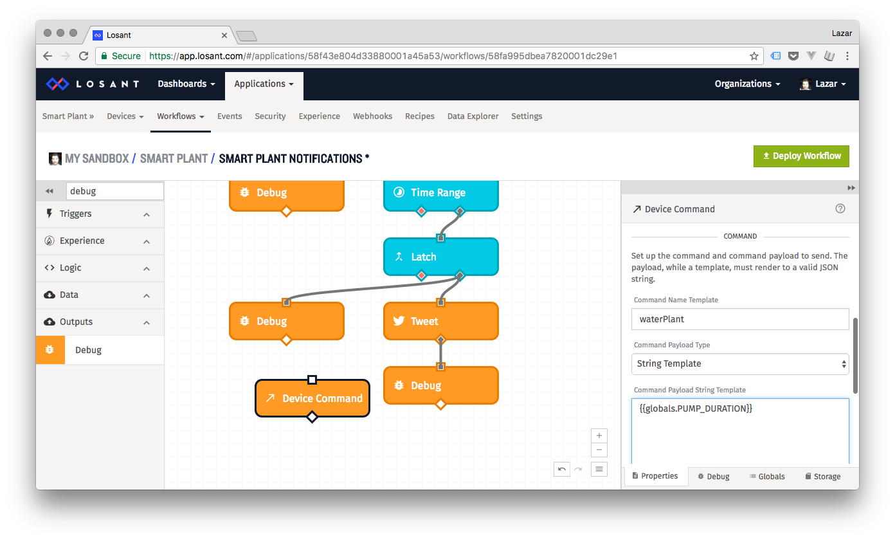

Connect the `Device Command` block to the output of the `Tweet` block so that the plant gets watered right after the Tweet is sent out:


Let's also add a `Debug` block that will output that the command indeed got sent out:


It might also be a good idea to change the contents of the Tweet:

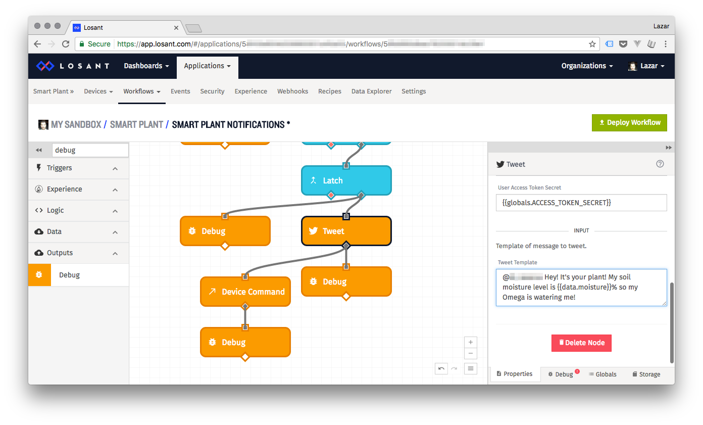

Connect the `Debug` block to the `Device Command` block and hit `Deploy Workflow`:


#### 1. Sit Back and Relax

Now whenever your plant's soil moisture level falls below the level in the `LOW_MOISTURE` global variable, your plant will water itself and alert you with a Tweet!

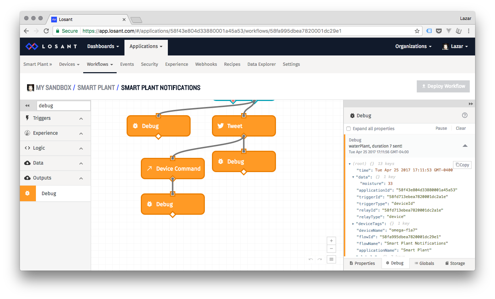


### Code Highlight

<!-- // one or two paragraphs (max) about something cool we did in the code -->
<!-- //	just give a brief description/overview and provide links to where they can learn more (Onion Docs, online resources, etc) -->
