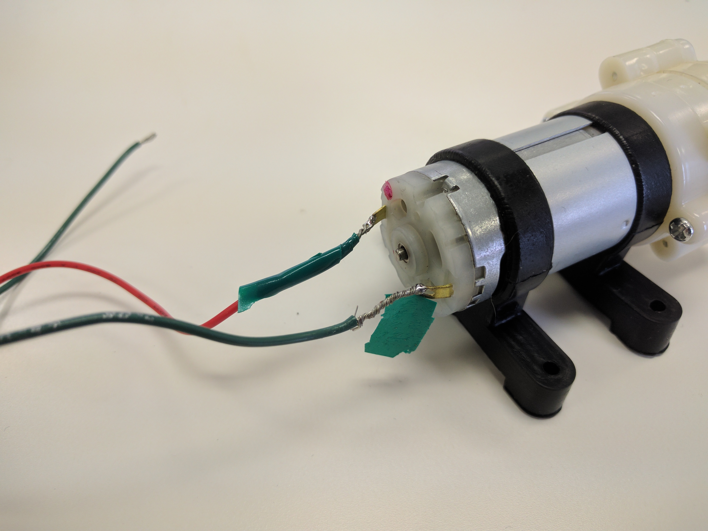
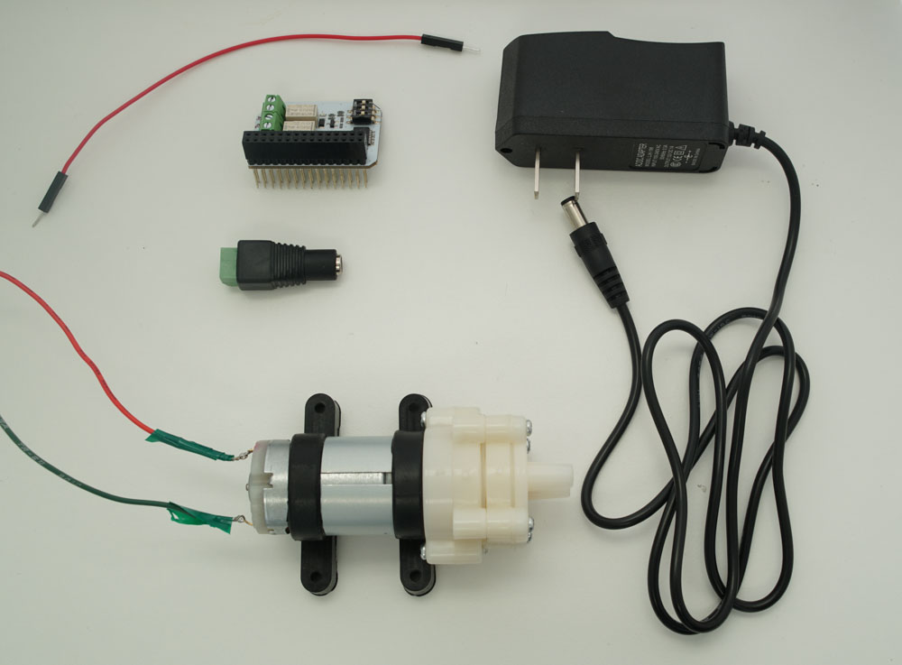
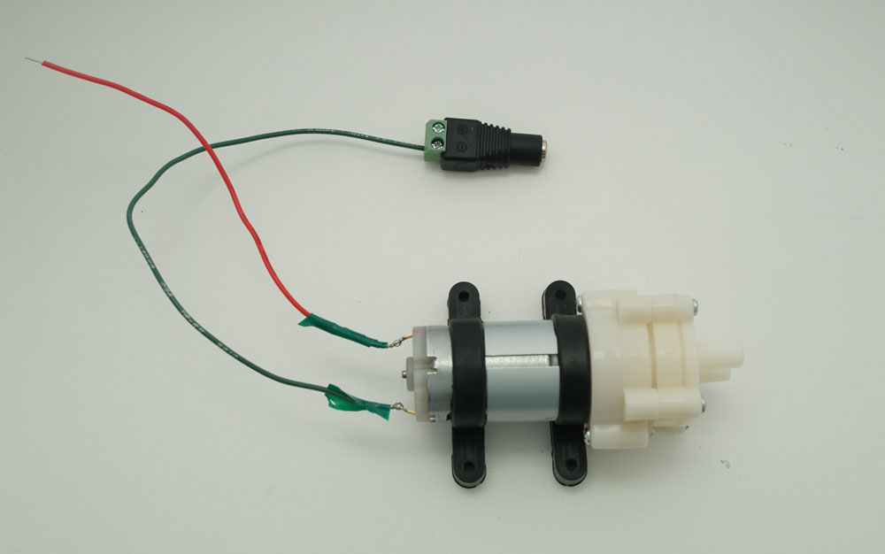
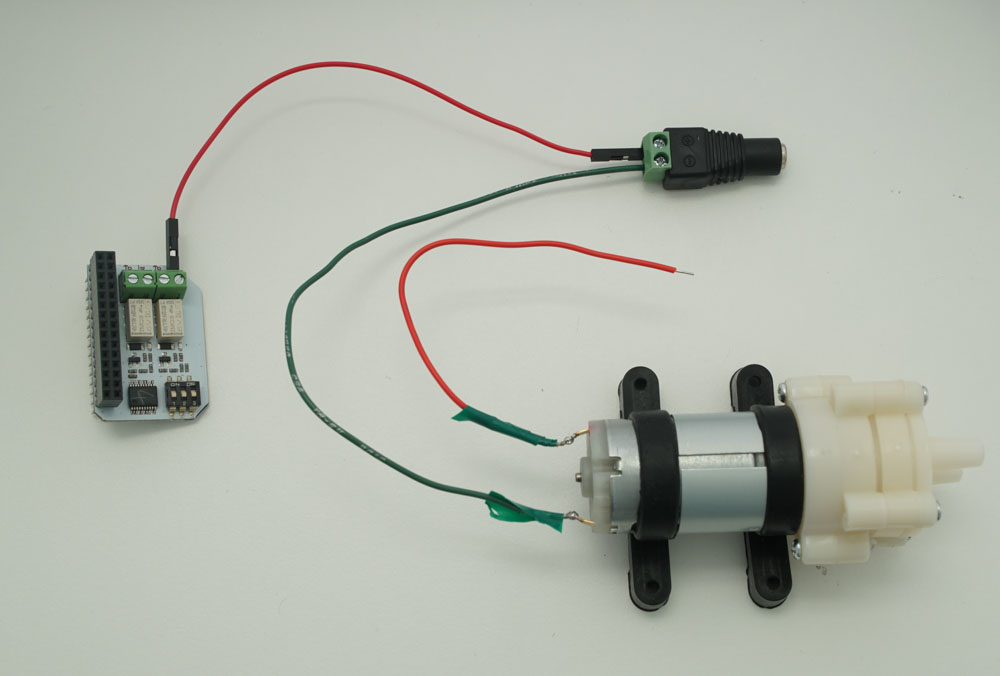
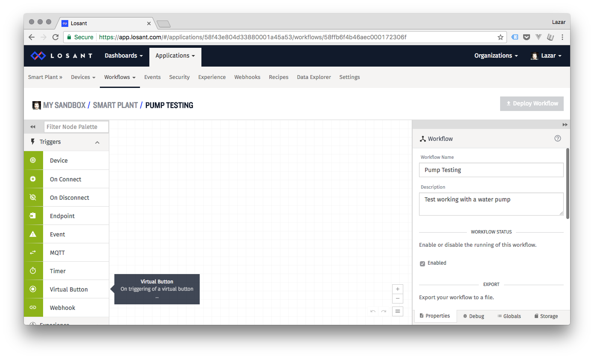
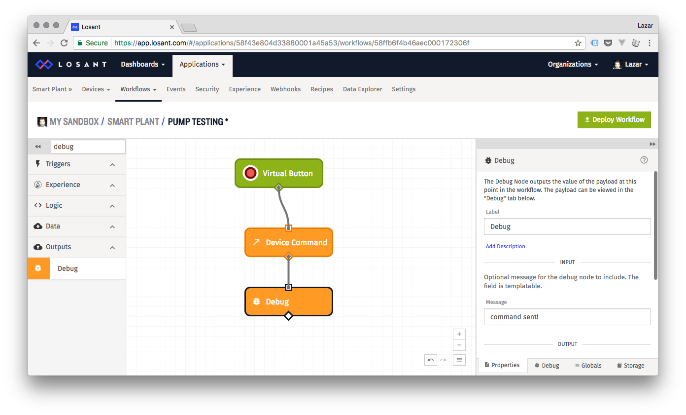
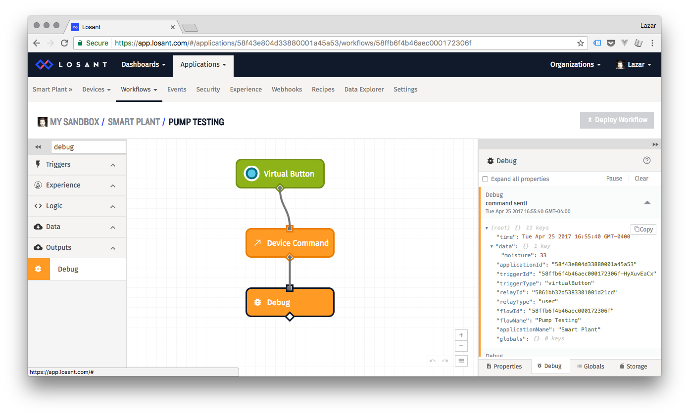
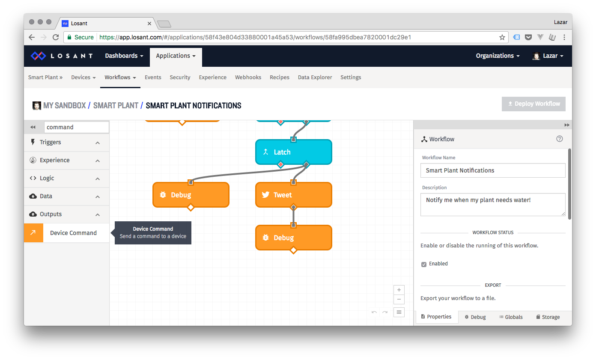
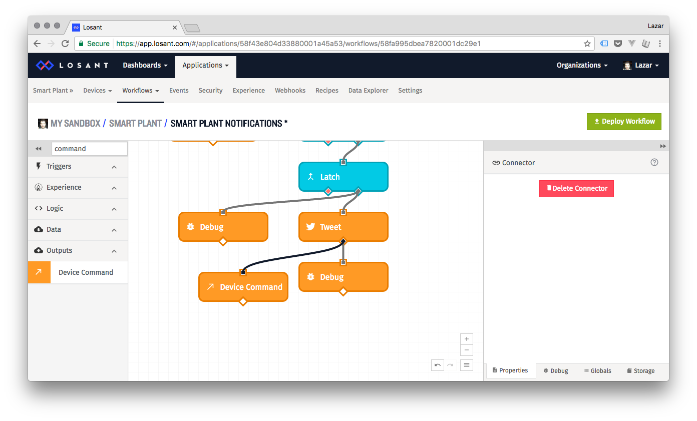
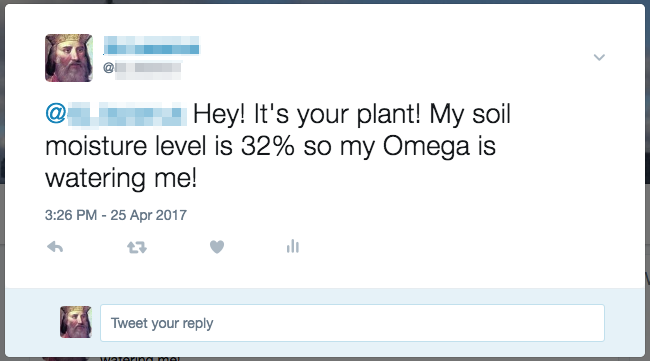

## Smart Plant - Automatic Plant Watering {#smart-plant-p4}

Now that our plant is smart enough to Tweet us when it needs water, let's see if we can make it even smarter and have it water itself! For this project, we'll add a water pump to our work in [Smart Plant Part 3](#smart-plant-p3) so we can automate the watering process.

<!-- // DONE: this photo shows the sensor disconnected... retake it -->


### Overview

**Skill Level:** Intermediate-Advanced

**Time Required:** 1 Hour

For this project, we'll be using the Relay Expansion to switch a water pump on and off, enabling our smart plant to water itself! To do that, we'll build a circuit to power the water pump, and use the [Relay Expansion Python Module](https://docs.onion.io/omega2-docs/relay-expansion-python-module.html) to control the pump with out script.

Once our pump works as expected, we'll build a new Losant **workflow** to test it out. Finally, we'll add it to the Losant workflow we've built in [Smart Plant Part 3](#smart-plant-p3) to get our plant to water itself!

The complete project code can be found in Onion's [`smart-plant` repo on GitHub](https://github.com/OnionIoT/smart-plant).

### Ingredients

We'll need all of the same materials as in the previous parts:

* Onion [Omega2](https://onion.io/store/omega2/) or [Omega2+](https://onion.io/store/omega2p/
* Arduino Dock 2
* Onion [OLED Expansion](https://onion.io/store/oled-expansion/)
* Soil Moisture Sensor
* 3x Male-to-Female Jumper Wires

And some new ingredients:

* Onion [Relay Expansion](https://onion.io/store/relay-expansion/)
* [DC Barrel Jack Adapter](https://www.amazon.com/gp/product/B00ZGDF7AY/ref=as_li_tl?ie=UTF8&camp=1789&creative=9325&creativeASIN=B00ZGDF7AY&linkCode=as2&tag=onion0e-20&linkId=5d39734cc06c3916099832cb4748a245)
* [Water Pump (12V DC)](https://www.amazon.com/Lightobject-EWP-DC30A1230-Brushless-Submersible-Cooling/dp/B0051HI3OM)
    * When we did this step, we used a pump in our office with **half** of the flowrate of this one. **Use caution when calibrating!**
* 3x Male-to-Male Jumper Wires
* [12V 1A DC Power Supply](https://www.amazon.com/gp/product/B019X3XVWS/ref=as_li_tl?ie=UTF8&camp=1789&creative=9325&creativeASIN=B019X3XVWS&linkCode=as2&tag=onion0e-20&linkId=7e3fcbbeb2bf474a33f4d68a7413fc21)
* [Flexible Plastic Tubing](https://www.amazon.com/Learn-Brew-LLC-Grade-Tubing/dp/B000E62TCC/ref=pd_bxgy_328_img_2/138-8608289-7851617?_encoding=UTF8&pd_rd_i=B000E62TCC&pd_rd_r=WS345JY54A7PJH2RK0RB&pd_rd_w=Ih1XS&pd_rd_wg=iQEme&psc=1&refRID=WS345JY54A7PJH2RK0RB)
    * Make sure to match the tubing's **inner** diameter (ID) is slightly less than the pump's ports' **outer** diameter (OD). This is so the tubing will stretch and grip the ports, preventing any leaks!
* A piece of paper the size of your hand to test the pump's polarity
* A plate or bowl to hold your plant and collect excess water
* A glass or bowl of water you can use as a reservoir

Tools:

* Flat-head screwdriver
* Philips-head screwdriver

If your pump does not come with wires attached, then you will need:
<!-- // DONE: this really depends on if the water pump has leads attached, see the 'Prepare the Pump' section below -->
* Eletrical Tape
* Wire Cutters
* Wire Strippers

<!-- DONE: find water pump from a US retailer -->
<!-- DONE: add specific tubing -->

<!-- // DONE: retake this photo with the soil moisture sensor included and the breadboard circuit taken apart -->
<!-- The breadboard circuit was not supposed to be part of this step -->


### Step-by-Step

Follow these instructions to set this project up on your very own Omega!


<!-- // DONE: enumerate the steps correctly (when you're done all of the others) -->

#### 1. Prepare

You'll have to have an Omega2 ready to go, complete the [First Time Setup Guide](https://docs.onion.io/omega2-docs/first-time-setup.html) to connect your Omega to WiFi and update to the latest firmware.


#### 2. Complete the Previous Parts of the Project

This project builds on the previous parts of the Smart Plant project. If you haven't already completed the [first](#smart-plant-p1), [second](#smart-plant-p2), and [third parts](#smart-plant-p3), go back and do them now!


#### 3. Install Required Software on the Omega

To control the Relay Expansion from a Python program, you'll need to install the [Onion Relay Expansion Python Module](https://docs.onion.io/omega2-docs/relay-expansion-python-module.html):

```
opkg update
opkg install pyRelayExp
```

#### 4. Prepare the Pump

<!-- // DONE: add a note that not all water pumps come with wires attached to the leads:
//	* walk them through identifying which lead is positive and which is negative
//		* this is super important since connecting it wrong will, at best, reverse the in and out ports and, at worst, break the pump
//	* the user will need to strip a jumper wire and connect it to the leads, just twisting it around and then covering with electrical tape is enough
//		* for users skilled with a soldering iron, they can add in some soldering to make the connection more secure (don't forget to add the regular disclaimer about soldering) -->

Let's prepare the pump so that we can connect it to our circuit. We'll be doing a few sub-steps here:

1. Preparing the Power leads
1. Connecting to the Barrel Jack Adapter
1. Locating the Inlet and Outlet
1. Determining the Polarity

##### Preparing the Power Leads

Not all water pumps come with wires attached to the 2 power leads on the back/top.  If yours does, skip to the "Wire the Pump" step.

If yours does not, you will need to put the wires together and determine the pump motor's polarity. This is extremely important because connecting it wrong will, at best, reverse the in and out ports and, at worst, break the pump!

Take two pieces of jumper wire, one red and one black, and strip about 1" from the ends. Some pumps without wires attached may have a marking for where to attach the red wire; examine your pump thoroughly for any hints. If you can find a marking, loop the bare end of the red wire through the hook. Just twisting it around and then covering it with electrical tape is enough. Repeat for the black wire.

If there are no markings, connect them to the leads whichever which way. If the order happens to be wrong, you can switch them later.

<!-- // DONE: photo -->


##### Connecting to the Barrel Jack Connector

With the 12V power supply **not** plugged in yet, connect the other end of the red wire to the (+) terminal on the barrel jack adapter, and the other end of the black to the (-) terminal.

>The screw terminal on the barrel jack adapter will rise and sink depending on the clamp position. When the screw is roughly flush with the top, it is open. To attach a wire, insert it into the terminal and turn the screw clockwise until it sinks to about halfway, or until it becomes difficult to continue turning.

<!-- // DONE: photo -->


##### Locating the Inlet and Outlet

Examine your pump's instruction manual (if there is one) or the ports to see if there are any markings or labels for "IN" and "OUT". Our pump had them in raised letters on the plastic housing:

<!-- // DONE: photo -->


##### Determining Polarity

Now we will **briefly** run the pump to make sure the polarity of the motor is correct.

>There is a risk of it overheating when running the pump "dry" without water for extended periods of time. This is because some pumps rely on water for cooling. Try not to leave it on for more than 10 seconds to avoid the risk of damage to your pump.

Prepare a small piece of paper about the size of your hand. Then plug in the 12V power supply and hear your pump come to life!

Move the piece of paper towards the outlet.

* If it gets blown away from it, the polarity is correct.
* If it gets sucked towards it, the wiring is backwards.

Unplug the power supply and remove the two wires from the barrel jack adapter. If the polarity is backwards, switch where the red and black wires are connected to the pump.

* The terminal on the pump where the red wire should be connected is known as the **positive `(+)`** terminal.
* Likewise, the place where the black wire should be connected is the **negative `(-)`** terminal.

##### Optional - Solder the Terminals

If you want, you can solder the wires to the pump terminals to make the connections more secure. You'll need to remove the electrical tape, solder the terminals, then replace the tape again.

Please familiarize yourself with proper soldering technique and safety procedures when working with soldering irons, as there is a risk of injury due to the high heat!

If you are not comfortable soldering, try finding a friend or professional who can quickly solder it for you. Or practice soldering wires together and then work your way up to soldering on actual electronics.

**Note:** Solder at your own risk, Onion is not responsible for any injury or damage!

#### 5. Connect the Pump to the Omega

We'll wire up the Water Pump with the Relay Expansion before connecting the Relay Expansion to the Dock.



>To set up the terminals on the Relay Expansion, turn the screw on the terminal counterclockwise until the metal clamp inside is sitting a bit less than halfway in the bottom of the housing, not too much or the screw might pop out.

<!-- // DONE: photo: retake these 3 photos so that all of the components are in the same place for each photo -->

1. Run a jumper wire from the **negative terminal** of the DC Barrel Jack Adapter to the **negative terminal** of the water pump.

  

1. Run a jumper wire from the **positive terminal** of the DC Barrel Jack Adapter to the **IN** screw terminal on Channel 0 of the Relay Expansion.

  

1. Run a jumper wire from the **OUT** screw terminal on Channel 0 of the Relay Expansion to the **positive terminal** of the water pump.

  


#### 6. Connect the Relay Expansion and Provide Power

Grab your Smart Plant Omega and Arduino Dock and unplug it from power. Take off the OLED Expansion and plug in your freshly wired Relay Expansion.


You can then plug the OLED Expansion into the Relay Expansion.


Power the Omega and Arduino Dock through the Micro-USB port and connect the 12V power supply to the DC Barrel Jack Adapter:


#### 7. Test your Setup

When your Omega boots up again, login to the Omega's command line and run the following command to turn on the relay connected to the water pump:

```
relay-exp 0 on
```

Your pump should now come to life!

Turn off the pump for now by running the following:

```
relay-exp 0 off
```

> For more info on the `relay-exp` command, see our [Relay Expansion documentation](https://docs.onion.io/omega2-docs/using-relay-expansion.html).


#### 8. Tubing and Sensor Setup

Before we connect the tubing, disconnect the motor from the circuit. This is so you can more easily work with the pump and avoid spilling water on your components.

<!-- // DONE: throw in an explanation and a photo of how to identify the inlet and outlet of the pump. 'Ours had the words "In" and "Out" embossed on the plastic.' -->
<!-- already done in section above -->

Place your plant in the plate to catch any excess water. Then prepare a water reservoir; it can be as simple as a big drinking glass. Then measure a length of tubing that would go from the bottom of your reservoir to the inlet of the pump. Cut off the tubing, then first fit one end to the pump's inlet. Make sure it's snug and tight to avoid leaks!


Then insert the other end into your reservoir. We recommend securing it to the reservoir using some tape so that the tubing stays safe.

Repeat this process for another piece of tubing that will go from the pump outlet to your plant.


Now connect the motor back to the circuit. Then reconnect the moisture sensor:

1. Connect the Arduino Dock's **5V pin** to the sensor's `Vcc` pin.
1. Connect the Arduino Dock's `GND` pin to the sensor's `GND` pin.
1. Connect the Arduino Dock's `A0` pin to the sensor's `SIG` pin.

and plug in the power supplies for the Omega and pump:

<!-- // DONE: this photo shows the sensor disconnected... retake it -->


The Omega should now be booting.

<!-- // DONE: since we changed the first part to setup an init.d script, we need to update this step
// The new step should entail:
//	* running `/etc/init.d/smart-plant stop`
//		-> before putting this step in, confirm that it actually stops the existing python script instance on the Omega -->

#### 9. Stop the Existing Program

In the first part of the project, we added a script to `/etc/init.d` to automatically run the smart plant program on boot. We'll now need to stop the program before running it again manually.

Run the following command:

```
/etc/init.d/smart-plant stop
```

#### 10. Pump Calibration

We'll need to play with the pump a little to see how long it should be enabled in order to properly water the plant.

Let's first run the Smart Plant program with the pump option enabled:

```
python /root/smart-plant/smartPlant.py --oled --quiet --losant /root/smart-plant/losant.json --pump
```

The `--pump` option enables receiving and reacting to commands from Losant. It calls the `pumpWater()` function that accepts a duration in seconds for how long to turn the pump on.

<!-- // DONE: need to explain the pump option:
// * enables receiving and reacting to commands from Losant
// * the `pumpWater` command has a payload that specifies the duration (in seconds) that the pump should be on for -->

Now, let's create a Losant workflow where we can use a virtual button to turn on our pump. We'll use this workflow now to find the optimal watering duration for your plant, and then afterwards you can use it to water your plant from anywhere in the world!

Head over to [Losant.com](https://www.losant.com/) and log in. Select your Smart Plant Application, click on the `Workflows` menu and then `Create Workflow`. Give your workflow a name and a description:


Add a `Virtual Button` block to your workflow:



For completeness, have the button send a payload:


Now add a `Device Command` block:


Set it up to use the device associated with your Smart Plant Omega, in our case, that was `omega-f11d`:


Now we need to setup the command to send to the device. The name of command the program on the Omega is expecting is `waterPlant`, the payload is a string that is the number of seconds to keep the pump enabled. In our case, we started with 4 seconds:


Let's also add a `Debug` block:


Set the debug message to something simple so we know our button click has gone through, and Deploy the workflow:




Try pressing the button and seeing how much water actually makes it to your plant:




Experiment with the payload of the `Device Command` block to see how much water suits your plant. Also, keep in mind the `LOW_MOISTURE` and `OK_MOISTURE` levels we set in the [previous part of the project](#smart-plant-p3), when your plant is watered at the `LOW_MOISTURE` level, the amount of water added should take it back up above `OK_MOISTURE` level.

We recommend starting at **1 second** and adjusting from there to avoid accidentally overflowing. In our lab, we found a duration of **3 seconds** to work well, but this depends on both your pump and plant.

<!-- // DONE: since we changed the first part to setup an init.d script, we need to update this step
// This step should entail:
//	* updating /etc/init.d/smart-plant to have the OPT argument include `--pump`
//	* restarting the process: `/etc/init.d/smart-plant restart` -->


#### 11. Update Program Run at Boot

Since we now need to run the Smart Plant program with additional arguments to use the pump, we'll need to update the `/etc/init.d/smart-plant` file.

Open the `/etc/init.d/smart-plant` file using the Vi editor: `vi /etc/init.d/smart-plant`. Hit `i` and use the arrow keys to navigate to the line that says `BIN="usr/...`. After the `...losan.json` text, insert a space and type the following:

```
--pump
```

and insert a space between `--pump` and the `>` character.

Your smart-plant file should now look like this:

```
#!/bin/sh /etc/rc.common
# Copyright (C) 2016 Onion Corporation
START=99

USE_PROCD=1
BIN="/usr/bin/python /root/smart-plant/smartPlant.py --oled --quiet --losant /root/smart-plant/losant.json --pump > /dev/null 2>&1 &"

start_service() {
        procd_open_instance
        procd_set_param command $BIN
        procd_set_param respawn
        procd_close_instance
```

Hit `esc` and type `:wq` to save and close the file.

Then re-enable the program:

```
/etc/init.d/smart-plant restart
```

Try rebooting your Omega (enter `reboot` in the command line), and you'll see that your program will start up again when the Omega boots up.


#### 12. Update the Existing Workflow

To make our smart plant truly automated, we need to add sending the `waterPlant` command to the notification workflow made in the [previous part of the project](#smart-plant-p3):


Add a `Device Command` Block to the bottom:



Like before, we need to set it up to use the device associated with your Smart Plant Omega:


Create a global variable, `PUMP_DURATION` to store the duration for which the pump will be active:


Now, go back to the `Device Command` block to setup the command name and payload. It will be the same as in the testing workflow used above, just this time, use `{{globals.PUMP_DURATION}}`, the global variable we just created:


Connect the `Device Command` block to the output of the `Tweet` block so that the plant gets watered right after the Tweet is sent out:



Let's also add a `Debug` block that will output that the command indeed got sent out:


It might also be a good idea to change the contents of the Tweet:


Connect the `Debug` block to the `Device Command` block and hit `Deploy Workflow`:


#### 13. Sit Back and Relax

Now whenever your plant's soil moisture level falls below the level in the `LOW_MOISTURE` global variable, your plant will water itself and alert you with a Tweet!




<!-- // DONE: add a note that users will have to experiment with the values for their `LOW_MOISTURE`, `OK_MOISTURE`, and `PUMP_DURATION` variables to see what is best for their plant -->

You'll have to experiment with the `LOW_MOISTURE`, `OK_MOISTURE`, and `PUMP_DURATION` variables to see what is best for your plant.

<!-- // DONE: add:
//	* "wow, revel in your achievements, you've made your plant so smart that all it needs you for is refilling the water reservoir"
//	* teaser for the next part -->

Wow, you've made your plant so smart that all it needs is for you to refill the water reservoir!

Now if only there were some way to make this project truly plug 'n' play...
