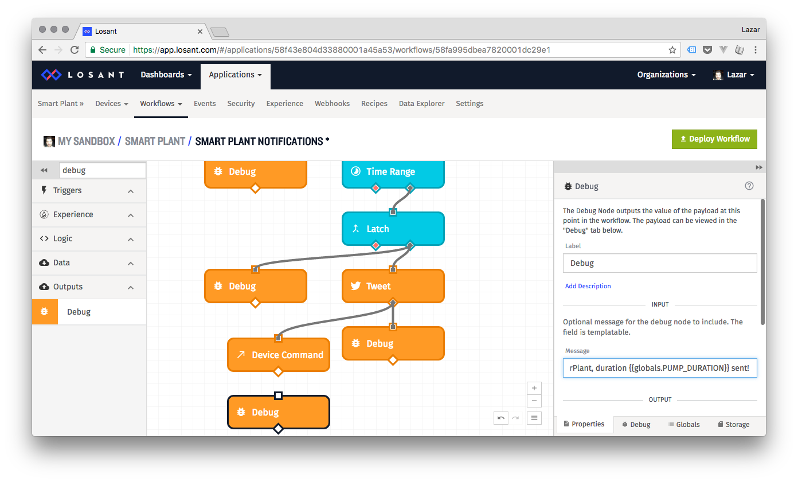

## Smart Plant - Part 4 {#smart-plant-p4}

// brief intro to the project

// include a photo of the final result

### Overview

**Skill Level:** [Beginner|Intermediate|Advanced]

**Time Required:** <a time estimate to complete the project>

// go into some detail here about how we're going to be implementing the project
//	eg. which programming language we'll be using, APIs
//	include links to any api or module references

### Ingredients

We'll need all of the same materials as in the previous part:

1. Onion Omega2 or Omega2+
1. Arduino Dock 2
1. Onion OLED Expansion
1. Soil Moisture Sensor
1. 3x Male-to-Female Jumper Wires

The new materials we need:

1. Onion Relay Expansion
1. DC Barrel Jack Adapter
1. [Water Pump (12V DC)](http://www.canadarobotix.com/index.php?route=product/search&search=pump)
1. 3x Male-to-Male Jumper Wires
1. 12V DC Power Supply
1. Flat-head screwdriver

<!-- TODO: find water pump from a US retailer -->
<!-- TODO: add specific tubing -->


### Step-by-Step

Follow these instructions to set this project up on your very own Omega!

// each step should be simple

#### 1. Prepare

You'll have to have an Omega2 ready to go, complete the [First Time Setup Guide](https://docs.onion.io/omega2-docs/first-time-setup.html) to connect your Omega to WiFi and update to the latest firmware.


#### 1. Complete the Previous Parts of the Project

This project builds on the previous parts of the Smart Plant project. If you haven't already completed the [first](#smart-plant-p1), [second](#smart-plant-p2), and [third parts](#smart-plant-p3), go back and do them now now!


#### 1.

```
opkg update
opkg install pyRelayExp
```

#### 1. Wire up the Pump

We'll wire up the Water Pump with the Relay Expansion before connecting the Relay Expansion to the Dock.

// TODO: photo: water pump, 3x jumper wires, relay expansion, dc barrel jack adapter, dc power supply

// TODO: add photos for each step (note: the steps don't have to be in a list, can just be broken up with photos)

1. Run a jumper wire from the **negative terminal** of the DC Barrel Jack Adapter to the **negative terminal** of the Water Pump
1. Run a jumper wire from the **positive terminal** of the DC Barrel Jack Adapter to the **IN** screw terminal on Channel 0 of the Relay Expansion
1. Run a jumper wire from the **OUT** screw terminal on Channel 0 of the Relay Expansion to the **positive terminal** of the Water Pump


// TODO: Add a brief > note on how to use screw terminals


#### 1. Connect the Relay Expansion and Provide Power

Grab your Smart Plant Omega and Arduino Dock and unplug it from power. Take off the OLED Expasnion and plug in your freshly wired Relay Expansion.

// TODO: photo of the above

You can then plug the OLED Expansion into the Relay Expansion.

// TODO: photo of the above

Power the Omega and Arduino Dock through the Micro-USB port and connect the 12V power supply to the DC Barrel Jack Adapter:

// TODO: photo of the above


#### 1. Test your Setup

When your Omega boots up again, login to the Omega's command line and run the following command:

```
relay-exp 0 on
```

Your pump should now come to life!

To turn off the pump, run the following

```
relay-exp 0 off
```

> For more info on the `relay-exp` command, see our (Relay Expansion documentation](https://docs.onion.io/omega2-docs/using-relay-expansion.html).


#### 1. Water Pump Setup

// TODO: section on connecting tubing to the pump. then running the tubing to a water reservoir and the other end to the plant

#### 1. Pump Calibration

// start the script on the Omega
```
python /root/smart-plant/smartPlant.py --oled --losant /root/smart-plant/losant.json --pump
```

// Losant: create new workflow and test


// experiment to see how much time is required to get enough water to the plant

#### 1. Update the Existing Workflow





### Code Highlight

// one or two paragraphs (max) about something cool we did in the code
//	just give a brief description/overview and provide links to where they can learn more (Onion Docs, online resources, etc)
