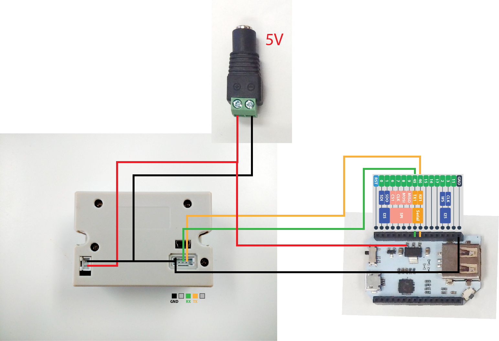

## Thermal Printer

In this project, we'll be using the Omega to control a thermal printer via a web interface. Simply type text in a box, and click Print to print it out in real life!


### Overview

**Skill Level:** Intermediate

**Time Required:** 20 minutes

We'll wire up a barrel connector for power and jumpers for serial communication with the Omega.


### Ingredients

1. Omega2 / Omega2+
1. Any Onion Dock that breaks out the Omega's  serial pins - Expansion Dock, Breadboard Dock, Arduino Dock 2, Power Dock, etc.
1. Thermal Printer (https://www.adafruit.com/product/2751) 
    * comes with a 2-pin JST power cable and a 5-pin TTL cable
1. 2.1 mm power jack adapter (https://www.adafruit.com/product/368)
1. 5V / 2A Power supply (https://www.adafruit.com/product/276)


### Step-by-Step

Follow these steps to turn your Omega into a web-based printer!


#### 1. Trim the cable

First, we need to cut one end of the 5-pin TTL cable that came with the thermal printer. This is so we can re-route the wires to where they need to go. The other end we'll leave alone, that goes into the printer.

Cut only **one** of these ends off, leaving bare wire:


#### 2. Assemble the Circuit

This is the circuit diagram for our printer:

<!-- TODO: new circuit diagram -->


For these wiring instructions, we're assuming you're working with an Onion Expansion Dock. Other docks may have different pin layouts than pictures show.

<!-- TODO: review wiring instructions -->

Plug in the 2-pin JST power cable into the left side of the bottom of the printer above. Route the red and black wires to the barrel jack; make sure the red wire is connected to the "(+)" terminal and the black to the "(-)" terminal. 

Then plug the non-cut end of the 5-pin TTL cable into the socket at the bottom of the printer. Then connect the green wire to the `TX` pin on the Omega Expansion header. The yellow wire goes to the `RX` pin. Finally, plug the black wire to the `GND` pin on the Expansion Dock header.

The wiring on the underside of the printer should look something like this:

<!-- TODO: review photo -->


Now plug in the 5V power supply into the barrel jack and turn the switch on the Mini Dock to ON. Then turn on the Omega and connect to its command line.

#### 3. Download the Code


The code for this project is all done and can be found in Onion's [iot-thermal-printer repo](https://github.com/OnionIoT/iot-thermal-printer) on GitHub. Follow the [instructions on installing Git](https://docs.onion.io/omega2-docs/installing-and-using-git.html), navigate to the `/root` directory, and clone the GitHub repo:

```
git clone https://github.com/OnionIoT/iot-thermal-printer.git
```

After cloning the repo, enter the repo directory and run the `install.sh` script:

```
cd iot-thermal-printer
sh install.sh
```

#### 4. Running the Printer

1. Connect your Omega to your WiFi network, or connect your computer to the Omega's WiFi network.
1. In a web browser, navigate to omega-ABCD.local/printer.html, where ABCD is the last 4 digits on the sticker on the Omega.
1. Type in text in the box in the middle of the webpage.
1. Click print to print it!


### Code Highlight

This project uses the `cgi-bin` method to run scripts on the Omega via a web interface. In the following line, we send the data from the text box to the script in the `/cgi-bin` directory using asynchronous JavaScript (AJAX):

```javascript
$.ajax({
    type: "POST",
    url: "/cgi-bin/print.sh",
    data: $('#printContent').val().split('\n').join('\r'), // <-- We need to replace \n with \r
    contentType: 'text/plain'
})
```

The `print.sh` script works like a simple API endpoint that takes data and does something with it; in this case, sending it to the printer via serial:

```sh
#!/bin/sh

echo "Content-type: application/json"
echo ""

if [ "$REQUEST_METHOD" = "POST" ]; then
    read -n $CONTENT_LENGTH line
    echo $line > /dev/ttyS1
    # feed paper
    echo '' > /dev/ttyS1
fi

echo '{"success":"ok"}'

exit 0
```

This is just one of many methods to create your own endpoints and services easily and quickly!
