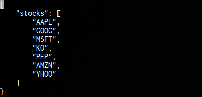

<!-- comment: anything in triangle brackets is meant to be replaced with text -->
<!-- comment: see `Omega2/Projects/oled/twitter-feed.md` for an example -->

## <PROJECT TITLE>

For this project, we'll be displaying the latest stock information for a configurable list of stocks:

// include a photo of the final result

### Overview

**Skill Level:** Beginner

**Time Required:** 5 minutes

This code will be written in Python and we'll be making use of a [Google Finance](https://www.google.com/finance) API to grab stock data. It will print the following data to the OLED:

1. Stock symbol (up to 4 characters)
1. Current trading price (USD)
1. Percentage change since last closing date

Specifically, the code uses the `info` endpoint; this is technically [deprecated](https://groups.google.com/forum/#!topic/google-finance-apis/q-DbjbzQDGQ), but still seems to remain active and returns up-to-date finance data.

We also use the [Onion's `pyOledExp` module](https://docs.onion.io/omega2-docs/oled-expansion-python-module.html) to provide control of the OLED Expansion.

The complete project code can be found in Onion's [`oled-stock-ticker` repo on GitHub](https://github.com/OnionIoT/oled-stock-ticker).

### Ingredients

1. Onion Omega2 or Omega2+
1. Any Onion Dock that supports Expansions: Expansion Dock, Power Dock, Arduino Dock 2
1. Onion OLED Expansion

### Step-by-Step

Follow these instructions to set this project up on your very own Omega!


#### 1. Prepare

You'll have to have an Omega2 ready to go, complete the [First Time Setup Guide](https://docs.onion.io/omega2-docs/first-time-setup.html) to connect your Omega to WiFi and update to the latest firmware.

Once that's done, plug in your OLED Expansion:


#### 2. Install Python

Connect to the Omega's Command line and install Python as well as some of the packages we need:

```
opkg update
opkg install python-light python-urllib3 pyOledExp
```

The `python-urllib3` package will allow us to make HTTP requests in Python, while the `pyOledExp` package gives us control of the OLED Expansion.

#### 3. Download the Project Code

The code for this project is all done and can be found in Onion's [oled-stock-ticker repo](https://github.com/OnionIoT/oled-stock-ticker) on GitHub. Follow the [instructions on installing Git](https://docs.onion.io/omega2-docs/installing-and-using-git.html), navigate to the `/root` directory, and clone the GitHub repo:

```
git clone https://github.com/OnionIoT/oled-stock-ticker.git
```

#### 4. Setup and Run the Code

The `config.json` file holds all of the settings for the project. Populate the `stocks` array with the symbols of the stocks you wish to track. 

Some notes about the stock symbols:

* The OLED has 8 rows and the 1st will be used for the date and time, so only the first seven will be shown.
* Due to space constraints on the OLED, the stock ticker can properly display only stocks with 4 letters or less.
* The code assumes the stocks are traded in USD.



Now run the code: `python main.py`


If you're interested in how the `pyOledExp` code can be used to control the OLED Expansion, take a look at how it's used in [the project code](https://github.com/OnionIoT/oled-stock-ticker/blob/master/oledDriver.py) and also check out the [`pyOledExp` Module documentation](https://docs.onion.io/omega2-docs/oled-expansion-python-module.html).

#### 5. Automate the Program to Run Periodically

The program will grab and display the latest stock info, then promptly exit. We'll use `cron`, a super useful Linux utility, to have the program run periodically.

Enter `crontab -e` to add a task to the `cron` daemon, it will open a file in vi, enter in the following:

```
* * * * * python /root/oled-stock-ticker/main.py
#
```

> This assumes that your project code is located in `/root/oled-stock-ticker`

Now, we'll restart `cron`:

```
/etc/init.d/cron restart
```

And the code will run once every minute, generating *literally* up-to-the-minute stock information on your OLED!

> Check out the Omega documentation for more info on [using `cron`](https://docs.onion.io/omega2-docs/running-a-command-on-a-schedule.html)

<!-- // TODO: this doesn't work, the oled just goes blank -->

### Code Highlight


// one or two paragraphs (max) about something cool we did in the code
//	just give a brief description/overview and provide links to where they can learn more (Onion Docs, online resources, etc)
