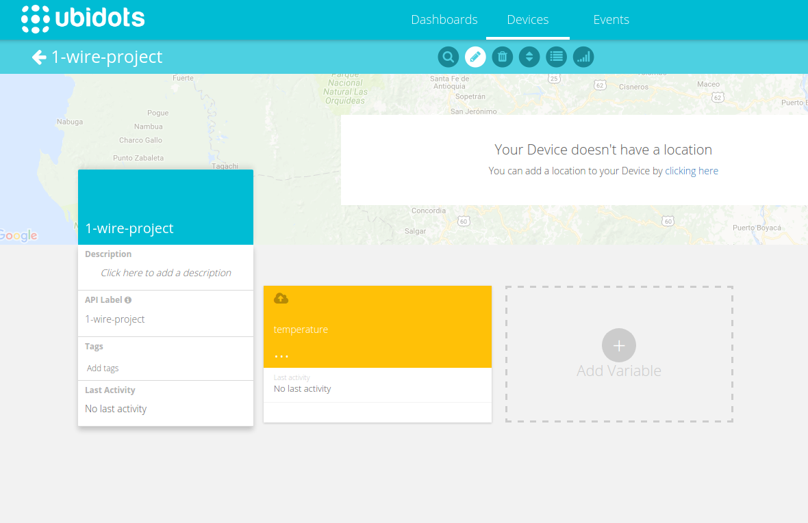
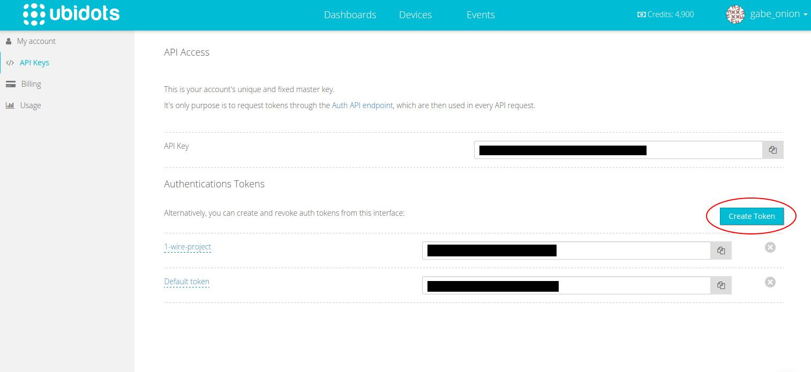
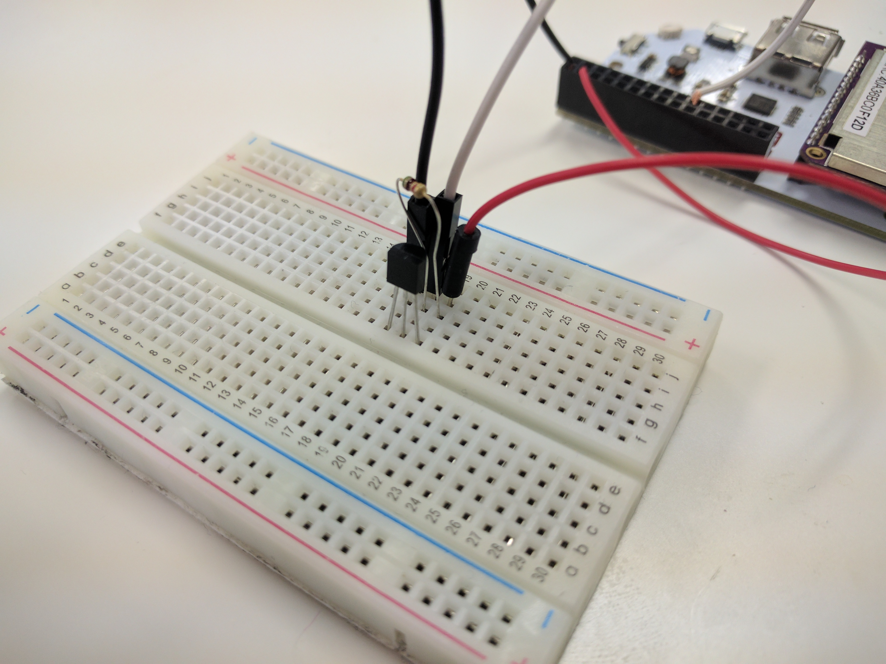
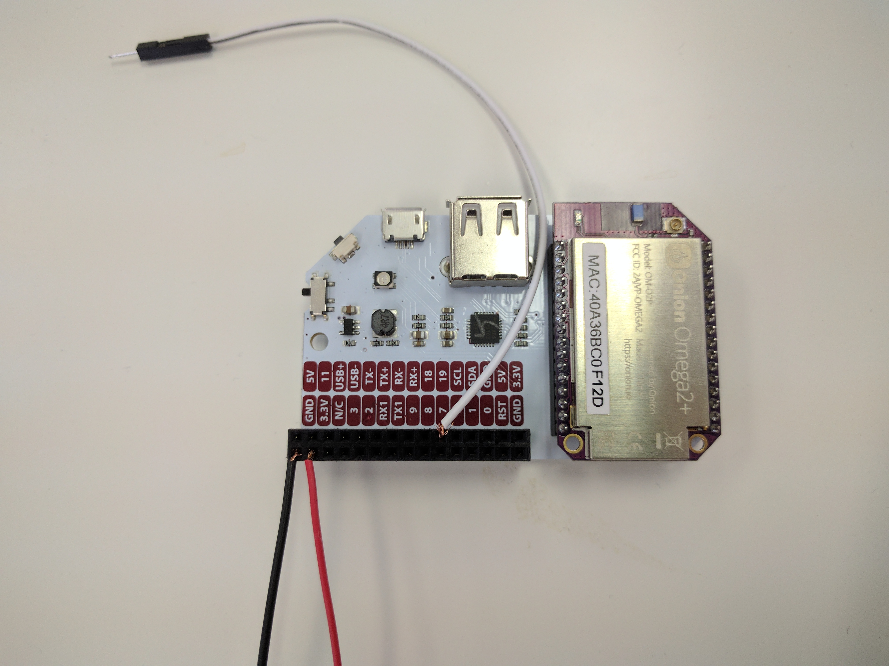
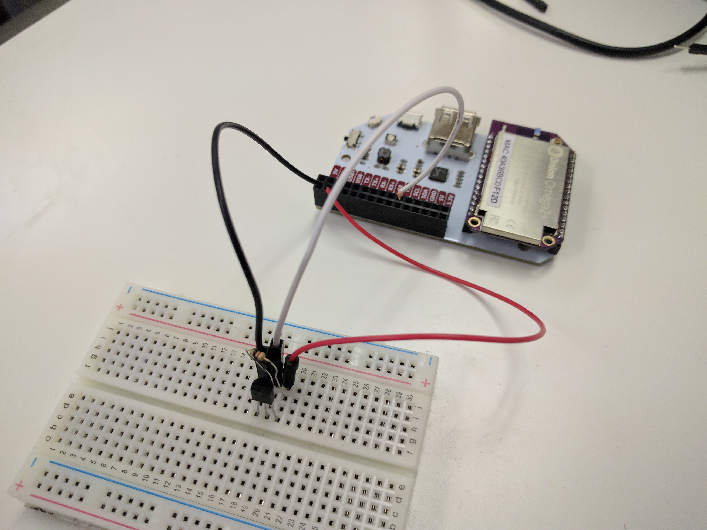
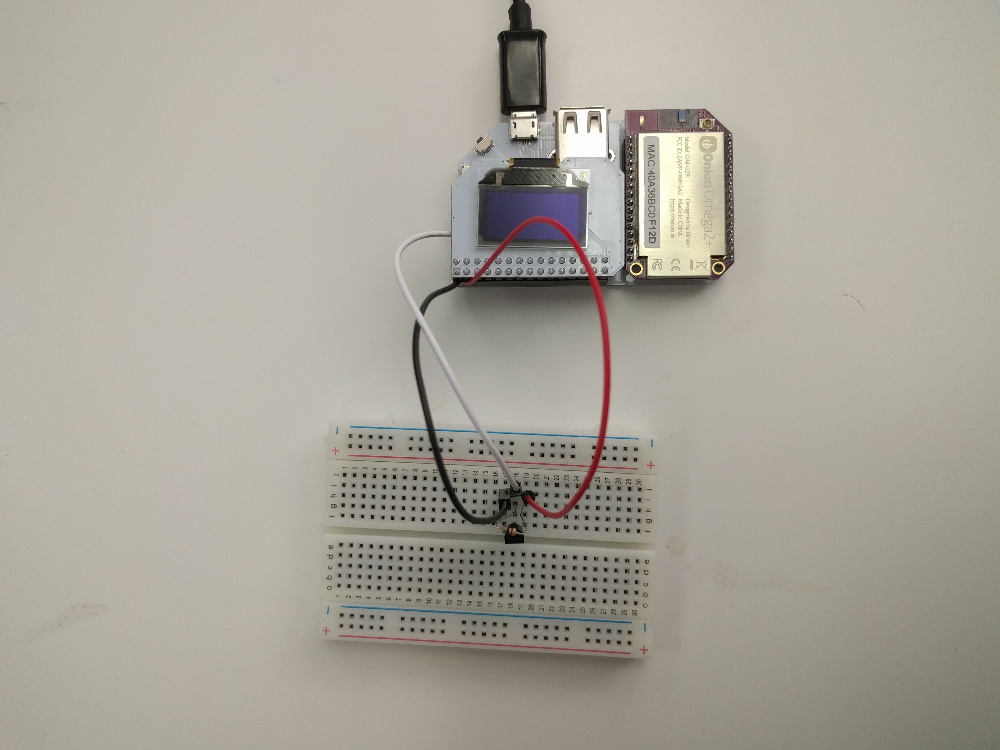
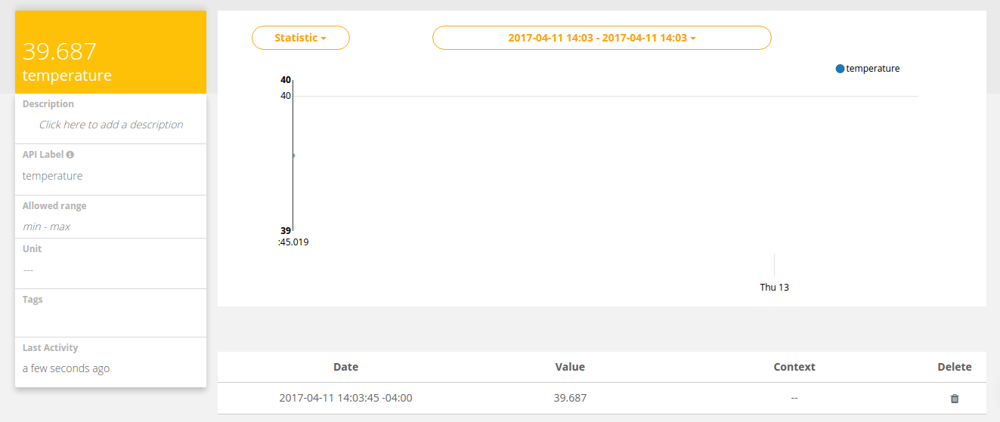
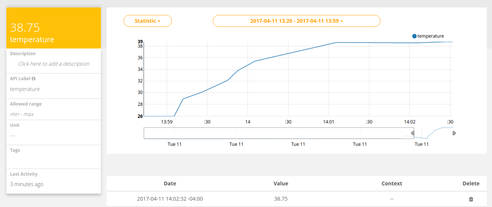

## Ambient Temperature Monitor {#ubidots-temperature-monitor}

This project will allow you to read temperature from a sensor, display it on the OLED Expansion, and also push the data to [Ubidots IoT Platform](https://ubidots.com/) for logging and monitoring!

TODO: add link to Ubidots

TODO: take a new photo where the main thing is the Omega and OLED, the temp sensor is secondary (can keep this existing photo at the bottom of this project)


TODO: add screenshot of data on ubidots platform

TODO: add short blurb describing what weather data is being collected

### Overview

**Skill Level:** Beginner-Intermediate

**Time Required:** 20 minutes

We'll be using a software 1-Wire bus to read the temperature from a sensor. The code will then write the value on the OLED Expansion and push the data to your [Ubidots](https://ubidots.com/) account. The code is written in Python and makes use of the UART1 serial port on the Omega to communicate with the Arduino Dock's microcontroller. We're also using [Onion's `pyOledExp` module](https://docs.onion.io/omega2-docs/oled-expansion-python-module.html) to provide control of the OLED Expansion.

TODO: we definitely don't use the Arduino Dock here, update the above paragraph to talk a bit about 1-wire

The complete project code can be found in Onion's [`temperature-monitor` repo on GitHub](https://github.com/OnionIoT/temperature-monitor).


### Ingredients

* Onion Omega2 or Omega2+
* Any Onion Dock that supports Expansions: Expansion Dock, Power Dock, Arduino Dock 2
* Onion OLED Expansion
* 1x DS18B20 1-Wire Temperature Sensor
* 1x 5.1 kΩ Resistor
* 3x Male-to-Female or Male-to-Male Jumper Wires
    * Make sure they use threaded wire on the inside
* 1x Breadboard

// TODO: note, we should always separate the tools from the project ingredients

Tools:

* 1x Wire Cutter
* 1x Wire Stripper

<!--  -->


### Step-by-Step

Follow these instructions to setup the Ambient Temperature Monitor project on your very own Omega!


#### 1. Prepare

You'll have to have an Omega2 ready to go, complete the [First Time Setup Guide](https://docs.onion.io/omega2-docs/first-time-setup.html) to connect your Omega to WiFi and update to the latest firmware.

**Do not plug in your OLED Expansion just yet.**

#### 2. Install Software

[Connect to the Omega's Command line](https://docs.onion.io/omega2-docs/connecting-to-the-omega-terminal.html) and install Python as well as some of the packages we need:

```
opkg update
opkg install python-light python-urllib3 pyOledExp ubidots-client
```

The `python-urllib3` package will allow us to make HTTP requests in Python, while the `pyOledExp` package gives us control of the OLED Expansion.

The `ubidots-client` package will allow us to push and pull data from the Ubidots IoT Platform.

#### 3. Download the Project Code

// TODO: don't really dig redirecting them to an article on installing Git, should install give in the previous step and then have them clone the repo to their root directory

// TODO: the name and link for the github repo are wrong...

The code for this project is all done and can be found in Onion's [`oled-temperature-monitor` repo](https://github.com/OnionIoT/oled-temperature-monitor) on GitHub. Follow the [instructions on installing Git](https://docs.onion.io/omega2-docs/installing-and-using-git.html), navigate to the `/root` directory, and clone the GitHub repo:

```
git clone https://github.com/OnionIoT/oled-temperature-monitor.git
```

#### 4. Setup Ubidots

First, sign up for a [Ubidots](https://ubidots.com/) account. At the time this was written, you should have 5000 credits in your account available for trial and testing. This is more than enough to get this project running!

Then go to the [account homepage](https://app.ubidots.com/ubi/insights/#/list), and click on Devices at the top, and click on the grey **Add Device** button. Call it `1-wire-project` like so:


Now we need to add a **variable** to store our data. Click on the device's blue card to go to its device page. Then click on the grey Add Variable button, then click Default. Call the new variable `temperature` (case sensitive) like so:



Now we need to create an **API key** for this project. Click on your username in the top right of the screen, then click My Profile. In the profile menu, click on API Keys on the left. Then click on the blue Create Token button to generate a token; click on the `newToken` text to rename it to `1-wire-project`.



You will need to put this long string of text into the `config.json` file in the project repo on the Omega to authenticate your requests. Replace the `yourTokenhere` placeholder with the key you just created:


Your software is now ready to run!

#### 5. Prepare the Wires

Next you will need to prepare the wires. The OLED Expansion does not have female headers to connect wires nor Expansions because they may block the screen. To deal with this, do the following for each of the 3 wires:

1. Using the wire cutter, cut one connector of the jumper wire off while leaving a male end intact.
    * One male end is needed to connect to the breadboard!
1. Using the wire stripper, strip about 10mm of insulation from the freshly cut end.
1. Pinch the exposed wire with one hand and twist it several times until the threads are thoroughly wound around each other.
    * This is so they don't fray.
1. Take the twisted wire and bend it 180 degrees backwards in half to make a thin hook-like shape.
1. Twist the hook again so it closes and doesn't fray.

Your wires should look like this:


#### 6. Connect the Sensor

Use this diagram for reference when wiring up the sensor:

// TODO: this image link needs to be an html url


We will treat the flat side as the front.

1. With the front of the sensor facing the middle gap of the breadboard, insert the three pins across 3 adjacent rows.
1. Connect the 5.1kΩ resistor to both DQ (pin 2) and Vdd (pin 3).

Your sensor should look like this:



#### 7. Sensor -> Omega

Our sensor is now ready and we need to connect it to the Omega using the wires we just prepared. The male end of the wire will plug into the breadboard while the bare ends will go into the Dock's Expansion pins.

1. Connect GND (pin 1) to the Omega’s GND pin.
1. Connect DQ (pin 2) to the Omega’s GPIO19.
1. Connect Vdd (pin 3) to the Omega’s 3.3V pin.

Insert the bare ends of the wire into the Expansion Dock like this:



Your circuit should now look like this so far:



#### 8. Connect OLED Expansion

The OLED Expansion will then plug in on top of the wires; there will most likely be enough space for the Expansion's pins to fit. Plug it in and it should look like this:



// TODO: add a blurb about how we're successfully using the GPIOs at the same time as the OLED Exp

#### 9. Run the Code

On the Omega, run the code:

```
cd /root/temperature-monitor
python main.py
```

On the Omega, you should see something like this:


Now go to your Ubidots account page and check on your `temperature` variable in the `1-wire-project` device. You should see your new reading:



#### 10. Automate the Program to Run Periodically

The program will read the temperature, display it on the OLED, push the value to Ubidots, then promptly exit. We'll use `cron`, a super useful Linux utility, to have the program run periodically.

Enter `crontab -e` to add a task to the `cron` daemon, it will open a file in vi, enter in the following:

```
* * * * * python /root/temperature-monitor/main.py
#
```

> This assumes that your project code is located in `/root/oled-temperature-monitor`

Now, we'll restart `cron`:

```
/etc/init.d/cron restart
```

And the code will run once every minute, pushing data to your Ubidots account that you can view over time!



> Check out the Omega documentation for more info on [using `cron`](https://docs.onion.io/omega2-docs/running-a-command-on-a-schedule.html)

### Code Highlight

This project makes use of two main interfaces: 1-Wire and Ubidots.

The 1-Wire protocol is a bus-based protocol that uses, as the name implies, one data wire to transmit data between devices. The `main.py` script uses some functions from the `oneWire.py` module to automatically do the following:

* setup a 1-Wire bus on the Omega
* scan for the temperature sensor's address
* use the in subsequent calls without you having to probe it yourself!

The Ubidots requests are handled by the `ubidots-client` command line utility that the `Ubidots` class calls. This is the same as running the command below:

```
ubidots -t (TOKEN) -d (DEVICENAME) set '{"variableOne":12, "variableTwo":10, ...}'
```
