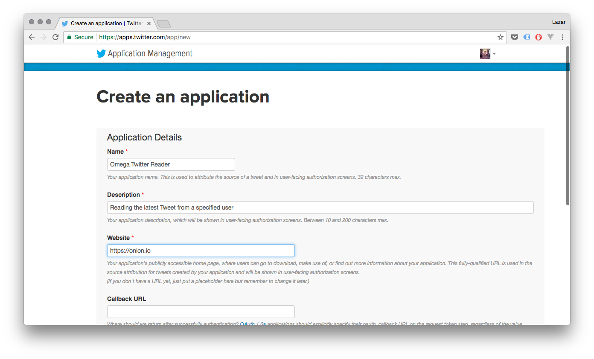
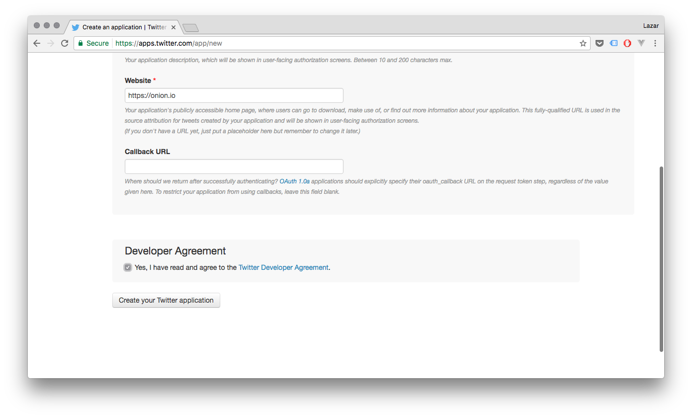
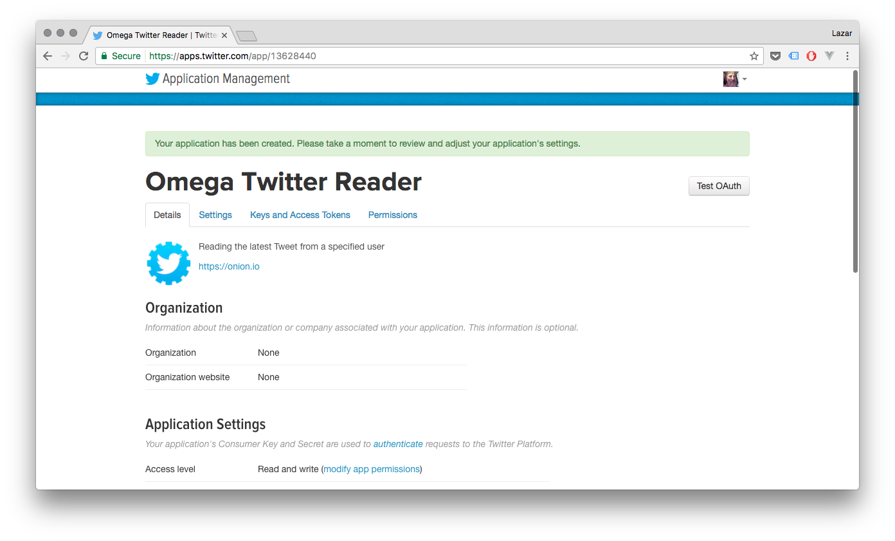

# Showing Tweets

// intro on project


// a glance at what we'll use to make it


### Overview

**Skill Level:** Intermediate

**Time Required:** 30 minutes


### Ingredients

1. Onion Omega2 or Omega2+
1. Any Onion Dock that supports Expansions: Expansion Dock, Power Dock, Arduino Dock 2
1. Onion OLED Expansion


### Step-by-Step

Follow these instructions to set this project up on your very own Omega!

#### 1. Prepare

You'll have to have an Omega2 ready to go, complete the [First Time Setup Guide](https://docs.onion.io/omega2-docs/first-time-setup.html) to connect your Omega to WiFi and update to the latest firmware.

Once that's done, plug in your OLED Expansion:


#### 2. Install Python

Connect to the Omega's Command line and install Python as well as some of the packages we need:

```
opkg update
opkg install python-light python-urllib3 pyOledExp
```

The `python-urllib3` package will allow us to make HTTP requests in Python, while the `pyOledExp` package gives us control of the OLED Expansion.

#### 3. Download the Project Code

The code for this project is all done and can be found in Onion's [oled-twitter-display repo](https://github.com/OnionIoT/oled-twitter-display) on GitHub. Follow the [instructions on installing Git](https://docs.onion.io/omega2-docs/installing-and-using-git.html), navigate to the `/root` directory, and clone the GitHub repo:

```
git clone https://github.com/OnionIoT/oled-twitter-display.git
```

> If you're in a hurry, we can download the code directly and avoid installing git. Go to your `/root` directory and run:<br>
> `wget https://raw.githubusercontent.com/OnionIoT/oled-twitter-display/master/oledTwitterDisplay.py`<br>
> `wget https://raw.githubusercontent.com/OnionIoT/oled-twitter-display/master/config.json`<br>
> We can do this direct download since this GitHub repo is public.

#### 4. Create a Twitter Application

We'll need to create a Twitter Application in order to be able to use Twitter's APIs to grab Tweets. Specifically, our code needs an API Key and API Secret in order to authenticate with Twitter before we can use the APIs:

1. Head over to https://apps.twitter.com and sign in with your Twitter handle

  

1. Fill in the form details for your application. It doesn't really matter what you type in, but a solid name and description goes a long way when you come back to a project after months away from it.

  

1. Read and agree to the Twitter Developer Agreement and hit Create your Twitter application.

  

  > Note that your Twitter account must have an associated mobile phone number before Twitter will allow you to create an application!

1. Your Application is now created!

  

1. Head over to the **Keys and Access Tokens** tab to grab the info we need

  


#### 5. Setup and Run the Code

The `config.json` file holds all of the settings for the project. Populate the `authorization` object with the Consumer Key and Consumer Secret from the Twitter app.


And then populate `application.user` with the Twitter handle whose latest tweet you want to be shown on the OLED Expansion


Now run the code: `python oledTwitterDisplay.py`


#### 6. Automate the Program to Run Periodically

The program will grab and display the latest Tweet, and then promptly exit. We'll use `cron`, a super useful Linux utility, to have the program run periodically.

Enter `crontab -e` to add a task to the `cron` daemon, it will open a file in vi, enter in the following:

```
*/5 * * * * python /root/oled-twitter-display/oledTwitterDisplay.py
#
```

> This assumes that your project code is located in `/root/oled-twitter-display`

Now, we'll restart `cron`:

```
/etc/init.d/cron restart
```

And the code will run once every 5 minutes, updating the Tweet shown on your OLED.

> Check out the Omega documentation for more info on [using `cron`](https://docs.onion.io/omega2-docs/running-a-command-on-a-schedule.html)


### Code Highlight

// highlight the three-legged auth we're doing, link to an article on three-legged auth
