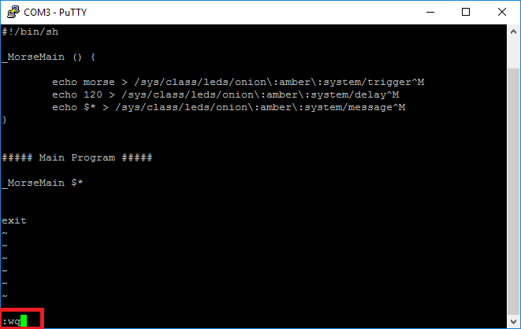

## Morse Code on an LED {#morse-code-led}

Morse code is an old binary encoding that transmits messages letter-by-letter through sound or a flashing light.

In this project we're going to write a script that will blink the Omega's LED in morse code based on the user's input using the Omega's command-line interface.


### Overview

**Skill Level:** Beginner

**Time Required:** 15 minutes


### Ingredients

* Onion Omega2 or Omega2+
* Any Onion Dock - we like the Mini Dock for this project!

### Step-by-Step

This project will take advantage of a `morse` LED utility that comes pre-loaded on the Omega. We'll test out how it works, then write a script to translate text live as we enter it!


#### 1. Prepare the ingredients

You'll have to have an Omega2 ready to go, complete the [First Time Setup Guide](https://docs.onion.io/omega2-docs/first-time-setup.html) to connect your Omega to WiFi and update to the latest firmware.

This project requires the use of the Omega's command-line, so we'll have to either SSH into the Omega's command-line, or connect serially.

To learn more on how to connect to the Omega's command-line you can read our comprehensive [guide to connecting to the Omega](https://docs.onion.io/omega2-docs/connecting-to-the-omega-terminal.html).


#### 2. Controlling the LED with the 'morse' command

The Omega comes ready with a kernel module that can translate text to Morse code and blink an LED, but you'll need to tell the kernel which LED you want to blink.  The kernel exposes a lot of hardware status and configuration options through a virtual filesystem under `/sys`.  

> The files under `/sys` aren't *actually* files, but they look and act like files to make it very easy to access them from the command line and in scripts or programs.

To tell the kernel that we are going to use the Morse code module, set the LED trigger condition for the Omega system LED to `morse` by using the `echo` command to write the setting into the virtual file:


```
echo morse > /sys/class/leds/omega2\:amber\:system/trigger
```

If you're using an **Omega2+**, the LED will be named `omega2p:amber:system`

So the command will look like this instead:

```
echo morse > /sys/class/leds/omega2p\:amber\:system/trigger
```

You can verify that it worked by using `cat` to look at the virtual file:

```
root@Omega-2757:~# cat /sys/class/leds/omega2\:amber\:system/trigger                                                              
none mmc0 timer default-on netdev transient gpio heartbeat [morse] oneshot
```

The square brackets indicate that the `morse` trigger is currently selected. The text in that file shows the other available options that this particular bit of the kernel can be set to.

Anyway, now we have everything set up!  

Once the morse option is selected, the kernel creates a new virtual file for that called `message`. We will `echo` the text we want to it:

```
echo Hello, Onion > /sys/class/leds/omega2\:amber\:system/message
```

Now watch your LED!

The message will keep looping forever or until you change it.  To stop it, you can either clear the message entirely:

```
echo > /sys/class/leds/omega2\:amber\:system/message
```

or change the LED trigger to something else:

```
echo default-on > /sys/class/leds/omega2\:amber\:system/trigger
```

##### Adjusting the Delay

If it's too fast or too slow, you can change the speed with the `delay` file:

```
root@Omega-12D9:~# cat /sys/class/leds/omega2\:amber\:system/delay
50
```

To slow it down a bit, we `echo` a bigger number:

```
root@Omega-12D9:~# echo 100 > /sys/class/leds/omega2\:amber\:system/delay
```


#### 3. Using a Shell Script instead of 'echo'

Create a file called `morse.sh` in the root directory using the following command:

```
vi /root/morse.sh
```

You'll open an empty file. To start typing you can enter `a`.

Copy the code below into the terminal.

```bash
#!/bin/sh

# find the name of the board, to be used in the name of the LED
. /lib/ramips.sh
board=$(ramips_board_name)

# define the function that will set the LED to blink the arguments in morse code
_MorseMain () {

	echo morse > /sys/class/leds/$board\:amber\:system/trigger
	echo 120 > /sys/class/leds/$board\:amber\:system/delay
	echo $* > /sys/class/leds/$board\:amber\:system/message
}


##### Main Program #####

# run the function and pass in all of the arguments
_MorseMain $*

exit
```


This block diagram shows the steps the `_MorseMain` function will perform:


Now to save the file you'll have to enter the Command Mode by hitting the `ESC` button on your keyboard.

>The Command Mode of `vi` allows you to enter keys to perform commands such as saving and exiting, exiting without saving, or deleting lines.

Type `:wq` and hit enter to save and exit your file.



You are now ready to convert text to morse code!

#### 4. Run it!

To run your Script enter the following command to run your script:

```
sh /root/morse.sh <YOUR MESSAGE HERE>
```

Enter a message that you would like to blink in morse code:

```
root@Omega-2757:~# sh /root/morse.sh Hello Onion
```


Once you're done, you can set the blinking back to `default-on` with the following command:

```
echo default-on > /sys/class/leds/omega2\:amber\:system/trigger
```

>Remember, on an Omega2+, the LED will be named `omega2p:amber:system` as opposed to `omega2:amber:system` so you will have to pipe the above command to `/sys/class/leds/omega2p\:amber\:system/trigger`
