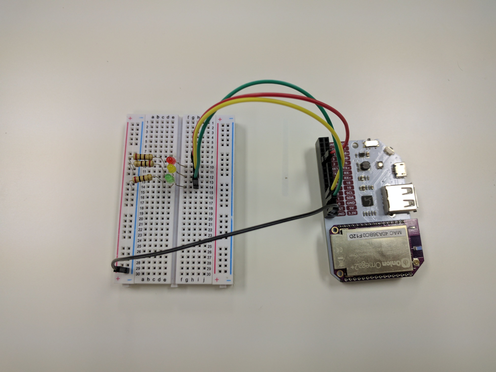

## LED Traffic Light {#led-traffic-light}

<!-- comment: anything in triangle brackets is meant to be replaced with text -->
<!-- comment: see `Omega2/Projects/oled/twitter-feed.md` for an example -->

This quick project will allow you to build a simple traffic light using a few LEDs and the Omega, while also teaching you the basics of how to control the GPIOs!


### Overview

**Skill Level:** Beginner

**Time Required:** 10 minutes

We'll be using the Onion GPIO Python module. This module is the bread and butter of any project where you will need to control and interface with other circuits!

### Ingredients

1. Onion Omega2 or Omega2+
1. Any Onion Dock that breaks out GPIOs: Expansion Dock, Arduino Dock R2, Power Dock, Breadboard Dock
* 1x Breadboard
* 3x LEDs
    * 1x red
    * 1x yellow/amber
    * 1x green
* 4x Jumper Wires (M-M)
* 3x 200Ω Resisters


### Step-by-Step

Follow these instructions to set this project up on your very own Omega!

#### 1. Prepare the ingredients

You'll have to have an Omega2 ready to go, complete the [First Time Setup Guide](https://docs.onion.io/omega2-docs/first-time-setup.html) to connect your Omega to WiFi and update to the latest firmware.

This project will need the Omega's command-line, so we'll have to either SSH into the Omega's command-line, or connect serially.

To learn more on how to connect to the Omega's command-line you can read our comprehensive [guide to connecting to the Omega](#connecting-to-the-omega-terminal).

#### Wire Up the LEDs

1. Plug in the LEDs across the breadboard, with the cathode on the left side of the gap and the anode on the right.
    * Make sure red is above amber, and amber above green!
1. Connect one end of a 200Ω resistor to the cathode row, and the other end to the negative rail marked `-` on the left side of the board.
1. Connect the `-` rail to one of the GND pins on the Omega.
1. Connect the GPIOs to the LEDs in the following manner:
    * Red to GPIO2
    * Amber to GPIO1
    * Green to GPIO0
    


#### 1. Install Python

Install Python and the required module by running the following commands:

```
opkg update
opkg install python-light pyOnionGpio
```

#### Download the Project Code

The code for this project can be found in Onion's [starter-traffic-light repo](https://github.com/OnionIoT/starter-traffic-light) on GitHub. Follow the [instructions on installing Git](https://docs.onion.io/omega2-docs/installing-and-using-git.html), navigate to the `/root` directory, and clone the GitHub repo:

```
git clone https://github.com/OnionIoT/starter-traffic-light.git
```

#### Running the Project

Enter the project directory and run the `main.py` file:

```
cd starter-traffic-light
python main.py
```

You should see the lights changing color!


### Code Highlight

We use the Onion GPIO Python module to control the GPIOs. It provides convenient functions such as `setOutputDirection()` and `setValue()` that abstract a lot of the boring work under the hood.

For more details, take a look at the [documentation](https://docs.onion.io/omega2-docs/gpio-python-module.html)