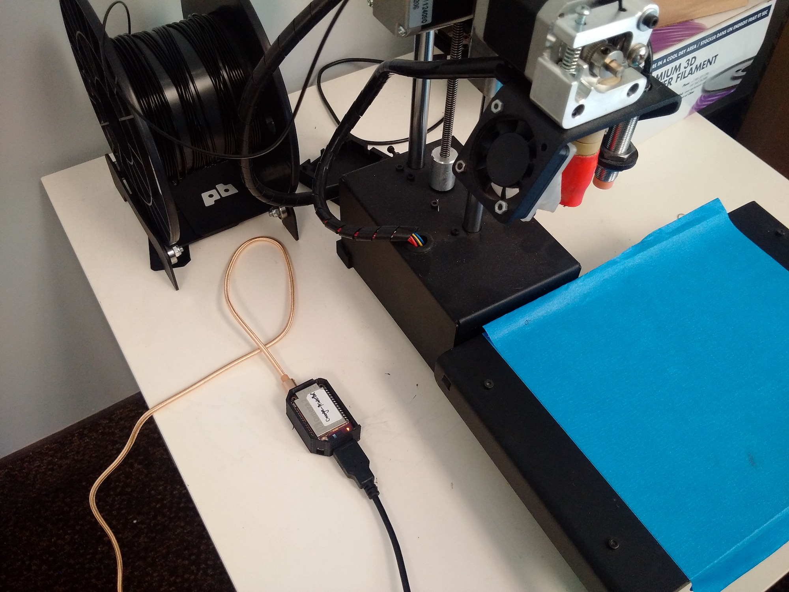

## OctoPrint 3D Printing Server {#octoprint-server}

This project allows you to use the Omega to wirelessly control your 3D printer.

Instead of having to connect a computer directly to our 3D Printer, we can have the Omega run Octoprint, a 3D printing server that will control the printer.



Octoprint serves up a web interface that we can access from any device in our Local Area Network that allows you to control and monitor every aspect of your 3D printer and your printing jobs right from within your browser.


### Overview

**Skill Level:** Intermediate

**Time Required:** 30 minutes

To get our printer server up and running, we'll have to use some packages from the LEDE repository. Additionally, we're going to build a custom version of OctoPrint to fix some compatibility issues.

### Ingredients

* Onion Omega2+
* Any Onion Dock with a USB host connector: [Expansion Dock](https://onion.io/store/expansion-dock/), [Power Dock](https://onion.io/store/power-dock/), [Mini Dock](https://onion.io/store/mini-dock/), [Arduino Dock 2](https://onion.io/store/arduino-dock-r2/)
	* We liked the [Mini Dock](https://onion.io/store/mini-dock/) for this project since it's so compact
* 3D Printer that is [supported by Octoprint](https://github.com/foosel/OctoPrint/wiki/Supported-Printers)
* Micro-SD Card
* USB cable to connect the Omega and 3D printer

### Step-by-Step

Follow these instructions to turn your 3D printer wireless!

#### 1. Set up the hardware

Here's a handy connection diagram of the way the pieces are put together:


First, connect the printer to the Omega with a USB cable. Next, connect the 3D printer to power. Finally, power on the Omega and we'll be good to go.

#### 2. Prepare the Omega

If you need, complete the [First Time Setup Guide](https://docs.onion.io/omega2-docs/first-time-setup.html) to connect your Omega to WiFi and update to the latest firmware.


#### 3. Expand Omega storage with SD card

Octoprint is a rather large program and will not fit on the on-board storage of the Omega2 or Omega2+. To remedy this, we will setup the Omega so that it boots the operating system from external storage.

> The below procedure is a condensed implementation of our [Booting from External Storage guide](https://docs.onion.io/omega2-docs/boot-from-external-storage.html). We recommend taking a look at the full guide before proceeding.

First, plug a micro SD card into the Omega2+, it will show up as `/dev/mmcblk0` and `/dev/mmcblk0p1`

To make it useable, we'll have to format the SD card to EXT4. **Warning: This will delete all data on the card!**

Install disk utilities:

```
opkg update
opkg install fdisk e2fsprogs block-mount
```
Now unmount and format the SD card:

```
umount /dev/mmcblk0p1
mkfs.ext4 /dev/mmcblk0p1
```

Mount the freshly formatted SD card in a more legible location:

```
umount /dev/mmcblk0p1
mkdir /mnt/SD
mount /dev/mmcblk0p1 /mnt/SD
```

Copy current `/overlay` directory:

```
tar -C /overlay -cvf - . | tar -C /mnt/SD/ -xf -
umount /mnt/SD
```

Now we'll set up the `/overlay` directory to automount on startup. First, we'll copy our current setup to the filesystem record:

```
block detect > /etc/config/fstab
```

Next, we edit `/etc/config/fstab` to tell the Omega to mount the SD card as the `/overlay` partition, ie run the Omega's operating system from the SD card's storageL

* Change `option target '/mnt/mmcblk0p1'` to `option target '/overlay'`
* Change `option enabled '0'` to `option enabled '1'`

Reboot for our changes to take effect.


After the Omega starts again, you can verify that you are indeed running the operating system from the SD card by running `df -h`.

You should see something like this:

```
Filesystem                Size      Used Available Use% Mounted on
.
.
.
/dev/mmcblk0p1         7201.9M     32.5M   6784.3M   0% /overlay
```


#### 4. Build Octoprint

Octoprint requires some packages that are not in the Onion package  repository, so we'll pull them from the LEDE repo instead.

To do so, we need to edit `/etc/opkg/distfeeds.conf` and uncomment this line:

```
src/gz reboot_packages http://downloads.lede-project.org/snapshots/packages/mipsel_24kc/packages
```

Once done, we can install the packages we need:

```
opkg update
opkg install python python-pip unzip
pip install --upgrade setuptools
```

Now we need to expand `/tmp` folder on the Omega:

```bash
mkdir /overlay/tmp
rm -rf /overlay/tmp/*
cp -a /tmp/* /overlay/tmp/
umount /tmp
[ $? -ne 0 ] && {
umount -l /tmp
}
mount /overlay/tmp/ /tmp
```

Once we have the packages and enough space, we can download and build Octoprint:

```
cd /root
wget https://github.com/foosel/OctoPrint/archive/1.0.0.zip
unzip 1.0.0.zip
cd OctoPrint-1.0.0
pip install -r requirements.txt
```

>Note: Currently we've only able to successfully get Octoprint 1.0.0 to compile and work

Now we need to edit a few files to resolve some compatibility issues.

Unicode characters cause problems with Python on the Omega, so we have to replace one of the author's names to be only ASCII characters (Sorry Gina Häußge)


```
s/Häußge/H\./g
sed -i 's/Häußge/H\./g' /root/OctoPrint-1.0.0/src/octoprint/util/comm.py
sed -i 's/Häußge/H\./g' /root/OctoPrint-1.0.0/src/octoprint/util/virtual.py
```

The Omega only has a single user, and that is the `root` user. Octoprint does not let you run as root, so we have to suppress that

```
sed -i 's/exit("You should not run OctoPrint as root!")/pass/g' /root/OctoPrint-1.0.0/src/octoprint/server/__init__.py
```

That's it! Now we can test drive our Octoprint Installation:

```
./run
```

Open a browser, connect to port `5000` on your Omega. We renamed our Omega to `omega-printerbot` so the address we use is `http://omega-printerbot.local:5000`:


#### 5. Auto start Octoprint at startup

Move OctoPrint to a proper location:

```
mv /root/OctoPrint-1.0.0 /usr/share/OctoPrint
```

Make a symlink to the start up binary:

```
ln -s /usr/share/OctoPrint/run /usr/bin/octoprint
```

Edit `/etc/rc.local` add the following before `exit 0`:

```
octoprint &
```

And bam, we're ready to control our 3D printer wirelessly from our local network!


