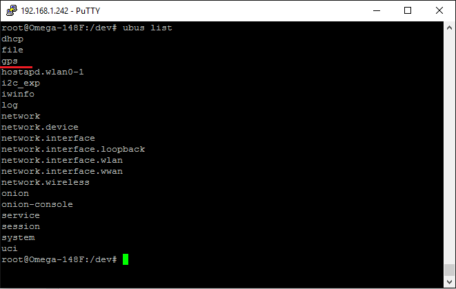

## Mobile WiFi Network Scanner

In this project, we'll be using the Omega to scan local WiFi networks, record the GPS coordinates where they're found, display the networks with the strongest signal on the OLED Expansion, and save the data to a spreadsheet file.

TODO: before this intro sentence, add an intro that's a 10,000 ft description of the project. then it naturally leads into the existing sentence


### Overview

**Skill Level:** Intermediate

**Time Required:** 10 minutes

Using the Power Dock, you will be able to use your Omega out in the world without needing a USB power supply. We will then scan any WiFi networks in range using a `ubus` call. Then we will retrieve location data from the GPS Expansion also via `ubus`. We will then sort the networks by signal strength, then display the 6 networks with the strongest signal on the OLED Expansion.

We will then save the following data for each network into a comma separated value (CSV) file that can be imported into a spreadsheet program:

* Date scanned
* Latitude and longitude
* SSID
* BSSID
* Encryption type
* Signal strength


### Ingredients

1. Onion Omega2 or Omega2+
1. Onion Power Dock
1. Onion OLED Expansion
1. Onion GPS Expansion

<!-- The Steps -->
### Step-by-Step

Here's how to turn your Omega into a WiFi scanner!

#### 1. Setup the Hardware

Connect your Omega to the Power Dock, then plug in the OLED Expansion into the Expansion Header. Then plug in the GPS Expansion into the USB host port as shown below.


The GPS Expansion's antenna is connected via a Hirose U.FL connector. If you have your own antenna with the appropriate connector that you would like to use, you can gently unplug the included antenna (the large square piece with a wire) and replace it with your own.


<!--# 2 -->

#### 2. Install Packages

Connect to the Omega's Command line and install Python as well as some of the packages we need:

```
opkg update
opkg install python-light pyOledExp ogps
```

The `pyOledExp` package gives us control of the OLED Expansion, while the `ogps` package will provide a `ubus` service that lets us easily get data from the GPS Expansion.

After installing `ogps`, check that the `ubus` `gps` service is listed by running `ubus list`:



If you don't see `gps` listed, you'll need to restart your `rpcd` service in order to refresh the list:

```
/etc/init.d/rpcd restart
```

If this doesn't work, try reinstalling the `ogps` package by running the following commands:

```
opkg remove ogps
opkg update
opkg install ogps
```

#### 3. Download and Install the Software

The code for this project is all done and can be found in Onion's [wifi-hotspot-scanner repo](https://github.com/OnionIoT/wifi-hotspot-scanner) on GitHub. Follow the [instructions on installing Git](https://docs.onion.io/omega2-docs/installing-and-using-git.html), navigate to the `/root` directory, and clone the GitHub repo:

```
git clone https://github.com/OnionIoT/wifi-hotspot-scanner.git
```

#### 4. Running the Project on Boot

Next we'll setup the Omega to automatically run the scanner when it turns on. Edit the `/etc/rc.local` file and add the following line above `exit 0`:

```sh
python /root/wifi-hotspot-scanner/main.py &
```

This way, when you flip the power switch, the Omega will run the code in the background after it completes the initialization process.

#### 5. Using the WiFi Scanner

Here's the fun part! Press the reset button and the Omega will run the program.

If the GPS Expansion is able to lock onto a satellite signal, you'll see the time, the GPS coordinates, and the 6 WiFi networks with the strongest signal available nearby.


The Omega will then save data about all of the discovered networks to a file called `wifiData.csv`. You can then import this into a spreadsheet or navigation program for mapping later!

##### Unable to Lock Signal

If the GPS Expansion cannot lock onto a satellite, you'll see an error message on the OLED. The program will try again in a few seconds.

#### 6. Code Highlight

This project uses the `ubus` system on the Omega to call certain services and functions as if you were sending data to a web API. The basic syntax goes like this:

```
ubus call (service) (function) '{(JSON parameters)}'
```

The WiFi scanning and GPS functions both are shorthand for these `ubus` calls. You can see how they work in the `helpers.py` and `ubusHelper.py` modules.
