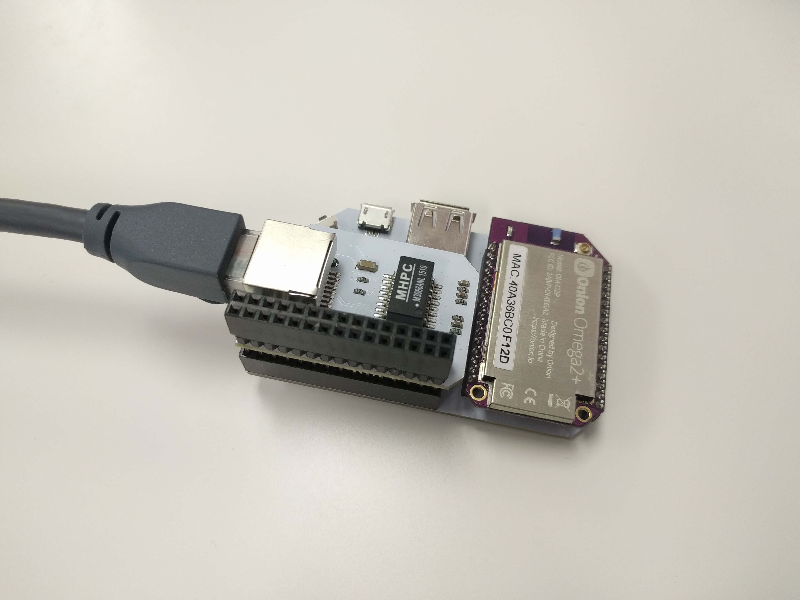

## Omega as a Router

A router is a device that connects multiple devices on a wired or wireless network. They are very widely used with modems to allow multiple devices to connect to the Internet through the single connection provided by the modem. We're going to use the Omega as a wireless router that takes an Ethernet connection and broadcasts a WiFi access point!

The Ethernet Expansion is required to give your Omega access to an Ethernet port. By using the Ethernet Expansion, we can turn our Omega into a low-cost yet effective router.

<!--  -->

### Overview

**Skill Level:** Intermediate

**Time Required:** 10 minutes

What we are going to do is to first enable the Omega's Ethernet connection, stop the Omega from connecting to other WiFi networks, then route traffic from the Omega's AP to the Internet through the Ethernet connection.


### Ingredients

1. Onion Omega2 or Omega2+
1. Any Onion Dock, preferably one with serial such as: Expansion Dock, Mini Dock
1. Onion Ethernet Expansion

<!-- The Steps -->
### Step-by-Step

Here's how to turn your Omega into a wireless router!

#### 1. Setup the Hardware

Connect your Ethernet Expansion to the Expansion dock, and plug in the Ethernet cable, as shown below:



<!--# 2 -->

#### 2. Setup the Omega

<!-- // Connect the Ethernet Expansion to the Omega -->

The next step is to disable the Omega's WiFi connection capabilities. By this, we mean the **ability to connect to other WiFi networks**, as it will be using the Ethernet Expansion to access the Internet instead.

>We're going to be restarting the WiFi on the Omega a few times, breaking any SSH connections in the process. To avoid this, you can try using a serial connection with your Omega. For more information, please refer to this [guide on connecting to your Omega.](#connecting-to-the-omega-terminal)

On the Omega's command line, enter the following commands:

```
uci set wireless.@wifi-iface[0].ApCliEnable=0
uci commit wireless
```

Restart the WiFi network to apply your saved changes:

```
wifi
```

<!--# 3 -->
#### 3. Changing your Omega Router’s Settings

Set the SSID and password of the router's WiFi network with the following commands, substituting `OmegaRouter` and `RouterPassword`:

```
uci set wireless.@wifi-iface[0].ssid=OmegaRouter
uci set wireless.@wifi-iface[0].key=RouterPassword
uci commit
```

##### Changing the Encryption Type

If you wish to keep the default encryption type (`psk2`), you can continue to the next step below.

However, if you wish to change the encryption type, find the type you want in the [UCI wireless encryption list](https://wiki.openwrt.org/doc/uci/wireless/encryption), then substitute it into `YourEncryptionType` and run:

```
uci set wireless.@wifi-iface[0].encryption=YourEncryptionType
uci commit
```

Please keep in mind that 1st generation WPA is [not secure](http://www.pcworld.com/article/153396/wifi_hacked.html).

##### Restarting the WiFi {#projects-omega-as-a-router-restarting-the-wifi}

Run the following command to restart the WiFi network and apply your settings:

```
wifi
```

#### 4. Enable `eth0`

Enable the Ethernet connection by running:

```
uci set network.wan.ifname='eth0'
uci set network.wan.hostname='OnionOmega'
uci commit
```

Then restart the network service:

```
/etc/init.d/network restart
```

This will allow the Omega to connect to the Internet via the Ethernet port.

#### 5. Enabling Packet Routing

Open the `/etc/config/firewall` file for editing and find the block that looks like the following:

```
config zone
        option name 'wan'
        option output 'ACCEPT'
        option forward 'REJECT'
        option masq '1'
        option mtu_fix '1'
        option network 'wwan'
        option input 'ACCEPT'
```

and do the following:

* Change `option forward 'REJECT'` to `option forward 'ACCEPT'`
* Change `option network 'wwan'` to `list network 'wwan'`
* Add `list network 'wan'` after the `list network 'wwan'` line

The block should now look like this:

```
config zone
        option name 'wan'
        option output 'ACCEPT'
        option forward 'ACCEPT'
        option masq '1'
        option mtu_fix '1'   
        list network 'wwan'  
        list network 'wan'   
        option input 'ACCEPT'
```

Now restart the firewall by running:

```
/etc/init.d/firewall restart
```

#### 6. Using the Omega Router

And we're ready! To use the Omega Router, you simply need to connect your computer or your smartphone/tablet to the WiFi network that you configured in Step 4, and your devices should be able to access the Internet via the Omega.


#### 7. Sample Configuration Files

The Onion [omega-as-router Github repository](https://github.com/OnionIoT/omega-as-router) contains reference configuration files in case you need to troubleshoot your setup.

Follow the [instructions on installing Git](https://docs.onion.io/omega2-docs/installing-and-using-git.html), navigate to the `/root` directory, and clone the GitHub repo:

```
git clone https://github.com/OnionIoT/omega-as-router.git
```

Please note that there are some placeholders such as `RouterPassword` and `somewifissid`. Make sure to copy only the relevant parts!